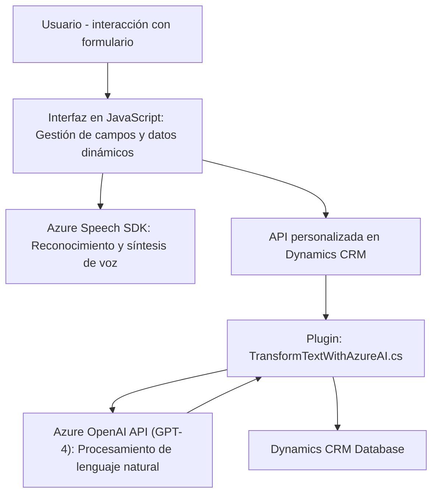

### Breve Resumen Técnico

El repositorio en cuestión presenta un sistema integrado que combina funcionalidades de accesibilidad por voz y procesamiento avanzado mediante Microsoft Azure AI. Los módulos trabajan para interactuar con formularios dinámicos de sistemas como Dynamics CRM, extrayendo y actualizando datos en tiempo real. Además, aprovecha servicios de voz y procesamiento de lenguaje natural mediante Azure Speech SDK y Azure OpenAI.

---

### Descripción de Arquitectura

La arquitectura general parece corresponder a un sistema híbrido basado en integración de APIs, con elementos de **microservicios** en Azure. Tiene cuatro características principales:
1. **Frontend dinámico basado en JavaScript**: Interacción directa con el usuario vía formularios, usando lógica local y dependiente de SDKs cargados dinámicamente.
2. **Integración de servicios externos**: Se comunica con Microsoft Azure Speech SDK y Azure OpenAI para soporte de voz y procesamiento avanzado.
3. **Backend basado en plugins**: Arquitectura de **plugin** en Microsoft Dynamics CRM usando .NET SDK, lo que permite extender las funcionalidades de la plataforma.
4. **Flujo Event-Driven**: Los eventos del sistema, como los cambios en el formulario, desencadenan tanto procesos locales como en la API remota, favoreciendo una arquitectura de procesamiento reactiva.

El sistema no es un monolito ni una arquitectura de n capas tradicional, ya que fragmenta responsabilidades en diferentes módulos. Además, la utilización de servicios en la nube y APIs externas sugiere una arquitectura orientada a servicios con principios de **microservicios**.

---

### Tecnologías Usadas
1. **Frontend (JavaScript)**:
   - Azure Speech SDK: Realiza reconocimiento y síntesis de voz desde Microsoft Azure.
   - Dynamics CRM: Framework para integrar funcionalidades propias.

2. **Backend (.NET)**:
   - Microsoft Dynamics CRM SDK: Extiende el CRM con un plugin (.NET Framework/C#).
   - System.Net.Http y Newtonsoft.Json: Para realizar solicitudes y manejar respuestas JSON de la API.
   - Azure OpenAI Service: Uso de GPT para procesamiento del lenguaje natural.

---

### Diagrama Mermaid

---

### Conclusión Final

Este sistema está diseñado para mejorar la accesibilidad y manejo de formularios dinámicos en soluciones CRM, destacándose por su integración de tecnologías punteras como Azure Speech SDK y Azure OpenAI (GPT). La arquitectura implementa categorías claras y separadas de funcionalidades (visualización, voz y procesamiento back-end), maximizando la modularidad y escalabilidad.  

Sin embargo, algunos puntos deben ser optimizados:
- **Gestión de secretos**: Uso explícito de claves API en el código puede ser un problema. Es ideal almacenar las claves en un sistema seguro como Azure Key Vault.
- **Errores y logging**: Se podría mejorar el manejo de errores en las solicitudes y en el CRM, añadiendo un sistema de monitoreo centralizado.
  
En general, la solución utiliza patrones modernos (orientación a servicios, arquitectura de plugins) y tecnologías sólidas para habilitar una plataforma robusta para interacciones dinámicas basadas en accesibilidad y voz.