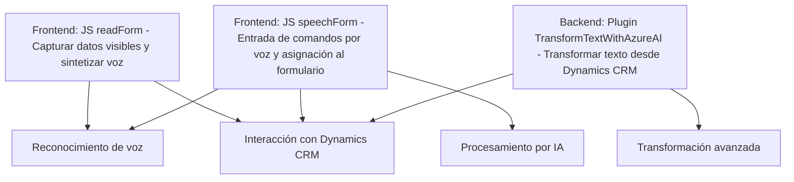

### Breve Resumen Técnico
El repositorio implementa una solución mixta para la entrada y salida de voz con interacción a formularios, basada en tecnologías de Microsoft Azure y Dynamics CRM. Incluye un frontend en JavaScript para la captura y síntesis de voz, así como un plugin en .NET para realizar transformaciones de texto mediante el servicio Azure OpenAI. La arquitectura está orientada a la utilización de APIs externas, modularidad y patrones comunes en el desarrollo de plugins.

---

### Descripción de Arquitectura
La solución tiene una arquitectura **modular distribuida** compuesta por diferentes capas:
1. **Capa Frontend**: Implementada en JavaScript, incluye la lógica para capturar la voz del usuario y sintetizar respuestas en voz utilizando el servicio Azure Speech SDK, así como la integración con formularios DOM en Dynamics CRM para extraer datos y aplicarlos.
2. **Capa Backend/Plugin**: Utiliza plugins basados en la arquitectura de extensibilización de Microsoft Dynamics CRM. Estos plugins llaman al servicio de Azure OpenAI mediante peticiones HTTP para realizar transformaciones avanzadas de texto.
3. **Dependencia de APIs externas**:
   - **Azure Speech SDK** se utiliza para la entrada y salida de voz.
   - **Custom API de Azure para IA y procesamiento avanzado** se accede desde el frontend para interpretar y mapear datos en el formulario.
   - **Azure OpenAI Service** es consumido por el plugin utilizando peticiones HTTP para realizar transformaciones de texto.

---

### Tecnologías Usadas
1. **Frontend (JavaScript)**:
   - Azure Speech SDK: Para captura y síntesis de voz.
   - Dynamics CRM Form Context API: Para extraer y aplicar valores en formularios.
   - ECMAScript (ES6): Para implementar manipulaciones y modularidad.
   - Event-Driven Programming.

2. **Backend (.NET)**:
   - Lenguaje: C# con .NET Framework.
   - Interfase `IPlugin` de Microsoft Dynamics CRM para extender la funcionalidad del CRM.
   - HTTP Client: Consumir servicios REST, como Azure OpenAI.

3. **Externo**:
   - Azure OpenAI Service: Para procesar y transformar texto conforme a reglas.
   - Azure Speech SDK: Para procesamiento de entrada y salida de voz.

**Patrones arquitectónicos utilizados**:
- Modularidad.
- Event-driven.
- Plugin Model para Dynamics CRM.
- DTO (Data Transfer Object) para el intercambio de datos estructurados.
- Cliente HTTP para interacción REST con Azure OpenAI.
- Separación de Concerns: Asigna a cada archivo responsabilidad específica de la solución (los scripts JS para interacción de formularios y plugin para lógica CRM).

---

### Diagrama Mermaid compatible con GitHub Markdown

---

### Conclusión Final
La solución presentada tiene un enfoque modular y distribuido que combina la entrada y salida de voz (frontend) con un procesamiento avanzado de texto orientado a CRM (backend). La interacción con varios servicios de Microsoft Azure (Speech SDK, OpenAI API) destaca la dependencia de APIs externas para características clave como reconocimiento de voz, síntesis de texto y transformaciones inteligentes basadas en IA.

Para un futuro mejorado:
1. Implementar el manejo de secretos de forma segura (los parámetros como `azureKey` y `azureRegion` deben ser externalizados).
2. Aplicar buenas prácticas como el uso de patrones de diseño como **Factory/Singleton** para la gestión de clientes HTTP.
3. Considerar la evolución hacia una arquitectura basada en **servicios más desacoplados**, integrando el plugin a través de un broker (mensajería o pub-sub).

Esta solución es adecuada para proyectos de automatización de datos con voz y representación visual, como parte de iniciativas de digitalización empresarial.