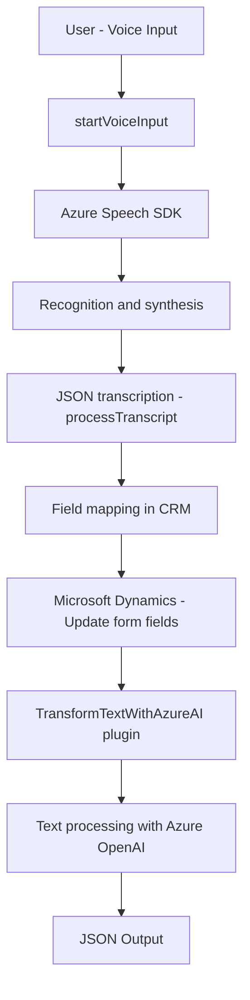

## Resumen Técnico

El repositorio en cuestión permite la interacción de un sistema de Microsoft Dynamics CRM con tecnologías avanzadas como **Azure Speech SDK** y **Azure OpenAI**, facilitando el procesamiento de texto y su integración con formularios, mediante:

1. **Frontend/JS**: Reconocimiento y síntesis de voz en tiempo real. Generación dinámica de información derivada de entrada hablada, mapeándola con los campos visibles en formularios.
2. **Plugins/TransformTextWithAzureAI.cs**: Plugin de Dynamics para transformar texto utilizando reglas específicas con ayuda de Azure OpenAI, devolviendo resultados estructurados en formato JSON.

## Descripción de Arquitectura

### Tipo de Solución
- **API y Cliente Ligero con Plugin**: La solución combina un **cliente frontend** que interactúa con SDKs y APIs externas para proporcionar funcionalidades avanzadas, junto con un **plugin backend** que procesa datos con servicios Azure (OpenAI) en un entorno CRM.

### Arquitectura
- El proyecto presenta una arquitectura híbrida:
  - **Cliente ligero (MVC)**: El frontend basado en **JavaScript**, donde cada archivo gestiona modularmente funciones específicas relacionadas con el reconocimiento y síntesis de voz.
  - **Plugin-based**: El backend define un plugin que se ejecuta según eventos predefinidos en un ciclo de vida dentro de Microsoft Dynamics CRM. Esto lo hace compatible con aplicaciones **desacopladas**, permitiendo extensibilidad basada en APIs y servicios externos como Azure OpenAI.

### Patrones de Diseño y Tecnologías
1. **Callback orchestration**: Uso de patrones de suscripción para garantizar que los servicios externos (Azure Speech SDK) estén oportunamente cargados antes de iniciar su procesamiento.
2. **Mapper pattern**: Generación de mapeos entre datos hablados y campos de formularios visibles en tiempo real.
3. **Modularización**: Separación de responsabilidades por función y archivo, facilitando el mantenimiento y la extensibilidad.
4. **API externo (REST)**: Utilización de APIs remotas como Azure OpenAI y Azure Speech SDK para realizar tareas específicas fuera del contexto del software base.
5. **Asynchronous programming**: Uso de promesas y callbacks para procesar eventos asincrónicos como la transcripción, conversión de voz a texto y recuperación de resultados JSON desde servicios externos.

### Tecnologías Utilizadas
- **Frontend**:
  - Lenguajes: **JavaScript**.
  - Integración del SDK de Azure Speech (`https://aka.ms/csspeech/jsbrowserpackageraw`).
  - Dependencia del objeto `executionContext` como parte del ecosistema Microsoft Dynamics CRM.
- **Backend**:
  - Lenguaje: **C#**.
  - Servicios:
    - Microsoft Dynamics CRM SDK (proveedores de servicios y contexto de ejecución).
    - Azure OpenAI (transformación de texto hacia JSON).
    - API Dynamics (`Xrm.WebApi.online`) para realizar consultas de datos y ejecución de APIs personalizadas.
    - HTTPClient para envío de solicitudes remotas.

### Dependencias o Componentes Externos
1. **Azure Speech SDK**: Para conversión voz-texto y síntesis de texto.
2. **Azure OpenAI**: Procesamiento avanzado de texto con modelos propietarios de inteligencia artificial.
3. **Microsoft Dynamics CRM SDK**:
   - Utiliza `executionContext` y `IPlugin` para eventos.
   - Dependencia del servicio `WebApi` relacionado con Dynamics CRM.
4. **APIs personalizadas**: Probable implementación de puntos de integración dentro del CRM para soporte adicional de IA (función a la que llama Dynamics).

---

## Diagrama Mermaid para **GitHub Markdown**

---

## Conclusión Final

Esta solución utiliza arquitectura híbrida basada en la interacción entre el frontend, plugins y servicios externos como **Azure Speech SDK** para reconocimiento y síntesis de voz. En el backend, un plugin en Dynamics CRM utiliza **Azure OpenAI** para transformar texto y asegurar una integración fluida con los objetos nativos del CRM.

La estructura modular y enfoque basado en servicios asegura escalabilidad y fácil mantenimiento. La utilización de patrones como mapper y callbacks garantizan flexibilidad para adaptarse al ecosistema CRM, permitiendo además la interacción con APIs externas y servicios cognitivos inteligentes.

Esta solución es altamente adecuada para entornos empresariales que requieren interacción avanzada (voz-texto) y procesamiento semántico de datos mediante IA en Microsoft Dynamics CRM.