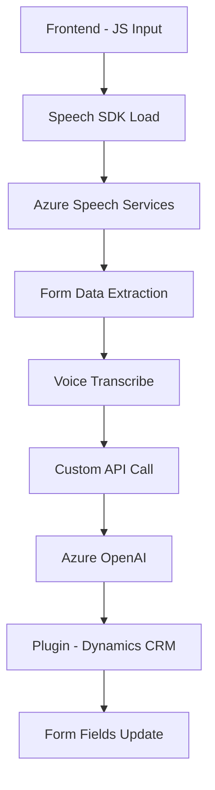

### Breve resumen técnico
El repositorio contiene varios archivos que implementan funcionalidades relacionadas con entrada y síntesis de voz, procesamiento de datos de formularios y transformación de texto mediante servicios de inteligencia artificial de Azure. Se utilizan tecnologías tanto de frontend (Azure Speech SDK en JavaScript) como de backend (Microsoft Dynamics CRM Plugins y Azure OpenAI).

---

### Descripción de la arquitectura
La solución está orientada a la interacción entre formularios dinámicos del CRM y plataformas de inteligencia artificial. En general:
1. **Frontend:** Realiza captura de voz y síntesis utilizando el Azure Speech SDK.
2. **Backend:** Implementa lógica en un plugin de Dynamics CRM que procesa texto con servicios Azure OpenAI.
   
La arquitectura está basada principalmente en una integración con SDKs y servicios externos, siguiendo patrones como **modularidad**, **callback-based design**, y **adaptación de datos** según el contexto (formulario dinámico). Por lo tanto, la solución utiliza una arquitectura **híbrida** entre capas con integración de servicios externos.

---

### Tecnologías usadas
1. **Frontend/JS:**
   - JavaScript/ES6
   - Azure Speech SDK
   - DOM Manipulation
   - APIs dinámicas del CRM
2. **Backend/Plugins:**
   - Microsoft Dynamics CRM SDK
   - .NET Framework/C#
   - Newtonsoft.Json para manejo de estructuras JSON
   - Azure OpenAI API (GPT-4 integrado)
3. **Servicios externos:**
   - Speech-to-Text y Text-to-Speech de Azure
   - Microsoft Dynamics CRM Web APIs
   - Azure OpenAI para procesamiento textual estructurado.

---

### Diagrama Mermaid

---

### Conclusión final
La solución está diseñada como una integración de frontend y backend con acceso a servicios externos como Azure Speech SDK y Azure OpenAI. Tiene una clara orientación modular, permitiendo la reutilización de funciones específicas y una interconexión efectiva con un CRM. Su arquitectura es híbrida, principalmente una combinación de **n capas** en el backend y **SDK-based workflow** en el frontend. Esto permite adaptar datos dinámicos mediante transformaciones basadas en IA y presenta una buena escalabilidad para aplicaciones comerciales.