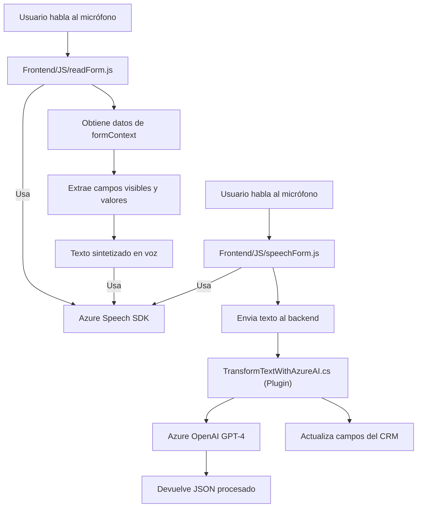

# Análisis técnico del repositorio

### Breve resumen técnico
El repositorio contiene módulos frontend y backend integrados para manejar texto hablado, procesamiento de voz, y actualización dinámica de formularios en un sistema CRM utilizando tecnología de Microsoft Azure y procesamiento de lenguaje natural mediante IA. Se observa una profunda integración de servicios de nube y funcionalidades específicas para mejorar la interacción con el sistema CRM basado en Microsoft Dynamics.

---

### Descripción de arquitectura
La solución tiene características de arquitectura distribuida, incluyendo integración de servicios externos en el Backend y Frontend. La estructura exhibe los siguientes aspectos:

1. **Frontend JavaScript:** 
   - **Propósito:** Captura entrada de voz y presenta datos dinámicos al usuario.
   - **Componentes principales:**
     - Azure Speech SDK en el frontend para reconocimiento de voz y síntesis de voz.
     - Capacidad para comunicar con un backend procesador (cuando se requiere procesamiento IA).

2. **Backend (.NET):** 
   - Utiliza Microsoft Dynamics CRM SDK y un plugin basado en Azure OpenAI para transformar y mapear datos en el formulario CRM.
   - La arquitectura del backend sigue el patrón **plugin design**, típico de sistemas extensibles como Dynamics CRM.

3. **Componentes conectados:**
   - A través de **facades**, encapsula la interacción con Azure Speech SDK y Azure OpenAI.
   - El backend realiza lógica de negocio, delegando operaciones complejas al servicio en la nube.

La solución no se comporta como un monolito, sino como una implementación de múltiples capas: 
- **Presentación:** módulos frontend.
- **Integración lógica:** plugins de procesamiento backend.
- **Exposición de datos y servicios:** Servicios Azure conectados.

---

### Tecnologías usadas
- **Frontend:**
  1. **JavaScript**, específicamente configurado para integrar el **Azure Speech SDK**.
  2. **Microsoft Dynamics CRM FormAPI (Xrm)** para manipular campos del sistema de formularios en el CRM.
  3. Promesas y callbacks para el manejo asincrónico en la carga y uso de librerías externas.

- **Backend:**
  1. **C# (.NET Framework)** como lenguaje base para implementar las extensiones de CRM.
  2. **Microsoft Dynamics CRM SDK** para invocar y manipular datos del sistema CRM.
  3. **Azure OpenAI API y GPT-4** para procesamiento de texto con reglas específicas.

- **Servicios externos:**
  1. **Azure Speech API** para síntesis y transcripción de voz en tiempo real.
  2. **Azure OpenAI GPT-4** para ajustar entradas textuales a un formato estructurado.

---

### Dependencias externas
1. **Azure Speech SDK** para captura y generación de voz.
2. **Azure OpenAI GPT-4** para procesamiento de lenguaje natural basado en reglas.
3. **Microsoft Dynamics CRM SDK** para manipulación de formularios en un sistema CRM.
4. **Librerías JSON (Newtonsoft.Json, System.Text.Json)** para manipulación estructurada de datos en el backend.

---

### Diagrama Mermaid

---

### Conclusión final
La solución implementa una arquitectura distribuida que aprovecha los beneficios del trabajo en n-capas, dividiendo responsabilidades entre el frontend, los servicios de nube y un backend con plugins dinámicos. El uso del patrón plugin en el backend permite escalar la lógica sin modificar el sistema central de CRM, mientras que la integración con servicios de Azure potencia capacidades avanzadas como síntesis y procesamiento de lenguaje natural. Esto demuestra un diseño moderno y escalable, ideal para escenarios que involucren interacción humana y automatización de tareas en entornos empresariales.