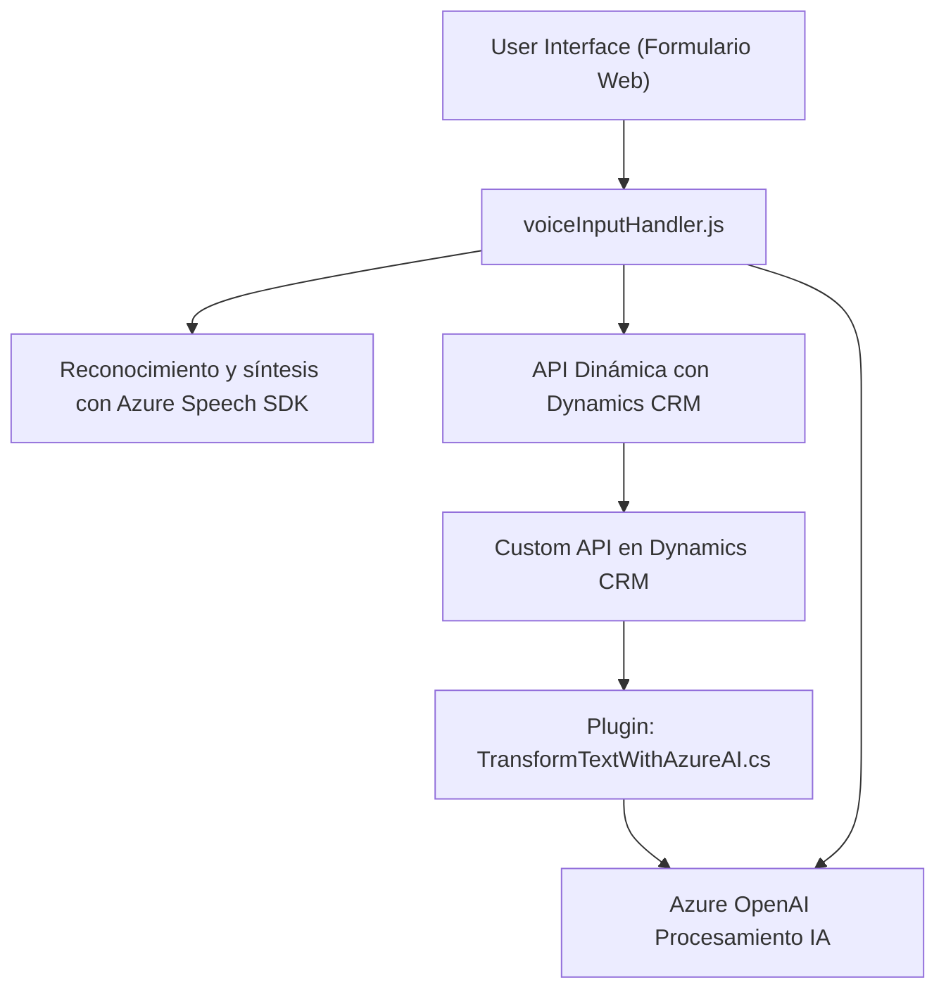
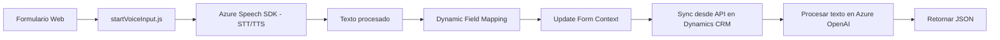
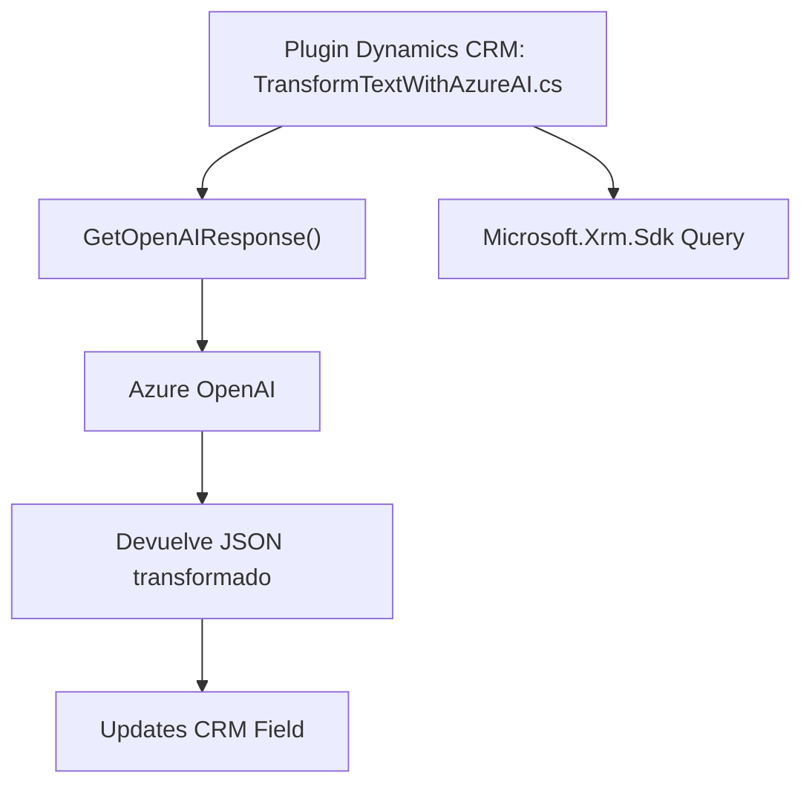

### Informe de análisis técnico del repositorio

#### Breve resumen técnico
El repositorio integra tecnologías frontend basadas en JavaScript con funcionalidades de voz y texto proporcionadas por el **Azure Speech SDK**, y una extensión backend que trabaja como un plugin de **Dynamics CRM**. La solución captura, transforma y manipula datos de formularios y realiza acciones específicas mediante reconocimiento de voz y servicios de inteligencia artificial (Azure OpenAI).

---

#### **Descripción de arquitectura**
La arquitectura es un modelo híbrido que combina **n capas** con integración externa a través del uso de APIs. Los archivos proporcionados implementan funcionalidad de **interacción cliente-servidor** en los siguientes aspectos:
1. **Frontend**:
   - Un módulo que interactúa con formularios web para obtener información textual y sintetizar voz (TTS con Azure Speech SDK).
   - Reconocimiento de comandos de voz (STT) y su mapeo a campos de formulario o API personalizada en Dynamics CRM.
2. **Backend**:
   - Extensión de Dynamics CRM en formato de plugin (C#) que invoca la API de Azure OpenAI para transformar texto según reglas específicas.

La dependencia hacia servicios externos (Azure) junto con Dynamics CRM sugiere una **arquitectura de integración de APIs**. Cada parte de la solución está organizada en capas de responsabilidad única:
- **Cliente Web (JS)**: Interacción directa con usuarios y SDK de Azure Speech.
- **Dynamics CRM Plugin**: Procesamiento del texto y soporte de integración con aplicaciones de Microsoft CRM.
- **Servicios externos**: APIs de reconocimiento de voz y transformación textual en Azure Cognitive Services y Azure OpenAI.

Por su estructura, este diseño se alinea con un modelo basado en eventos que depende de programación asincrónica y servicios cloud.

---

#### **Tecnologías usadas**
1. **Frontend**:
   - **Lenguaje**: JavaScript (interpretable en navegador).
   - **Framework/librerías**:
       - Azure Speech SDK para entrada y síntesis de voz.
       - Dynamics CRM SDK para interacción con formularios.
   - **Patrones**:
       - Encapsulación modular para funciones como reconocimiento de campos y síntesis de texto.
       - Diseño basado en eventos y callbacks.
       - API Integration (Azure Speech SDK y Dynamics CRM Web APIs).

2. **Backend (C#)**:
   - **Lenguaje**: C#.
   - **Framework/librerías**:
       - Microsoft.Xrm.Sdk.
       - Newtonsoft.Json para manejar estructuras JSON.
       - Azure OpenAI para procesamiento avanzado de texto.
   - **Patrones**:
       - Plugin de Dynamics CRM implementando la interfaz `IPlugin`.
       - Separación de preocupaciones entre la lógica del CRM y la conexión a servicios externos.
       - Integración con API externa (Azure OpenAI).
       - Uso de dependencias como HTTP para realizar peticiones seguras.
       
---

#### **Dependencias y componentes externos**
1. **Servicios Azure**:
   - **Azure Speech SDK**: Reconocimiento de voz (STT) y síntesis de texto (TTS).
   - **Azure OpenAI**: Transformación de texto en formato estructurado (JSON).
2. **Dynamics CRM Web API**:
   - **Xrm.WebApi.online**: Para llamar APIs personalizadas y manipular entidades en Dynamics CRM.
3. **Bibliotecas externas**:
   - Newtonsoft.Json para JSON en .NET backend.
4. **Formato de integración**:
   - Carga dinámica de scripts desde URLs (`https://aka.ms/csspeech/jsbrowserpackageraw`).

---

#### Diagramas **Mermaid** válidos para GitHub

##### Visión general de la arquitectura de la solución:

##### Flujo de conversación y mapeo de datos:

##### Estructura de interacción del plugin con Azure OpenAI:

---

### Conclusión final
El repositorio implementa una solución avanzada de reconocimiento de voz y síntesis en el lado del cliente, integrada con APIs de Dynamics CRM y potenciada por los servicios de inteligencia artificial de Azure. Su arquitectura modular permite una separación clara de responsabilidades entre el procesamiento de voz, el mapeo dinámico de campos en el frontend, y un plugin backend dedicado a manipular datos procesados desde la IA en los registros de CRM. Es adecuado para entornos empresariales que requieran automatización avanzada y soporte de interacción natural con los formularios.