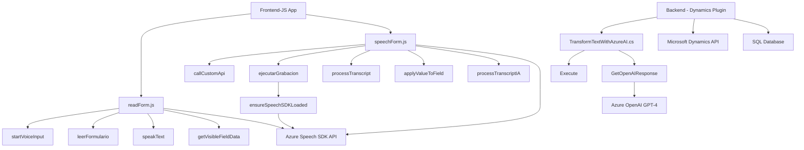

### Análisis técnico y descripción

#### Breve resumen técnico
El repositorio expone un conjunto de archivos para implementar una solución de software que interactúe con formularios de Microsoft Dynamics 365 y que también se integre con servicios de Microsoft Azure (Speech SDK y OpenAI API). La solución presenta un frontend en JavaScript y un componente de backend desarrollado como plugin para Dynamics CRM.

---

### Descripción de arquitectura

La solución parece incorporar una arquitectura de **n capas**, donde la capa frontend (JavaScript) proporciona interacción directa con los usuarios mediante voz o formularios y un backend implementado como extendido de Dynamics CRM que lleva a cabo operaciones de transformación avanzada de datos con la ayuda de Azure OpenAI. Además:
- La integración con la API de Azure OpenAI sigue el patrón de **API Gateway**, que centraliza la interacción con un servicio externo para el procesamiento de datos.
- Existen **patrones por responsabilidad** aplicados en el diseño de métodos y funciones específicas. Por ejemplo:
  - La carga dinámica del SDK (patrón singleton para gestionar único punto de carga).
  - Gestión modular de texto (en clases separadas como en `TransformTextWithAzureAI`).
  - La separación de responsabilidades tanto en el frontend como en el backend.

Esto indica una arquitectura bien definida que separa la lógica del cliente (interfaz de usuario) y la de negocio (dinámica de los plugins).

---

### Tecnologías usadas
1. **Frontend (JavaScript):**
   - DOM Manipulation API: Para acceder y modificar elementos del formulario de Dynamics 365.
   - Azure Speech SDK: Integración para conversión de texto a voz y reconocimiento de voz.
   - Promesas para manejo de lógica asincrónica.
   
2. **Backend (C#):**
   - Microsoft Dynamics CRM SDK: Para desarrollo de plugins.
   - Azure OpenAI API: Para la transformación de texto con un modelo GPT-4.
   - Newtonsoft.Json y System.Text.Json: Manejo de datos JSON.
   - System.Net.Http: Para comunicación con APIs externas.

---

### Diagrama **Mermaid** (GitHub Markdown Valid)

---

### Detalles de los nodos en el diagrama:
1. **A (Frontend-JS App)**
   - Representa la capa de frontend implementada en JavaScript.
   - Consume la API de Azure Speech SDK y alimenta los formularios de Dynamics 365.

2. **P (Backend - Dynamics Plugin)**
   - Representa la extensión de Dynamics CRM mediante un plugin C# que consume el servicio de Azure OpenAI API.
   - Procesa datos recibidos para transformar texto y devolver datos formateados.

3. **Backend Componentes**:
   - `Execute`: Inicializa la ejecución del plugin.
   - `GetOpenAIResponse`: Encapsula la lógica de comunicación con la API de Azure OpenAI.

4. **Frontend Componentes**:
   - `readForm.js`: Gestión de formularios y síntesis de texto a voz mediante Azure Speech SDK.
   - `speechForm.js`: Reconocimiento de voz, transcripción y operaciones en formularios de Dynamics 365.

5. **Integraciones externas**:
   - **Azure APIs**:
     - Speech SDK para síntesis de voz y reconocimiento de voz.
     - OpenAI GPT-4 para transformación y estructura del texto.
   - **Microsoft Dynamics CRM API**: Llamadas nativas como parte del plugin.
   - **SQL Database**: Posiblemente utilizado como repositorio para entidades relacionadas.

---

### Conclusión final

Este repositorio define una solución híbrida de **Frontend-Backend**, donde el frontend (desarrollado en JavaScript) interactúa con formularios y con los servicios cognitivos de Azure (Speech SDK) para realizar síntesis y reconocimiento de voz, mientras que el backend implementado en C# extiende las funcionalidades de Dynamics CRM para la transformación avanzada de datos utilizando el modelo GPT-4 de Azure OpenAI. La integración representa una arquitectura **n capas** con patrones de modularidad y separación de responsabilidades, lo que favorece la escalabilidad y mantenibilidad de la solución.