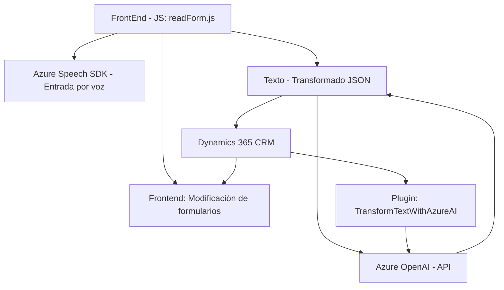

# Resumen Técnico

1. **Tipo de solución:**  
   La solución corresponde a una integración con Dynamics 365 destinada a implementar funcionalidades basadas en entrada/salida de voz y procesamiento de texto. En el repositorio hay una combinación de **frontend**, **API personalizada,** y **plugin**. El frontend proporciona interacción entre los usuarios y el sistema (captación y síntesis de voz), mientras que la API utiliza servicios de procesamiento de texto basados en Azure AI (OpenAI). Además, un plugin implementa funcionalidades específicas integradas directamente con Dynamics CRM.

2. **Tecnologías, frameworks y patrones utilizados:**
   - **Frontend**: 
     - JavaScript.
     - Azure Speech SDK (JavaScript).
     - Dynamics 365 APIs (`Xrm.WebApi`).
   - **Backend**:
     - Microsoft Dynamics CRM SDK.
     - ASP.NET/C#.
     - Azure OpenAI API.
     - JSON processing libraries (`Newtonsoft.Json.Linq`, `System.Text.Json`, etc.).
   - **Patrones de programación**:
     - Event-driven programming (en el frontend, basado en callbacks).
     - Cliente-Servidor (comunicación con servicios externos como Azure Speech SDK y Azure OpenAI).
     - Adapter Pattern (procesamiento de valores entre transcripción de voz y atributos del formulario).
     - Multi-layered Architecture (separación por componentes: frontend, plugins, APIs).

3. **Tipo de arquitectura:**
   - Aunque muestra características de una arquitectura **n-capas** dado el uso de una capa de presentación (frontend), lógica de negocio (plugin/API) y bases de datos (Dynamics CRM), por la integración con servicios externos (Azure Speech SDK y OpenAI), también podría considerarse un diseño **microservicios orientados a procesos**, donde se delega la funcionalidad de síntesis y procesamiento de texto a servicios especializados.

4. **Dependencias o componentes externos:**
   - **Azure Speech SDK**: Para síntesis de voz y reconocimiento de lenguaje hablado.
   - **Azure OpenAI API**: Proceso basado en Inteligencia Artificial para transformar textos.
   - **Microsoft Dynamics CRM SDK**: Manejo de formularios y servicios en Dynamics CRM.
   - **Browser-based script loading**: Uso de carga de scripts en tiempo de ejecución para incorporar el Azure Speech SDK.  
   - **JSON libraries**: Newtonsoft.Json y System.Text.Json para serialización/deserialización de JSON.
   - **HTTP client libraries**: System.Net.Http para enviar solicitudes de API.

# Descripción de Arquitectura

La solución combina tres componentes principales:
1. **Frontend (readForm.js, speechForm.js)**: Maneja la interacción del usuario por voz, la sintetización de texto y el procesamiento de datos de formularios. Se comunica con servicios externos como Azure Speech SDK y envía texto a la API de Dynamics CRM.
2. **Custom API (Dynamics 365)**: Implementa un servicio extendido basado en el procesamiento de texto con Azure OpenAI para manejar, analizar y estructurar texto avanzado.  
3. **Plugin (TransformTextWithAzureAI.cs)**: Añade capacidades de enriquecimiento y normalización de texto mediante Azure OpenAI y proporciona una integración directa con Dynamics CRM.

La arquitectura podría considerarse una combinación de **Aplicación n-Capas** con integración de **Backends microservicio-like**, donde las capas principales son:
- **Capa de presentación (Frontend):** Interacción directa con el usuario (input/output de voz).
- **Capa de negocio:** Lógica en el plugin y la API personalizada que manipula y transforma datos en Dynamics CRM.  
- **Servicios externos:** Azure Speech SDK y Azure OpenAI para entrada de voz y procesamiento de texto.

# Tecnologías usadas:
Frontend:
- JavaScript.
- Azure Speech SDK.
- Xrm.WebApi.online para integración con Dynamics CRM.

Backend:
- Microsoft Dynamics CRM SDK.
- ASP.NET/C#.
- Azure OpenAI API.
- Serialización/deserialización JSON.
- HTTP client (System.Net.Http).  

# Diagrama Mermaid (100% compatible con GitHub Markdown)

# Conclusión Final

La solución presenta una integración avanzada entre tecnologías de entrada/salida de voz (Azure Speech SDK), procesamiento de textos (Azure OpenAI API), y manipulación dinámica de formularios dentro de Dynamics CRM. La arquitectura es híbrida, combinando patrones de diseño basados en cliente-servidor, n capas y un enfoque de microservicios para tareas específicas delegadas a servicios externos. Aunque robusta en su diseño, la dependencia de servicios externos puede ameritar mejoras en el manejo de fallos y validación de datos.