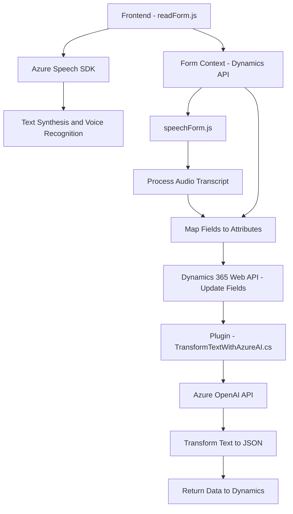

### Breve resumen técnico
El repositorio contiene funciones orientadas para la integración de formularios web y dinámicos con servicios de voz e inteligencia artificial, específicamente mediante Azure Speech SDK y Azure OpenAI. Estas funcionalidades apoyan la entrada y salida de datos por voz, así como su procesamiento en tiempo real para aplicaciones como formularios dinámicos y sistemas CRM (Dynamics 365).

---

### Descripción de la arquitectura
La solución combina una arquitectura **n-capas** en el contexto de un conjunto de servicios externalizados y funciones específicas dentro de Dynamics CRM. La arquitectura incluye las siguientes capas principales:

1. **Capa de presentación (Frontend)**: Contenida en los archivos de JavaScript (`readForm.js` y `speechForm.js`), permite la interacción del usuario con formularios dinámicos mediante reconocimiento y síntesis de voz.
2. **Lógica empresarial (Middle Layer)**: Proporcionada por el backend de Dynamics CRM mediante el plugin `TransformTextWithAzureAI.cs`. Este plugin extiende la funcionalidad del sistema al integrar servicios de procesamiento inteligente de texto con Azure OpenAI.
3. **Capa de integración**: Usa servicios externos como:
   - **Azure Speech SDK** para síntesis y reconocimiento de voz.
   - **Azure OpenAI API** para transformación de textos usando modelos GPT.
   - **Microsoft Dynamics Web API** para operaciones CRUD de datos en el sistema CRM.

El sistema aprovecha el patrón de integración entre frontend y backend utilizando APIs y eventos en el contexto de Dynamics CRM. La arquitectura puede ser clasificada como una **n-capas orientada a servicios** con integración en tiempo real entre componentes cliente y servicios externos.

---

### Tecnologías usadas
1. **Frontend**:
   - Lenguaje: JavaScript.
   - Framework/SDK: Azure Speech SDK.
   - Enfoque: Modularidad, uso de eventos asíncronos (`ensureSpeechSDKLoaded`) y procesamiento dinámico de formularios interactivos.

2. **Backend/Plugin**:
   - Lenguaje: C# (.NET Framework).
   - Framework: Dynamics CRM extensibility model.
   - API: Microsoft.Xrm.Sdk para interactuar con Dynamics CRM y Azure OpenAI API para procesamiento de texto.
   - Core Patterns:
     - Plugin Pattern.
     - Factory/Builder para composición de solicitudes.
     - Proxy para llamadas a servicios externos.

3. **Servicios externos**:
   - Azure OpenAI (GPT-4) para procesamiento de texto en modo JSON.
   - Azure Speech SDK para reconocimiento y síntesis de voz.

4. **Integración dinámica de scripts**:
   - URL de carga de SDK: `https://aka.ms/csspeech/jsbrowserpackageraw`.

---

### Dependencias y componentes externos
1. **Azure Speech SDK**:
   - Utilizado tanto para síntesis de voz como para reconocimiento de voz.
   - Cargado dinámicamente mediante la función `ensureSpeechSDKLoaded`.

2. **Azure OpenAI API**:
   - Procesamiento inteligente de textos mediante modelos avanzados como GPT-4.
   - JSON estructurado basado en reglas proporcionadas al modelo.

3. **Microsoft Dynamics 365**:
   - Web API para operaciones CRUD (actualización de formularios, consultas de datos).
   - Utilización de clases como `IPlugin` para integración de lógica empresarial en el CRM.

4. **Librerías .NET**:
   - Gestión JSON (`System.Text.Json`, `Newtonsoft.Json.Linq`).
   - Solicitudes HTTP (`System.Net.Http`).

---

### Diagrama **Mermaid** 100% compatible con **GitHub Markdown**

---

### Conclusión final
El repositorio ofrece una solución modular que facilita la interacción vía voz con datos de formularios dinámicos, integrándola directamente con Microsoft Dynamics 365. Mediante una arquitectura n-capas y orientada a servicios, se logra una comunicación fluida entre el cliente (frontend), servicios cloud (Azure Speech/OpenAI), y el backend (Dynamics 365). Este diseño es escalable y adaptativo para escenarios que requieran procesamiento avanzado de datos y respuestas en tiempo real.