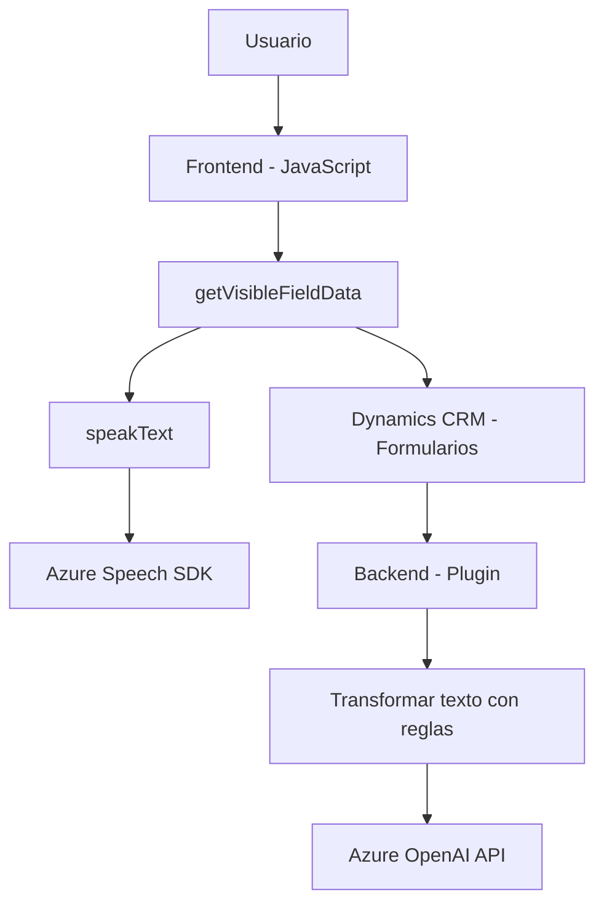

### Breve resumen técnico

El repositorio trata una solución centrada en la integración de servicios de reconocimiento de voz, síntesis de voz y procesamiento avanzado de datos textuales mediante APIs externas (Azure Speech SDK y Azure OpenAI) dentro del ecosistema de Dynamics 365 CRM. Está compuesto por archivos que configurarán un **frontend JavaScript para formularios** y un **plugin backend creado en C# para Dynamics CRM**.

---

### Descripción de arquitectura

La solución presenta una arquitectura **n capas** con los siguientes componentes:
1. **Frontend**:
   - Desarrollado en JavaScript.
   - Proporciona interacción con el usuario para la entrada de voz, síntesis de texto hablado, y manipulación de formularios.
   - Carga SDKs dinámicamente y procesa datos transcritos/convertidos directamente en tiempo real.
2. **Backend**:
   - Un plugin de Dynamics CRM escrito en C# que extiende la funcionalidad del sistema para ejecutar transformación avanzada de texto.
   - Se comunica con Azure OpenAI para estructuración de datos mediante HTTP y procesamiento en JSON.

La solución no utiliza microservicios ni una arquitectura hexagonal, pero sí presenta integración de servicios externos siguiendo los principios de modularidad y desacoplamiento.

---

### Tecnologías usadas

1. **Frontend**:
   - **JavaScript**:
     - Incluye patrones para modularización y adaptadores.
     - Manejo de DOM.
   - **Azure Speech SDK**:
     - Reconocimiento y síntesis de voz en tiempo real.
   - **APIs del navegador**:
     - Manipulación de scripts y control dinámico del SDK.
2. **Backend**:
   - **C# con Net Framework**:
     - Permite crear un plugin integrable en Dynamics CRM.
   - **Azure OpenAI**:
     - Procesamiento avanzado de texto con solicitudes HTTP.
   - **Microsoft Dynamics CRM APIs**:
     - Extensión de las funcionalidades del CRM mediante plugins.
   - **Newtonsoft.Json**:
     - Para manejar JSON en el plugin.

---

### Dependencias o componentes externos

- **Azure Speech SDK**: Usado para reconocimiento y síntesis de voz en el frontend.
- **Azure OpenAI API**: Procesamiento y estructuración avanzada de texto útil para el backend.
- **Dynamics CRM Web API**: Integración directa con los formularios, campos y atributos relacionados.
- **APIs del navegador**: Manejo dinámico de scripts y datos locales.
- **Newtonsoft.Json**: Manipulación de JSON en el procesamiento backend.

---

### Diagrama Mermaid válido para GitHub Markdown

---

### Conclusión final

La arquitectura de esta solución se centra en una combinación de frontend y extensión backend para Microsoft Dynamics CRM, habilitando funcionalidades avanzadas basadas en voz y procesamiento textual con APIs externas como Azure Speech SDK y Azure OpenAI. Utiliza principios de **modularización**, **desacoplamiento** y **n capas** para integrar claramente componentes frontend y backend. Este diseño es ideal para aplicaciones empresariales avanzadas, donde las capacidades de personalización, interacción usuario (UX) y conexión con servicios externos son críticas.