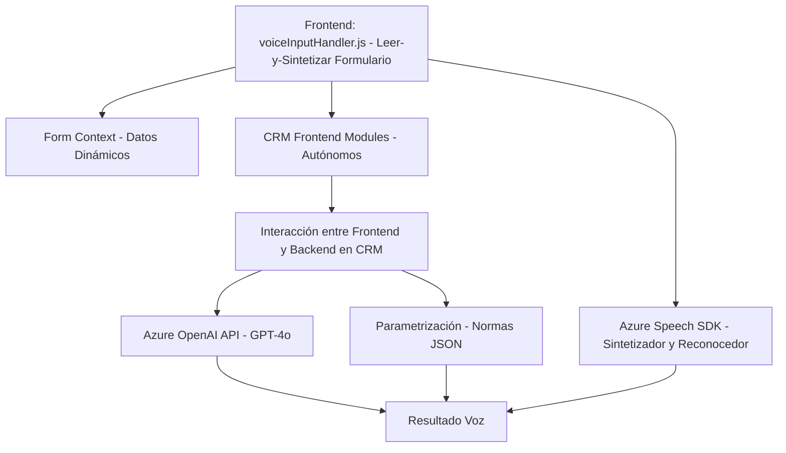

### Breve resumen técnico

La solución presentada integra tanto funcionalidades de frontend (JavaScript) como un plugin de backend (.NET) para Microsoft Dynamics CRM. Ambos módulos emplean servicios de Microsoft Azure (Speech SDK y OpenAI) para facilitar el procesamiento de voz y texto, integración con formularios dinámicos y manipulación de datos.

### Descripción de arquitectura

#### Tipo de solución
La estructura presentada es un **híbrido entre un sistema frontend y uno backend.** Incluye:
1. **Frontend**: Scripts de JavaScript para interacción, procesamiento de voz y modificación dinámica de formularios en un entorno cliente (posiblemente en Dynamics CRM).
2. **Backend plugin**: Ejecutado en el servidor de Dynamics CRM para integrar funcionalidades que procesan y transforman texto con servicios de Azure OpenAI.

#### Tipo de arquitectura
La solución exhibe una **arquitectura de capas (n capas)**, donde las responsabilidades se distribuyen entre:
- **Presentación:** Interacciones de usuario en el frontend mediante script en JavaScript. Procesos que interactúan con formularios y gestionan la entrada/salida de voz.
- **Lógica de negocio:** Una combinación entre la lógica interna del plugin en .NET para trabajar en Dynamics CRM y llamadas HTTP al servicio de OpenAI de Azure, además de dinámica en los formularios.
- **Consumo de servicios externos:** Comunicación entre las herramientas locales y APIs basadas en la nube de Azure (Azure Speech SDK para frontend y Azure OpenAI para backend).

#### Patrones identificados
- **MVC-like**: El frontend maneja la interacción entre la interfaz visual (formularios de CRM), el modelo de formulario (formContext) y la lógica de negocio (funciones como `applyValueToField`).
- **Plugin Design Pattern**: En el backend, se utiliza este patrón para acceder al contexto y servicios de Dynamics CRM con la implementación de `IPlugin`.
- **Integration Proxy Pattern**: En la integración de Azure OpenAI mediante el método independiente `GetOpenAIResponse` del plugin.

### Tecnologías usadas
#### Frontend
- **JavaScript (vanilla)**: Para interacción con DOM y control de formularios.
- **Azure Speech SDK**: Sintetización y reconocimiento de voz.

#### Backend
- **C#**: Usado para el plugin escrito en .NET.
- **Dynamics CRM SDK**: Gestión de datos dentro de Dynamics.
- **Azure OpenAI API**: Implementación avanzada para transformar texto.
- **HTTP Client (.NET)**: Comunicación con servicios externos en Azure.
- **JSON Libraries**: Para procesamiento y transformación de datos (e.g., `Newtonsoft`).
  
### Dependencias o componentes externos
1. **Azure Speech SDK**:
   - Necesita claves y configuración específica (región, API Key) para inicializar el reconocimiento y síntesis de voz.
2. **Azure OpenAI API**:
   - Requiere configuraciones similares (endpoint, clave de acceso y modelo GPT-4 o similar).
3. **Microsoft Dynamics CRM SDK**:
   - Los plugins interactúan con Dynamics CRM mediante `IPluginExecutionContext`, entre otros componentes.
4. **Libraries**: `Newtonsoft.Json` y posibles herramientas integradas del framework .NET para manipular JSON.
5. **Frontend DOM manipulation**: Directa con JavaScript, probablemente en browsers compatibles.

### Diagrama Mermaid válido para GitHub

### Conclusión final

La solución presentada está bien estructurada bajo una arquitectura de **n capas**, integrando un sistema **frontend** para interacción de formularios dinámicos y procesamiento de voz con un **plugin backend** especializado en Dynamics CRM. Ambos módulos dependen de servicios en la nube de **Microsoft Azure** (Speech SDK y OpenAI API) para procesar datos complejos.

El diseño muestra adherencia a principios SRP (Single Responsibility Principle) y modularidad, haciendo que cada función o clase cumpla una tarea específica. Sin embargo, la carga dinámica de SDKs externos puede requerir validaciones adicionales para mejorar la estabilidad del sistema.

Este diseño garantiza una solución escalable y adaptable que aprovechará las capacidades de Microsoft Azure como proveedor de servicios clave.