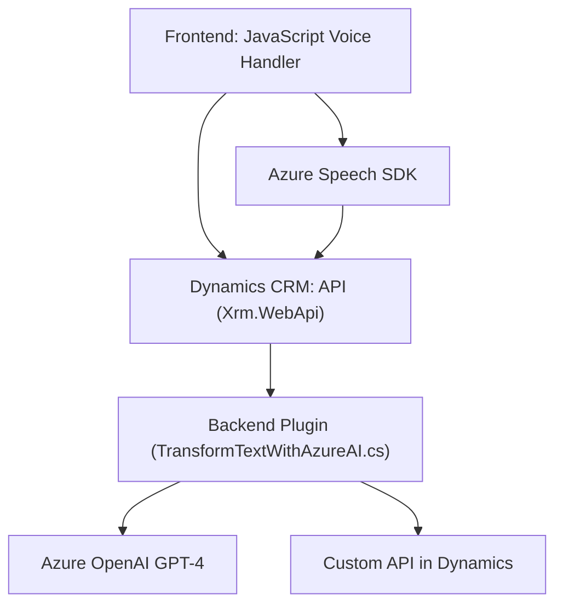

### Análisis del repositorio

---

#### **Breve resumen técnico:**

El repositorio parece estar diseñado para habilitar funcionalidades de entrada y salida de voz en formularios web de **Dynamics CRM**, utilizando **Azure Speech SDK** para el reconocimiento y síntesis de voz, además de **Azure OpenAI GPT-4** para procesamiento avanzado de texto. Combina lógica en el frontend con plugins server-side.

---

### **Descripción de arquitectura**:

El sistema implementa una arquitectura basada en las siguientes características:

1. **Frontend altamente modular**: Los archivos del frontend (`JS`) definen funcionalidades específicas como reconocimiento de voz, síntesis y procesamiento. Esto se acopla a los formularios web de Dynamics CRM mediante un contexto (`executionContext`) y utiliza APIs externas en tiempo de ejecución.

2. **Plugins en backend CRM**:
   - Plugins como `TransformTextWithAzureAI.cs` extienden el comportamiento del sistema CRM en el servidor.
   - El patrón **plugin architecture** de Dynamics permite ejecutar lógica en contexto del servidor basado en interacciones del usuario.

3. **Uso de servicios externos**:
   - **Azure Speech SDK**: Para reconocimiento y síntesis de voz en el cliente.
   - **Azure OpenAI GPT-4**: Plugin server-side para procesamiento textual.
   - **Dynamics 365 APIs**: Conexión directa con los formularios y entidades del CRM para manipulación de datos.

4. **Patrones usados**:
   - **Modularización**: Frontend agrupa funcionalidades específicas en funciones autónomas.
   - **Callbacks o Promesas**: Se emplean para manejar flujos dependientes de carga de SDKs en tiempo de ejecución.
   - **DTO y desacoplamiento**: La comunicación con Azure GPT-4 usa objetos JSON estructurados.

5. **Arquitectura global**:
   - Combinación de `n capas` + `plugins`. Las capas incluyen:
     - Frontend (JavaScript).
     - Backend en Dynamics CRM.
     - APIs externas (Azure Speech y OpenAI GPT-4).
   - Por lo tanto, el modelo general puede clasificarse como una arquitectura híbrida.

---

### **Tecnologías usadas**:

- **Frontend**:
  - **JavaScript ES6**.
  - **Azure Speech SDK**.
  - **API Dynamics CRM (Xrm.WebApi.online).**

- **Plugins en backend**:
  - **Microsoft Dynamics CRM SDK** (interfaz `IPlugin`).
  - **Azure OpenAI GPT-4**.
  - **Newtonsoft.Json** y **System.Net.Http** para manejo de JSON y comunicación HTTP.

---

### **Dependencias o componentes externos que podrían estar presentes**:

1. **Azure**
   - Speech SDK (Reconocimiento y síntesis de voz).
   - OpenAI GPT-4 (Procesamiento de texto avanzado).

2. **Dynamics CRM**
   - Framework web (`Xrm.WebApi`) para manipulación de datos del formulario en el cliente.
   - Plugins de personalización server-side mediante `IPlugin`.

3. **APIs REST**
   - Custom API dinámica para enriquecimiento del texto procesado.

4. **Bibliotecas adicionales**
   - Newtonsoft.Json.
   - System.Net.Http (en el plugin backend).

---

### **Diagrama Mermaid**

---

### **Conclusión final**:

El repositorio combina **reconocimiento y síntesis de voz** con procesamiento textual basado en IA en un sistema CRM como Dynamics 365. Su enfoque en integraciones con servicios externos como **Azure Speech SDK** y **Azure GPT-4** proporciona capacidad avanzada para automatización y personalización, siendo ideal para entornos empresariales centrados en formularios interactivos y dinámicos.

Además, muestra un diseño modular, intuitivo y centrado en interoperabilidad entre frontend y backend, con una arquitectura híbrida de capas y plugins bien definida.