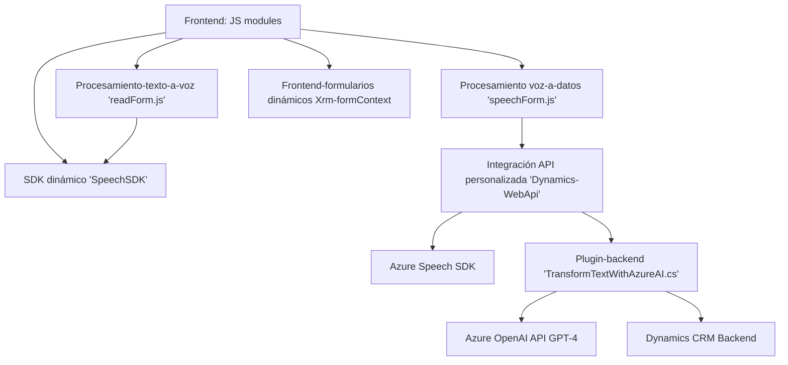

### Breve resumen técnico
El repositorio combina funcionalidad frontend y backend, orientada a la integración de servicios basados en inteligencia artificial y voz mediante Azure Speech SDK y Azure OpenAI API. Este código representa una solución híbrida que incluye:
- **Frontend**: Módulos de JS para procesamiento de formularios, síntesis de texto a voz, reconocimiento de voz, y mapeo entre datos y formularios.
- **Backend**: Plugin en C# para Dynamics CRM que interactúa con Azure OpenAI API para transformación avanzada de texto.

---

### Descripción de arquitectura
La arquitectura empleada parece ser **n-capas**, enfocada tanto en la separación lógica entre frontend y backend como en el manejo de servicios distribuidos. 
- **Frontend**: Módulos que interactúan con las APIs en tiempo real para habilitar capacidades inteligentes en Dynamics CRM.
  - Presenta una estructura modular basada en servicios, donde cada archivo JS actúa como un bloque especializado con funcionalidad independiente.
- **Backend**: El plugin cumple con los principios de extensibilidad mediante el estándar `IPlugin` de Dynamics CRM. Usa directamente servicios externos como Azure OpenAI y convierte datos en tiempo real, habilitando un flujo seamless entre usuario, CRM y los servicios de Azure.
- **Arquitectura distribuida**: Integración con SDK y APIs externas posiciona el diseño como un sistema distribuido orientado a eventos, donde las acciones del usuario (inputs, cambios en formularios) desencadenan procesos inteligentes basados en AI.

---

### Tecnologías usadas
1. **Frontend**:
   - [Azure Speech SDK](https://aka.ms/csspeech/sdk): Reconocimiento y síntesis de voz.
   - JavaScript: Para lógica de cliente, modularización, y dinámica de formularios en CRM.
   - Microsoft Dynamics CRM APIs (`Xrm.WebApi`): Interacción directa con el backend del CRM.
2. **Backend**:
   - C#
   - Framework .NET para la implementación de plugins.
   - `Microsoft.Xrm.Sdk`: Contexto para integración con Dynamics CRM.
   - [`HttpClient`](https://learn.microsoft.com/dotnet/api/system.net.http.httpclient): Consumo de servicios externos, como Azure OpenAI API.
   - JSON y librerías de deserialización, como `System.Text.Json` y `Newtonsoft.Json`.
   - Azure OpenAI API para transformar texto basado en GPT-4.
3. **Patrones arquitectónicos**:
   - Modularidad: Separación de funcionalidades por archivos, con clases y métodos bien definidos.
   - Event-driven architecture: Backend basado en eventos del sistema CRM y entrada/salida en tiempo real desde APIs.
   - Carga dinámica: El SDK de Azure Speech se importa solo cuando es necesario.

---

### Diagrama Mermaid válido para GitHub

---

### Conclusión final
Este repositorio es una solución híbrida diseñada para proporcionar capacidades avanzadas basadas en inteligencia artificial y voz en sistemas como Dynamics CRM. Utiliza varias tecnologías como Azure Speech SDK, Azure OpenAI API y Dynamics CRM para habilitar interacción auditiva y reconocimiento de texto. La arquitectura modular y de n-capas facilita su mantenimiento y escalabilidad en aplicaciones empresariales modernas.