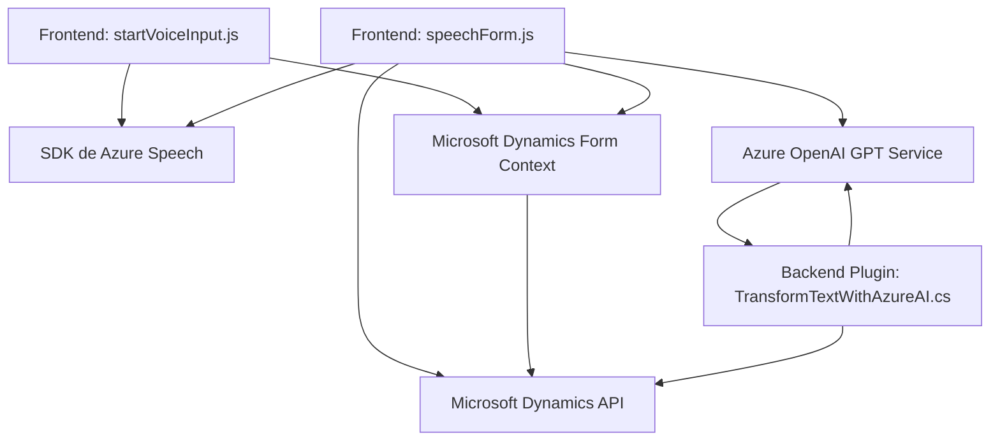

### Breve resumen técnico

El repositorio contiene archivos que implementan funcionalidades relacionadas con la integración de tecnologías de reconocimiento de voz, síntesis de texto a voz, y procesamiento de texto con IA dentro de escenarios de Microsoft Dynamics CRM. Las funciones están estructuradas en torno a dos módulos principales: un frontend basado en JavaScript para manejar el reconocimiento de voz y la síntesis, y un plugin de backend en C# que consume la API de Azure OpenAI para transformar texto en estructuras JSON.

---

### Descripción de arquitectura

#### Arquitectura General:
1. **Arquitectura de Integración:** El sistema parece estar diseñado como un conjunto de módulos complementarios en una solución Dynamics CRM, integrando servicios externos de Azure Speech SDK y Azure OpenAI.
2. **Frontend:** Interactúa con el formulario de Dynamics CRM mediante el objeto `executionContext` y proporciona capacidades basadas en voz (interacción) y síntesis de texto a voz.
3. **Backend:** El plugin (`IPlugin`) funciona como un microservicio server-side que transforma texto en estructuras JSON utilizando un modelo de IA hosted en Azure OpenAI API.
4. **Capacidades de integración:** Usa un enfoque desacoplado para consumir tecnologías externas, como el SDK de Azure para voz y la API de OpenAI.

#### Tipo de arquitectura predominante:
Podemos clasificarla como un **sistema "tradicional" de n capas orientado a integración**, en el que:
- El frontend maneja la entrada del usuario, el reconocimiento de voz y las interacciones visuales.
- El backend actúa como un middleware para integrar funcionalidades avanzadas, consumiendo servicios proporcionados por Microsoft Dynamics CRM y Azure Cloud (Speech y OpenAI).

---

### Tecnologías usadas

#### Lenguaje de programación
1. **JavaScript:** Utilizado para la creación de scripts frontend que interactúan con el formulario en Dynamics CRM.
2. **C# (.NET):** Implementación del plugin orientado al consumo de servicios en la nube (Azure OpenAI).

#### Frameworks y APIs
1. **Microsoft Dynamics SDK (Xrm):** Para actualizar y recuperar datos de formularios y entidades en Dynamics 365.
2. **Azure Speech SDK:** Para realizar reconocimiento de voz y síntesis de texto a voz.
3. **Azure OpenAI GPT Service:** Para transformar texto de entrada en datos estructurados (JSON).
4. **Newtonsoft.Json:** Aplicación en el plugin para manejar y procesar JSON.

#### Patrones arquitectónicos
1. **Modularización:** Código distribuido en funciones y clases autónomas agrupadas por responsabilidades (lectura de datos, síntesis de voz, interacción API).
2. **Cliente-Librería:** Uso de SDKs (Speech SDK y Dynamics SDK) para simplificar tareas específicas sin depender directamente de los protocolos de red.
3. **Facade para API externa:** Centralización del consumo de Azure OpenAI API.
4. **Callbacks:** Implementación de modelos asincrónicos para operaciones como la carga dinámica del SDK.

---

### Diagrama mermaid

---

### Conclusión final

Este repositorio implementa una solución funcional con enfoque en la interacción usuario-aplicación mediante tecnologías avanzadas de voz y IA. Está diseñado para integrarse directamente con formularios de Dynamics CRM, utilizando componentes frontend basados en JavaScript y un backend en C# como complementos de Dynamics 365. Su arquitectura de integración y uso de servicios externos como Azure Speech SDK y Azure OpenAI, hacen que sea una solución robusta pero dependiente de los servicios de Microsoft y Azure.

### Recomendaciones
1. **Gestión de configuraciones sensibles:** Aspectos como claves de API deberían almacenarse de manera segura en archivos de configuración cifrados o entornos administrados.
2. **Error Handling:** Sería ideal robustecer la gestión de excepciones, especialmente dentro del plugin, para tratar errores de comunicación con las APIs externas.
3. **Pruebas:** Considerar la implementación de pruebas unitarias tanto en el frontend como en el backend, especialmente para validar la interacción con Azure y Dynamics API.