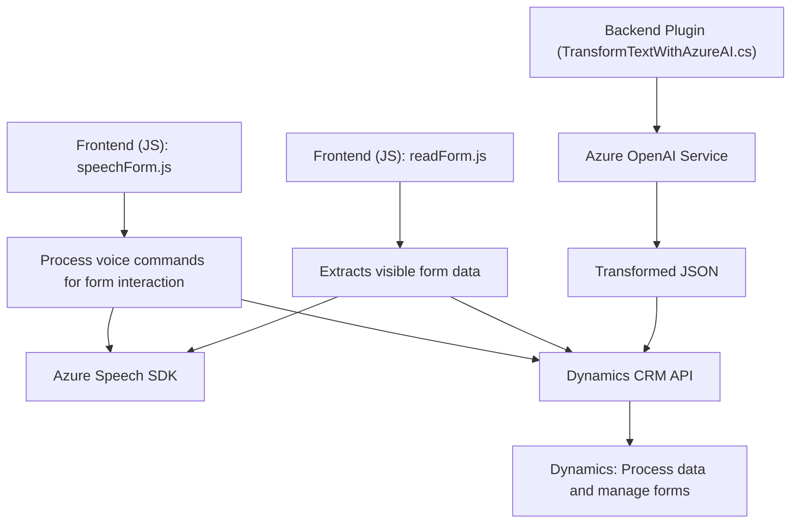

**Breve resumen técnico:**  
Este repositorio implementa una solución que integra Azure Speech SDK y Microsoft Dynamics CRM, con una funcionalidad centrada en mejorar la accesibilidad mediante la generación de audio desde datos del formulario y la entrada de comandos de voz para procesamiento. Además, incluye un plugin en C# que utiliza Azure OpenAI Service para transformar texto de forma avanzada.

---

### **Descripción de arquitectura:**  
La solución está segmentada principalmente en tres componentes:  
1. **Frontend en JavaScript**: 
   - Realiza la extracción de datos del formulario.
   - Interactúa con el servicio Azure Speech SDK para sintetizar texto a voz y procesar comandos por voz.
   - Facilita la interacción dinámica con la interfaz, incluyendo funciones de transcripción de voz a texto y generación de audio, además de integrarse con APIs internas de Dynamics CRM para mapear y completar campos de formularios.

2. **Backend en C#**:
   - Implementa un plugin para Dynamics CRM utilizando el framework de extensibilidad `IPlugin` de Microsoft.
   - Se enfoca en transformar texto con reglas específicas usando Azure OpenAI.

3. **Integración con servicios externos**:
   - Azure Speech SDK para síntesis de voz y reconocimiento de audio.
   - Azure OpenAI para la generación de transformaciones de texto.
   - Microsoft Dynamics CRM API (`Xrm.WebApi`) para interactuar con datos internos del sistema CRM.

### **Tecnologías, frameworks y patrones usados:**  
1. **Frontend (JavaScript):**  
   - **Azure Speech SDK:** Utilizado para síntesis de voz y reconocimiento de comandos de voz.  
   - **Callback Pattern:** Implementación de funciones asíncronas como `ensureSpeechSDKLoaded()` y manejo de promesas con APIs internas de Dynamics.  
   - **Lazy-load Pattern:** Carga dinámica del SDK cuando se necesita, optimizando la utilización de recursos.  
   - **Adaptador Pattern:** En las funciones del frontend, como `applyValueToField`, adaptan datos reconocidos por el SDK para aplicarlos al modelo de Dynamics.

2. **Backend (C# Plugin):**
   - **Dynamics CRM Plugin Framework (Microsoft.Xrm.Sdk):** Interacción directa con objetos del CRM como contexto de ejecución y servicios organizativos.  
   - **Azure OpenAI Service:** Transformación de texto mediante procesamiento basado en reglas usando HTTP para hacer solicitudes al endpoint de OpenAI.  
   - **Single Responsibility Principle:** Cada clase y método cumple con una responsabilidad bien definida. Por ejemplo: el método estático `GetOpenAIResponse()` solo se enfoca en la comunicación con Azure OpenAI Service.

3. **Generales:**
   - **REST API:** Uso de HTTP calls para interactuar con Azure Speech SDK y Azure OpenAI Service.  
   - **JSON Serialization:** Uso extensivo en comunicación entre los plugins y los servicios de IA.  

---

### **Tipo de arquitectura:**  
La solución utiliza una combinación de **arquitectura por capas** y **basada en servicios**:  
- El frontend sigue un enfoque modular con funciones dedicadas, como extracción de datos y entrada de voz.  
- La integración con Dynamics CRM y Azure OpenAI se basa en la **arquitectura de microservicios**, donde servicios específicos de terceros realizan tareas especializadas y se integran de forma desacoplada mediante APIs.  
- El backend C# implementa un **modelo plugin** para extender la funcionalidad nativa de Dynamics CRM.

---

### **Dependencias o componentes externos:**
1. **Azure Speech SDK:** Para síntesis de texto a voz y reconocimiento de voz.  
2. **Azure OpenAI Service**: Para procesamiento de texto y generación de resultados en formato JSON mediante la API de OpenAI.  
3. **Microsoft Dynamics CRM API (Xrm.WebApi)**: Para interactuar con datos y operaciones relacionadas con formularios y entidades del CRM.  
4. **JSON Parsing Libraries**: Uso de `System.Text.Json` y `Newtonsoft.Json`.

---

### **Diagrama Mermaid**  

---

### **Conclusión Final:**  
Este repositorio es un **modular hybrid solution** para interactuar con Microsoft Dynamics CRM mediante servicios externos como **Azure Speech SDK** (para reconocimiento de voz y síntesis) y **Azure OpenAI Service** (para transformación de texto).  

Aunque el frontend sigue un diseño basado en funciones modulares y utiliza patrones como lazy-load y adaptador, el backend sigue un enfoque orientado a plugins y servicios, formando una arquitectura de capas. La integración con servicios de IA y reconocimiento de voz demuestra un uso efectivo de herramientas de terceros para delegar tareas especializadas. Sin embargo, el diseño final podría optimizarse creando una interfaz común para la comunicación con servicios externos, reduciendo la dependencia explícita de cada componente.