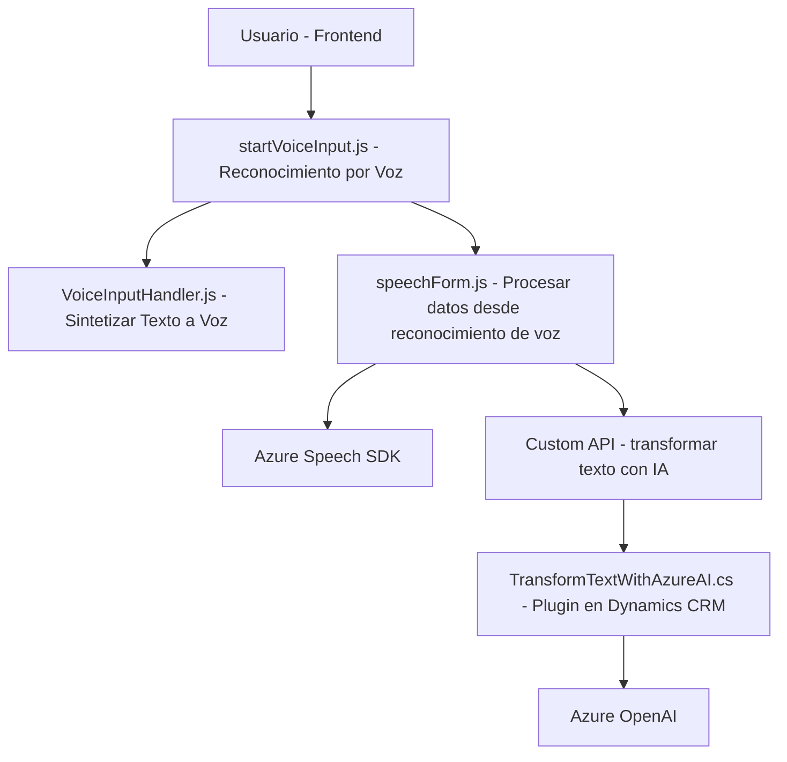

### Breve Resumen Técnico
El repositorio presenta tres bloques funcionales: un frontend basado en JavaScript para interacción por voz y síntesis de voz con Azure Speech SDK, un backend integrado como plugin de Dynamics CRM para procesamiento avanzado con Azure OpenAI, y una serie de APIs y servicios estratégicos que utilizan inteligencia artificial para optimizar la interacción usuario-sistema.

La solución busca mejorar la accesibilidad y capacidad de procesamiento de texto por voz en entornos Dynamics CRM, aprovechando el reconocimiento automático y transformación de datos mediante servicios Azure.

---

### Descripción de Arquitectura
La solución se basa en una **arquitectura de tres capas** (frontend, lógica de negocio y servicios externos) con fuerte dependencia de servicios externos como Azure Speech SDK y Azure OpenAI. El diseño presenta patrones bien definidos:

1. **Frontend modular**: Funciones específicas organizadas alrededor de tareas únicas (SRP - responsabilidad única) para manejo de voz y síntesis de texto.
2. **Lógica de negocio con plugin**: Plugin para Dynamics CRM implementado en .NET, interactuando con la API de OpenAI para transformación de texto.
3. **Integración basada en eventos**: Para el plugin en Dynamics CRM, la ejecución depende de eventos dentro del contexto del sistema.
4. **Dependencia de APIs externas**: Integración fuerte con servicios de Azure (Speech, OpenAI) para tareas específicas de reconocimiento, síntesis y procesamiento.

---

### Tecnologías Usadas
1. **Lenguajes y Plataformas**:
   - **JavaScript**: Para frontend e interacción con el navegador (SDK dinámico).
   - **C# .NET**: Plugin para lógica de negocio en Dynamics CRM.
2. **Frameworks y SDKS**:
   - **Azure Speech SDK**: Reconocimiento y síntesis de texto a voz.
   - **Dynamics CRM SDK**: Modelos, entidades y configuración de plugins dentro de CRM.
   - **Azure OpenAI**: Endpoint para procesamiento y transformación avanzada de texto en JSON.
3. **Dependencias adicionales**:
   - **Newtonsoft.Json**: Procesamiento de JSON en backend.
   - **System.Net.Http**: Comunicación HTTP con APIs externas en .NET.
   - **DOM y SDK dinámico**: Acceso a scripts cargados dinámicamente y contexto del navegador en frontend.

---

### Diagrama Mermaid

---

### Conclusión Final
El repositorio expone una solución integrada basada en accesibilidad y automatización mediante servicios por voz y procesamiento de texto. Utiliza una arquitectura de tres capas con integración estratégica de APIs externas (Azure Speech SDK y Azure OpenAI), alineada con el ecosistema de Dynamics CRM. 
Los patrones empleados (SRP, eventos y modularidad) indican una estructura robusta, aunque con una alta dependencia en servicios externos que podrían impactar la portabilidad de la solución.