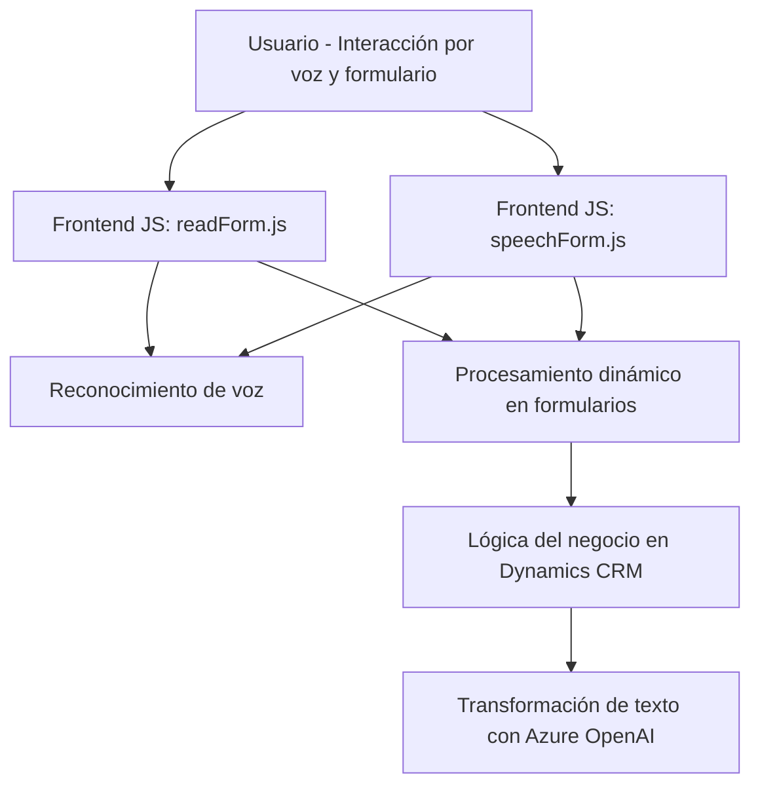

### Breve resumen técnico
El repositorio implementa una solución para integrar la funcionalidad de entrada de voz y transformación de texto utilizando servicios de Microsoft Azure (Speech y OpenAI) en formularios, probablemente destinados a aplicaciones de CRM dinámico como Microsoft Dynamics. Los módulos se distribuyen en archivos frontend en JavaScript y un plugin backend en C#.

---

### Descripción de arquitectura

La arquitectura es claramente **n capas**, compuesta principalmente por:
1. **Frontend (presentación)**: Módulos `readForm.js` y `speechForm.js`, que implementan funcionalidades para interactuar con usuarios mediante entrada de voz y procesamiento de formularios dinámicos.
2. **Backend (lógica de negocio)**: El plugin de Dynamics CRM en `TransformTextWithAzureAI.cs` realiza las transformaciones del texto usando Azure OpenAI y encapsula la lógica del negocio para integrarse con formularios, validaciones y reglas de Dynamics CRM.
3. **Dependencias externas (servicios)**: Azure Speech Services y Azure OpenAI se usan tanto en frontend como en backend para ofrecer funcionalidades de síntesis de voz, reconocimiento de voz y transformación de lenguaje.

La arquitectura es **orientada al servicio y modular**, aprovechando la extensibilidad de Dynamics CRM mediante plugins en backend y componentes frontend bien definidos para interacción.

---

### Tecnologías y frameworks usados

1. **Frontend**:
   - **JavaScript**: Lenguaje base para implementar interacciones dinámicas en navegadores.
   - **Azure Speech SDK**: Para síntesis y reconocimiento de voz.
   - **Dynamics CRM APIs** (`Xrm.WebApi`): Para operaciones con formularios en plataformas CRM.

2. **Backend**:
   - **C#**: Lenguaje de programación utilizado para implementar el plugin dentro del ecosistema de Dynamics CRM.
   - **Microsoft Dynamics SDK** (`IPlugin, Xrm.SDK`): Framework para desarrollar extensiones en Dynamics CRM.
   - **Azure OpenAI SDK**: Usado para realizar transformaciones de datos basadas en lenguaje natural.

3. **Patrones arquitectónicos**:
   - **SRP (Single Responsibility Principle)**: Cada componente del sistema tiene una función específica y se hace evidente mediante la modularización del código.
   - **Integración de API externa**: Interacción directa con Azure Speech Services y OpenAI para sintetizar y procesar datos.
   - **Estructura basada en eventos**: Callbacks para coordinar la carga de dependencias externas, como los SDKs de Azure, y para controlar la ejecución en sincronización con las respuestas de dichas APIs.

---

### Dependencias o componentes externos posibles

1. **API de Azure Speech Services**: Para entrada de voz, síntesis de texto a voz y reconocimiento de voz.
2. **Azure OpenAI API**: Para transformación de texto usando modelos de lenguaje como GPT.
3. **Microsoft Dynamics CRM APIs**:
   - `Xrm.WebApi`: Extensión de Dynamics para operaciones relacionadas con los formularios.
   - Plugin estándar de Dynamics que utiliza el patrón `IServiceProvider`.
4. **Bibliotecas externas**:
   - **Newtonsoft.Json**: Manipulación JSON en el lado backend (C#).
   - **System.Net.Http**: Realización de llamadas API en el plugin.

---

### Diagrama Mermaid

---

### Conclusión final

La solución presentada se orienta a integrar funcionalidades avanzadas de reconocimiento y síntesis de voz, así como transformación de texto mediante IA, en formularios dinámicos de Microsoft Dynamics CRM. Esto permite a los usuarios interactuar de forma más natural con sistemas CRM a través de APIs de Azure. La arquitectura sigue claramente un patrón de **n capas**, con independencia entre frontend, backend y servicios externos que aseguran modularidad y escalabilidad. 