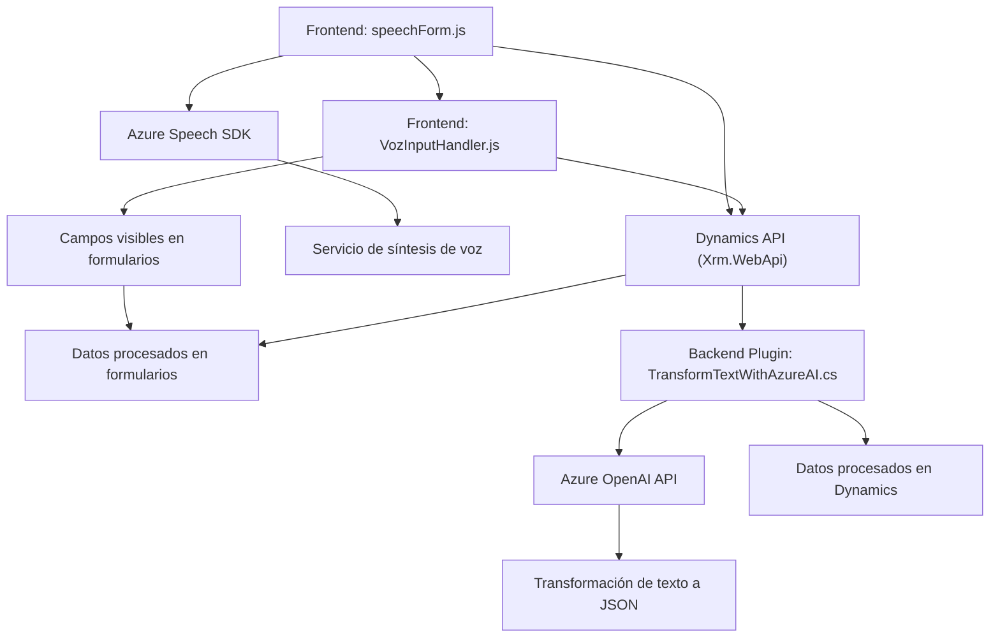

# Análisis del repositorio

## Breve resumen técnico

El repositorio presentado tiene componentes que abarcan funcionalidades para el procesamiento de voz y texto, tanto en un **sistema frontend (JavaScript)** como en un **plugin backend (C#)**. Está orientado a integrarse con Dynamics 365 y utiliza servicios de **Azure Speech SDK** y **Azure OpenAI**. Se emplea una arquitectura modular con integración de servicios externos.

---

## Descripción de arquitectura

La solución global presenta una arquitectura basada en **microservicios** y módulos distribuidos:

1. **Frontend (JavaScript):**
   - Se encarga de interactuar directamente con el usuario a través de formularios en Dynamics 365, procesando datos de voz (reconocimiento y síntesis) por medio de **Azure Speech SDK**.
   - Utiliza **DOM manipulation** y manejo asíncrono para actualizar atributos de los formularios.
   - Sigue una arquitectura basada en eventos y flujos asincrónicos.

2. **Plugin Backend (C#):**
   - Implementa un sistema interactivo que utiliza **Azure OpenAI API** para transformar texto de entrada según reglas específicas.
   - Aplica el patrón **Plugin-oriented Architecture** para integrarse eficientemente con Dynamics CRM backend.
   - Utiliza una metodología REST para realizar solicitudes HTTP con datos bien estructurados en formato JSON.

Esta configuración evita un diseño monolítico e implementa una separación lógica de responsabilidades.

---

## Tecnologías usadas

### **Frontend (JavaScript):**
1. **Core JS:** Manejo de lógica básica.
2. **Azure Speech SDK:** Integración con servicios de reconocimiento y síntesis de voz.
3. **Dynamics 365 APIs:** Manipulación de formularios en la interfaz del usuario.

### **Backend (C# - Plugin):**
1. **Microsoft.Xrm.Sdk:** SDK oficial para conectar plugins al ecosistema de Dynamics CRM.
2. **Azure OpenAI API:** Uso de servicios de inteligencia artificial para transformar texto.
3. **HTTP Clients:** Para procesamiento y comunicación con la API.

---

## Patrones y dependencias presentes

- **Frontend:**
  - Carga dinámica de dependencias: `ensureSpeechSDKLoaded`.
  - Interfaz asincrónica para comunicación con el servidor.
  - Encapsulación modular: Cada función tiene responsabilidades específicas.

- **Backend Plugin:**
  - Microfrontend/backend basado en plugins: Implementa la interfaz `IPlugin` de Dynamics CRM.
  - Usos optimizados de servicios REST (API externa de Azure OpenAI).
  - Validación estricta de datos antes de ejecutar servicios IA o aplicar transformaciones.

---

## Diagrama **Mermaid** compatible con **GitHub Markdown**

---

## Conclusión final

El repositorio presenta una solución multifuncional basada en integración entre **frontend**, **backend** y **servicios externos**. Las principales capacidades incluyen el procesamiento avanzado de voz (sintaxis y reconocimiento) y la interacción mediante comandos con formularios dinámicos en **Dynamics 365**, además de transformar textos mediante IA en el backend.

### Puntos destacados:
- **Diseño modular:** Asegura escalabilidad y mantenibilidad del código.
- **Tecnologías modernas (Azure Speech y OpenAI):** Favorecen la implementación de inteligencia artificial en el procesamiento de datos.
- **Adecuado para **Dynamics 365**:** Adopta prácticas óptimas de integración mediante estrategias como `Xrm.WebApi`.

### Recomendado para:
- Sistemas interactivos que enlacen inteligencia artificial y Dynamics.
- Aplicaciones que requieran procesamiento dinámico de datos en tiempo real.
