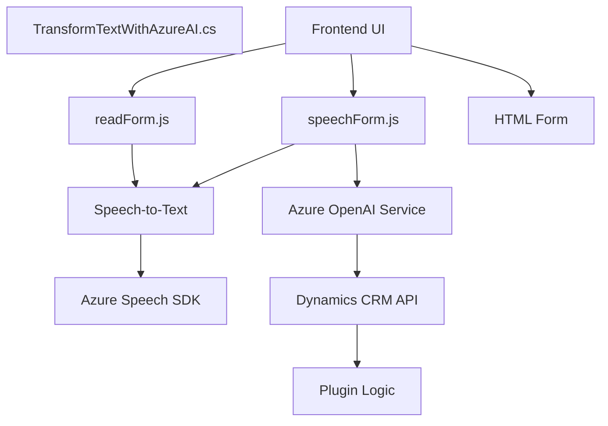

### Resumen Técnico
El repositorio contiene varios archivos que integran funcionalidades para el manejo de formularios en frontend y plugins en Microsoft Dynamics, conectando servicios externos como **Azure Speech SDK** y **Azure OpenAI**. La infraestructura combina interacción entre frontend y backend, con enfoque en usar IA para transcripción, síntesis y transformación de datos.

---

### Descripción de Arquitectura
La solución está orientada a la integración de servicios externos (IA y reconocimiento de voz) con formularios dinámicos en una aplicación. Aunque los archivos están separados, el diseño sugiere una **arquitectura modular** basada en **capas lógicas**:
1. **Frontend Layer**: 
   - `readForm.js` y `speechForm.js` gestionan tareas de síntesis y reconocimiento de voz en el cliente.
   - Se hace integración directa con SDKs, APIs externas y servicios de formularios.
2. **Backend Layer**: 
   - `TransformTextWithAzureAI.cs` como plugin en Dynamics CRM actúa como intermediario para el procesamiento avanzado mediante OpenAI.
   - Backend opera bajo eventos con el **patrón de diseño basado en eventos** típico de Dynamics CRM, generalizando la entrada y salida de datos.

La arquitectura tiene aspectos de **arquitectura de n capas** en términos de separación de responsabilidades, pero también elementos **modulares**, con cada archivo diseñado para cumplir funciones específicas dentro del contexto global.

---

### Tecnologías Usadas
1. **Frontend**:
   - **JavaScript**: Para manipulación de DOM, lógica y SDK.
   - **Azure Speech SDK**: Para síntesis y reconocimiento de voz.
   - Uso de promesas y dinamismo (dependencias cargadas en tiempo de ejecución).
2. **Backend**:
   - **C#**: Para escribir el plugin.
   - **Microsoft Dynamics CRM SDK**: Para interacción directa con el sistema CRM.
   - **Azure OpenAI Service**: Para transformación del texto usando IA.
   - **HTTP Services**: Para llamadas REST al API externo.
3. **Infraestructura externa**:
   - **Azure Speech API**: Integración directa mediante SDK.
   - **Azure OpenAI Service**: Procesamiento avanzado de texto.

---

### Diagrama **Mermaid**

---

### Conclusión Final
El proyecto implementa una solución de **gestión de formularios interactiva** y **procesamiento avanzado de voz y texto basada en servicios de Microsoft Azure**. La arquitectura combina patrones de **n capas** y modularidad, con una fuerte dependencia en **servicios externos como Azure Speech SDK y Azure OpenAI Service**. Esto garantiza flexibilidad, pero también hace que el sistema dependa con fuerza de la disponibilidad de estos servicios.