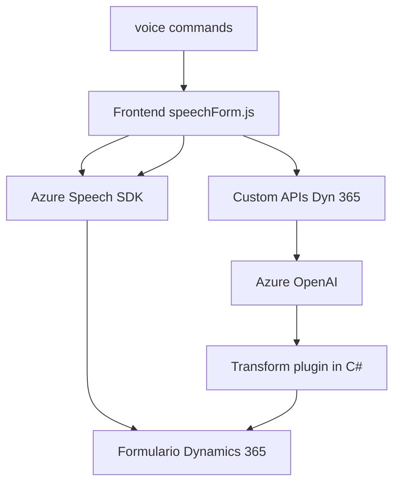

# Breve resumen técnico
Este repositorio contiene archivos que implementan funcionalidad específica para integrar capacidades de reconocimiento y síntesis de voz (mediante Azure Speech SDK) y procesamiento semántico (con Azure OpenAI API) dentro de un sistema CRM, específicamente Dynamics 365. Hay un enfoque modular con servicios y plugins para transformar datos en formularios utilizando voz e inteligencia artificial.

# Descripción de arquitectura

La arquitectura evidencia una orientación hacia un patrón **multi-capa**:
1. **Capa de presentación**: Los archivos `readForm.js` y `speechForm.js` procesan datos de voz e interactúan directamente con los usuarios y el entorno del formulario en Dynamics 365.
2. **Capa de negocio**: El plugin `TransformTextWithAzureAI.cs` encapsula lógica de negocio avanzada, validando inputs y aplicando normas específicas de procesamiento de texto mediante un servicio externo (Azure OpenAI API).
3. **Capa integradora**: Integración directa con servicios externos como Azure Speech SDK y Azure OpenAI, en paralelo con APIs personalizadas del entorno de Dynamics 365.
4. **Patrón Plugin Design** en Dynamics CRM: Utilizado para la extensión del flujo operativo y transformación de datos.

# Tecnologías usadas
**Frontend y Dynamics 365**:
- **JavaScript**: Para la implementación en cliente y formularios de Dynamics 365 (`readForm.js`, `speechForm.js`). 
- **Azure Speech SDK**: Reconocimiento y síntesis de voz.
- **Dynamics 365 (Xrm.WebApi)**: Gestión de entidades y servicios.

**Backend plugin**:
- **C#**: Base para la codificación del plugin (`TransformTextWithAzureAI.cs`).
- **Azure OpenAI API (GPT-4o)**: Procesamiento semántico y transformación de texto.
- **System.Net.Http** para invocaciones a servicios externos.
- **System.Text.Json** para manipulación de objetos JSON.

**General Architecture**:
- **Event-driven Design**: Procesos asincrónicos impulsados por eventos, como el inicio de reconocimiento de voz y la carga dinámica de SDK.
- **Integration via SDKs/APIs**: Uso de servicios externos (Azure Speech SDK y OpenAI API) y métodos internos del entorno de Dynamics CRM.

# Diagrama Mermaid

# Conclusión final
Este repositorio representa una solución monolítica extendida con integración de servicios externos, diseñada específicamente para formularios de Dynamics 365. Utiliza Azure Speech SDK para síntesis y reconocimiento de voz y Azure OpenAI para inteligencia artificial. El diseño enfatiza encapsulación lógica y modularidad, con enfoque en la integración dinámica vía APIs, lo cual lo hace escalable y adaptable a otros entornos relacionados con CRM y automatización procesal.