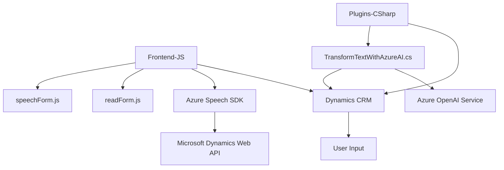

### Breve resumen técnico:

El repositorio es un proyecto orientado a mejorar la interacción y gestión de datos mediante tecnologías de voz y procesamiento de lenguaje natural en formularios vinculados a Dynamics CRM. Combina un frontend en JavaScript, integraciones con SDKs de Microsoft (Azure Speech y OpenAI), y plugins en C# para extender funcionalidades en un sistema CRM. El proyecto implementa procesos de síntesis y reconocimiento de voz, procesamiento de transcripciones, y transformaciones de texto con inteligencia artificial.

---

### Descripción de arquitectura:

La arquitectura del proyecto presenta las siguientes características:
1. **N-capas/Microservicio desacoplado**:
   - **Frontend**: Implemente capacidades como síntesis y reconocimiento de voz mediante una serie de módulos y funciones (archivo `readForm.js`, `speechForm.js`) dentro del contexto del navegador. Esto interactúa con dependencias del SDK de Microsoft Azure.
   - **Plugin CRM (Backend)**: Extiende capacidades del sistema Dynamics CRM implementando lógica de negocio para normalización de texto y transformación utilizando el servicio Azure OpenAI. Es compatible con los patrones de Dynamics Plug-ins.
   
   Aunque varios componentes están separados, la arquitectura puede definirse como una solución orientada a microservicios, con comunicación entre frontend y backends mediante servicios externos como Azure API.

2. **Estilo basado en materiales SDK/API**:
   Utiliza SDKs y APIs externas (Azure Speech SDK y Dynamics Web API) como mecanismos para estructurar las interacciones entre módulos.

---

### Tecnologías usadas:

- **JavaScript (Frontend)**:
  - Cargado dinámicamente en el navegador.
  - Integración directa con **Azure Speech SDK** para síntesis y reconocimiento de voz.

- **C# (Backend)**:
  - Plugin para Dynamics CRM que utiliza:
    - **Azure OpenAI Service**: Para procesamiento avanzado de texto.
    - **Dynamics SDK (Microsoft.Xrm.Sdk)**: Para integrarse al sistema CRM del cliente.
    - **System.Net.Http**: Para realizar llamadas REST.
    - **System.Text.Json**: Para manejo de estructuras JSON.

- **Servicios externos**:
  - **Azure Speech SDK**: Reconocimiento de voz y síntesis verbal.
  - **Azure OpenAI Service**: Integración con modelos GPT para entendimiento de texto.
  - **Dynamics Web API**: API de Dynamics CRM para gestión de datos.

---

### Diagrama Mermaid válido para GitHub:

---

### Conclusión final:

La solución presentada en el repositorio sigue una estructura orientada a servicios con módulos desacoplados. En el frontend, funcionalidades como reconocimiento y síntesis de voz interactúan directamente con formularios. El backend, en varios plugins, utiliza los servicios de Dynamics CRM y de Azure OpenAI para realizar procesamiento avanzado. Este diseño permite una fácil adaptación en escenarios que requieran voz como entrada o procesamiento de texto en inteligencia artificial. 

Se recomienda adoptar mecanismos más robustos de manejo de secretos (como Azure Key Vault) y una arquitectura más profundamente desacoplada si el proyecto escala.