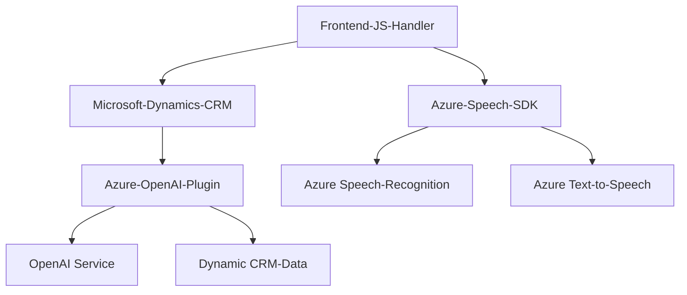

### Breve resumen técnico
El análisis del repositorio GitHub indica que este proyecto está orientado a una solución integrada destinada al reconocimiento de voz y conversión de texto (para interfaces de usuario como formularios) en el contexto de aplicaciones web. También incluye un plugin que utiliza Azure OpenAI para enriquecer los datos mediante transformaciones avanzadas de texto. Está construido sobre Microsoft Dynamics CRM y utiliza servicios de Azure (Azure Speech SDK y Azure OpenAI).

---

### Descripción de arquitectura
El proyecto sigue una arquitectura **n-capas** debido a la separación lógica de responsabilidades:
1. **Frontend:** Cuenta con scripts en JavaScript que operan en el navegador y tienen la capacidad de interactuar con servicios externos como Azure Speech SDK.
2. **Backend:** Un plugin implementado en C# que extiende la funcionalidad de Dynamics CRM. Este plugin utiliza una arquitectura basada en capas: capa de lógica de negocio (donde hace la transformación del texto usando Azure OpenAI) y capa de datos (interacción con Dynamics CRM para obtener y manipular información).
3. **Servicios externos:** Se integra con dos servicios de Azure: Speech SDK para síntesis/reconocimientos de voz, y OpenAI para transformaciones de texto.

La solución combina patrones modernos de integración de servicios y buena separación de responsabilidades mediante arquitecturas modulares.

---

### Tecnologías usadas
1. **Frontend:**
   - **JavaScript**: Utilizado para manejar eventos del usuario, DOM y formularios.
   - **Azure Speech SDK**: Carga dinámica para síntesis y reconocimiento de voz. Script: `https://aka.ms/csspeech/jsbrowserpackageraw`.
   - **Microsoft Dynamics Framework/Xrm.WebApi**: Para interactuar con formularios de Dynamics CRM desde JavaScript.
   - **Patterns**:
     - Modular Programming.
     - Callback/Promise-driven asynchronous programming.
     - Practices for accessibility via voice interaction.

2. **Backend:**
   - **C# (.NET Framework)**: Desarrollo del plugin convencional para Dynamics CRM.
   - **Azure OpenAI**: Procesamiento del texto mediante HTTP requests para obtener respuestas JSON estructuradas.
   - **Microsoft.Xrm.Sdk**: Para extender y manipular la funcionalidad del CRM.
   - **Newtonsoft.Json**: Para procesar respuestas JSON y realizar transformaciones de datos.
   - **HTTP Client Consumption Pattern**: Manejo dinámico de solicitudes HTTP para integrar servicios externos.

---

### Diagrama **Mermaid**

---

### Conclusión final
Este proyecto se puede catalogar como una integración de tecnologías para la mejora de accesibilidad y automatización mediante una **solución híbrida**. Consta de varias capas claras:
1. **Fronted web (JavaScript) dinámica**, especializada en reconocimiento y síntesis de voz.
2. **Backend (C# plugin)** que aprovecha servicios de Azure OpenAI y Dynamics CRM para procesar y almacenar datos.
3. **Servicios externos (Azure Speech SDK y OpenAI).**

La arquitectura es **n-capas** con una orientación moderna que combina servicios externos y patrones de diseño como Modular Programming, External SDK Integration, y Dynamic API Consumption. Es ideal para aplicaciones con accesibilidad mejorada y procesamiento de datos avanzado, aunque requiere configuración externa y una dependencia fuerte en servicios de Microsoft Azure.