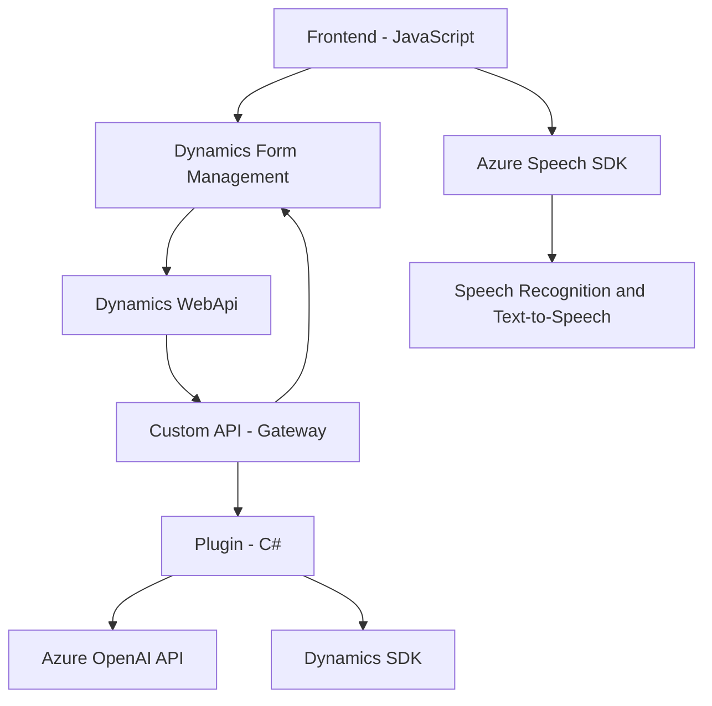

### **Análisis Técnico**

#### **Breve Resumen Técnico**
Este repositorio contiene implementaciones relacionadas con la interacción de voz, procesamiento inteligente y manipulación de formularios en Microsoft Dynamics 365 integrándose con servicios de Azure. Los componentes se dividen en archivos frontend JavaScript y un plugin C#, siguiendo patrones diseñados para gestionar datos, trabajar con APIs externas y optimizar parámetros de entrada por voz.

---

### **Descripción de Arquitectura**
La solución tiene una arquitectura **n-capas híbrida** donde:
1. **Frontend JavaScript**: Administra lógicas que interactúan directamente con los formularios de Dynamics 365 y realiza síntesis y reconocimiento de voz con el Azure Speech SDK.
2. **Backend Plugin (C#)**: Amplía las capacidades del servidor Dynamics 365 mediante un plugin integrado en la plataforma, que realiza procesamiento adicional de texto usando la API de OpenAI.

Este diseño fomenta la modularidad y el desacoplamiento mediante:
- **Frontend Layer**: Implementa la lógica de interacción del usuario mediante la voz, administración de datos de formularios y transmisión de datos procesados a través de API.
- **Middleware Layer**: Usa Dynamics Custom APIs como punto central para el procesamiento (una especie de API Gateway).
- **Azure Integration Layer**: Consume servicios como Azure Speech SDK y Azure OpenAI API para tareas específicas, conectando microfuncionalidades en una solución global.

---

### **Tecnologías y Técnicas Usadas**
1. **Frontend**
   - Desarrollo en **JavaScript**.
   - Consumo de **Azure Speech SDK** para reconocimiento y síntesis de voz.
   - Interacción con formularios web en **Dynamics 365**.
   - Uso de AJAX y objetos nativos **WebApi** para transmisión de datos al backend.

2. **Backend**
   - **C#** como lenguaje para desarrollar plugins de Dynamics.
   - Biblioteca **Microsoft.Xrm.Sdk** para extensiones nativas de Dynamics.
   - Consumo de **Azure OpenAI API** para procesamiento avanzado de texto.
   - Uso de **System.Net.Http** para llamadas HTTP y patrones asíncronos.

3. **Patrones Arquitectónicos**
   - Modularidad funcional basada en **lógica procedural** para el frontend.
   - **Plugin-based design** en Dynamics CRM usando extensiones nativas como `IPlugin`.
   - Acoplamiento con SDKs externos (Azure Speech y OpenAI).
   - Patrones de **Facade API** y **Gateway** para integraciones externas mediante APIs personalizadas.

---

### **Dependencias o Componentes Externos**
1. **Azure Speech SDK**: Usado en JavaScript para textos por voz y síntesis.
2. **Azure OpenAI API**: Usado en el plugin C# para ejecutar transformaciones de texto.
3. **Dynamics Web API**: Invocado desde el frontend para interacción con sistemas internos como consultas y operaciones de registros.
4. **Servicios Microsoft Dynamics API Gateway**: Personalizable para consumir otras APIs internas o servicios en Dynamics.

---

### **Diagrama Mermaid**

---

### **Conclusión Final**
La solución combina tecnologías frontend (JavaScript) y backend (C#) diseñadas para interactuar con Dynamics CRM, ofreciendo una experiencia de usuario moderna mediante entrada de voz y manipulaciones inteligentes de formularios. Su estructura modular facilita la integración con servicios externos como Azure Speech y OpenAI, pero también introduce riesgos de dependencia y seguridad, como el manejo de claves API directamente en el código.

#### **Fortalezas**
- Uso de SDKs especializados para resolver problemas de UI/UX y procesamiento de datos.
- Modularidad en funciones, permitiendo un desarrollo incremental.

#### **Debilidades**
- Excesiva dependencia de servicios de Azure (relativo en términos de portabilidad).
- Falta de mecanismos avanzados de seguridad como encriptación de claves o tiempos expuestos en el SDK.

Este diseño es adecuado para soluciones orientadas al consumidor final o integraciones específicas en entornos de trabajo con Dynamics completando tareas modernas y específicas como manipulación de voz.