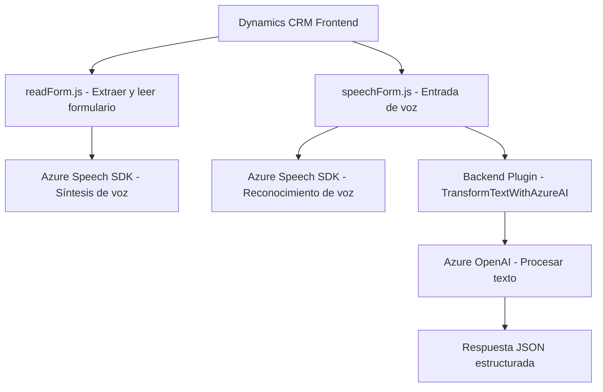

### Breve resumen técnico
Este repositorio encapsula funcionalidades ligadas a la integración entre formularios específicos en Dynamics CRM y servicios en la nube, como **Azure Speech SDK** y **Azure OpenAI**. Los componentes principales son scripts frontend para procesamiento de voz y un plugin backend que transforma datos en lenguaje natural mediante inteligencia artificial.

---

### Descripción de arquitectura
1. **Tipo de solución:**  
   Principalmente un sistema híbrido **API—Frontend—Plugin**, diseñado para enriquecer funcionalidades de Dynamics CRM. Implementa capacidad de entrada y salida de datos por voz en la capa cliente y procesamiento avanzado de texto con IA en la capa backend.

2. **Patrones aplicados:**  
   - **Patrón mediador (Dynamics CRM):** Usa el contexto del formulario como intermediario para gestionar la interacción entre el código y los datos del CRM.  
   - **Integración con SDK externo:** Los scripts cargan dinámicamente dependencias como Azure Speech SDK, optimizando recursos.  
   - **Cascada funcional separada:** Utiliza flujos unidireccionales claras: entrada de datos por voz, procesamiento de IA y actualización de formularios.  

3. **Tipo de arquitectura:**  
   **Hexagonal orientada a servicios**:
   - **Clientes y adaptadores:** Scripts frontend actúan como clientes que interactúan con el usuario y los servicios de Speech/IA.  
   - **Core:** El plugin en `TransformTextWithAzureAI.cs` maneja procesamiento en el backend.  
   - **Puertos:** APIs externas y contextos del formulario actúan como interfaces hacia servicios externos.

---

### Tecnologías usadas
1. **Frontend**:
   - **JavaScript**: Gestión de lógica de formularios y procesamiento de voz.
   - **Azure Speech SDK**: Reconocimiento de voz y síntesis de texto a audio.

2. **Backend**:
   - **C# y Dynamics SDK**: Plugin CRM basado en Microsoft.Xrm.Sdk.
   - **Azure OpenAI**: Procesamiento de texto estructurado con inteligencia artificial.
   - **Newtonsoft.Json**: Manipulación JSON.
   - **System.Net.Http**: Comunicación HTTP con APIs externas.

3. **Dependencias adicionales**:  
   - APIs y servicios externalizados:
     - Azure Speech (`aka.ms/csspeech/jsbrowserpackageraw`).
     - Azure OpenAI para análisis de texto.

---

### Diagrama Mermaid válido para GitHub Markdown

---

### Conclusión final
El repositorio implementa una solución completa para enriquecer Dynamics CRM con integración de voz e inteligencia artificial. La arquitectura híbrida se basa en dos capas principales: **Frontend**, que maneja la entrada y salida de datos con SDKs de Azure, y **Backend**, que procesa texto mediante un plugin que consume Azure OpenAI. Se aprecia una separación funcional clara mediante una arquitectura hexagonal orientada a servicios externos.

La integración dinámica de dependencias como Speech SDK y las capacidades de transformación de texto demuestran un enfoque ligero y modular. No obstante, sería recomendable mejorar la seguridad del plugin mediante el encriptado de credenciales y realizar pruebas para asegurar la carga eficiente de librerías en clientes con recursos limitados.