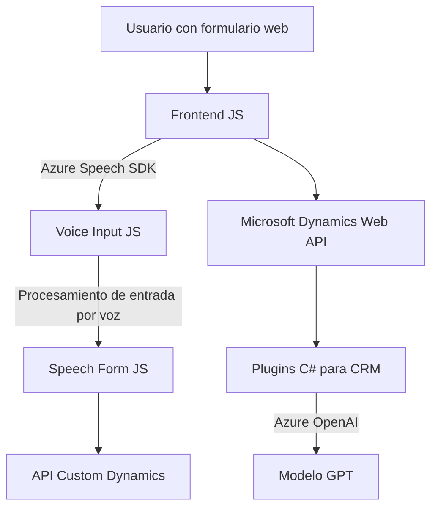

### Breve Resumen Técnico

El repositorio implica una solución de software con integración entre un frontend basado en JavaScript y un sistema backend de plugins personalizados para Microsoft Dynamics CRM. Adicionalmente, se incluye un servicio de inteligencia artificial mediante Azure OpenAI y reconocimiento de voz mediante Azure Speech SDK.

---

### Descripción de la Arquitectura

La solución refleja una arquitectura **multicapa** con componentes claramente diferenciados:

1. **Capa de frontend**:
   - Consiste en archivos de JavaScript que actúan como interfase entre el usuario y el sistema.
   - Estos archivos gestionan tanto la interacción de los formularios como el procesamiento de entrada basada en voz, una característica avanzada proporcionada por el SDK de Azure Speech.
   - Aplica un enfoque modular, programación orientada a funciones, separación de responsabilidades y adopta patrones como adaptador y cliente-servidor.

2. **Capa de backend**:
   - Plugins basados en C# se ejecutan en el contexto de Dynamics CRM para extender la lógica del sistema.
   - Implementan integraciones directas con Azure OpenAI para transformación avanzada de texto; este componente es fundamental para interactuar con el modelo de GPT alojado en Azure.
   - Utilizan patrones estándares como el patrón Factory para servicios del sistema, y el patrón de consumo de APIs externas.

En conjunto, esta solución une un **frontend** dinámico con un **backend** extensible. La interacción entre servicios y las características de procesamiento de voz e inteligencia artificial sugiere un diseño que no corresponde a un monolito, sino a un enfoque orientado a **n capas**.

---

### Tecnologías Utilizadas

1. **Frontend**:
   - **JavaScript**: El principal lenguaje para la capa cliente.
   - **Azure Speech SDK**: Para procesamiento de voz (síntesis y reconocimiento).
   - **Microsoft Dynamics Web API**: Para interacción con el backend del sistema.

2. **Plugins Backend (C#)**:
   - **Microsoft Dynamics SDK**: Para manipulación de datos en el contexto de Dynamics CRM.
   - **Azure OpenAI**: Para transformación de texto a objeto JSON mediante GPT en un endpoint API.
   - **HTTP Client**: Usado para comunicación REST con Azure OpenAI.
   - **JSON Handling Libraries**:
     - `System.Text.Json` y `Newtonsoft.Json.Linq` para serialización/deserialización dinámica.

---

### Dependencias y Componentes Externos

Algunas dependencias clave incluyen:
- **Azure Speech SDK**: Soporte para síntesis y reconocimiento de voz en tiempo real en el frontend.
- **Microsoft Dynamics SDK**: Para interacción con datos de CRM.
- **Azure OpenAI**: Procesamiento avanzado de texto con GPT.
- **Xrm.WebApi.online**: Cliente integrado para acceder a la API personalizada desde el frontend hacia el backend.
- **Bibliotecas de JSON**: Dinámicas para manipulación de objetos JSON complejos en el backend.

Además, el uso de carga dinámica de dependencias optimiza el rendimiento dependiendo del contexto y reduce el peso inicial de las aplicaciones en el frontend.

---

### Diagrama Mermaid

---

### Conclusión Final

La solución presentada es un sistema robusto de múltiples capas que facilita la interacción entre un frontend (formulario web y entrada por voz) y un backend extensible basado en Microsoft Dynamics CRM. Algunas características importantes son:

1. **Frontend**:
   - Permite interacción avanzada por sintetización y reconocimiento de voz con Azure Speech SDK.
   - Modularidad y separación de responsabilidades en el manejo de formularios y la integración con APIs.

2. **Backend**:
   - Plugins personalizados que amplían la lógica comercial en Dynamics CRM.
   - Integración con servicios avanzados de OpenAI en Azure para transformar textos.

La arquitectura tiene un diseño bien estructurado, que aprovecha las capacidades de servicios cloud como Azure para proporcionar funcionalidades modernas de inteligencia artificial y procesamiento de voz.