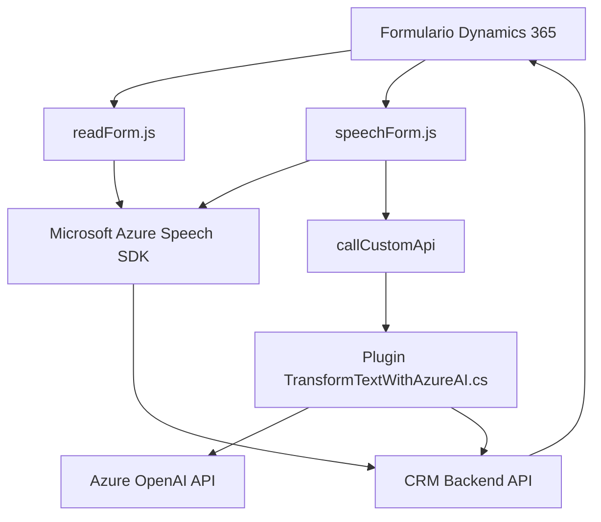

### **Breve resumen técnico**
El repositorio muestra una solución que abarca una interacción avanzada con un sistema CRM (Dynamics 365), integrando funcionalidades de entrada y procesamiento de voz, junto con un plugin para transformación de textos mediante Azure OpenAI y Speech SDK. La solución apunta a mejorar la accesibilidad y el flujo de trabajo dentro de Dynamics 365.

---

### **Descripción de arquitectura**
1. **Arquitectura de la solución:**
   - **Frontend:** Scripts JavaScript (como `readForm.js` y `speechForm.js`) procesan voz y datos del formulario, integrándose con el SDK de Microsoft Azure Speech para entrada y síntesis de voz.
   - **Backend:** Plugin basado en C# (`TransformTextWithAzureAI.cs`) para transformación avanzada de textos vía Azure OpenAI y manipulación de datos almacenados en Dynamics 365.
   - El diseño se divide en dos capas principales:
     - **Interfaz de usuario (Front-End):** Scripts que interactúan con formularios y usuarios.
     - **Servicios (Back-End):** Plugin en Dynamics CRM que utiliza APIs externas para procesamiento avanzado.

2. **Tipos de arquitectura:**
   - Sistema distribuido basado en **n-capas**: Frontend para usuarios, backend acoplado a Dynamics 365 gestionando lógica empresarial y comunicación con APIs externas (Azure OpenAI, Azure Speech SDK).
   - Elementos de **hexagonal architecture** o **ports and adapters** en el plugin C#: La dependencia directa de APIs externas (como Azure OpenAI) se maneja mediante adaptadores bien definidos.

---

### **Tecnologías usadas**
1. **Frontend:**
   - **JavaScript:** Lenguaje base para los scripts de procesamiento de voz y manipulación de formularios. Alta modularidad en funciones.
   - **Azure Speech SDK:** Para interacción con servicios de voz (entrada y síntesis). Uso del SDK a través de script dinámico desde Microsoft (`https://aka.ms/csspeech/jsbrowserpackageraw`).

2. **Backend:**
   - **C#:** Implementación del plugin en Dynamics CRM.
   - **Azure OpenAI API:** Usado para transformación de textos y generación de JSON.
   - **Microsoft Dynamics SDK:** Biblioteca para interactuar con la lógica empresarial y bases de datos CRM.
   - **System.Net.Http:** Para peticiones HTTP hacia Azure.

3. **Patrones observados:**
   - **Modularidad funcional:** Separación de funciones por responsabilidad específica mencionada tanto en Frontend como Backend.
   - **Callbacks y Promessas:** Manejo asincrónico en JavaScript (Frontend) y peticiones HTTP en el plugin.
   - **Integration Pattern:** Comunicación con APIs externas (Azure Speech y OpenAI en ambos niveles).
   - **Plugin Pattern en Dynamics CRM:** Uso de la interfaz `IPlugin` para extender la funcionalidad nativa del CRM.

---

### **Diagrama Mermaid**

---

### **Conclusión final**
La solución diseñada integra tecnologías avanzadas como Azure Speech SDK y Azure OpenAI para mejorar la interacción con formularios en Dynamics 365, mediante voz y transformación avanzada de texto. La arquitectura del proyecto combina elementos de n-capas y patrones hexagonales, siendo altamente extensible y escalable para entornos corporativos. Los módulos de frontend manejan accesibilidad y el plugin backend se encarga del procesamiento con IA, logrando un flujo eficiente entre usuario, servicios externos y lógica empresarial.