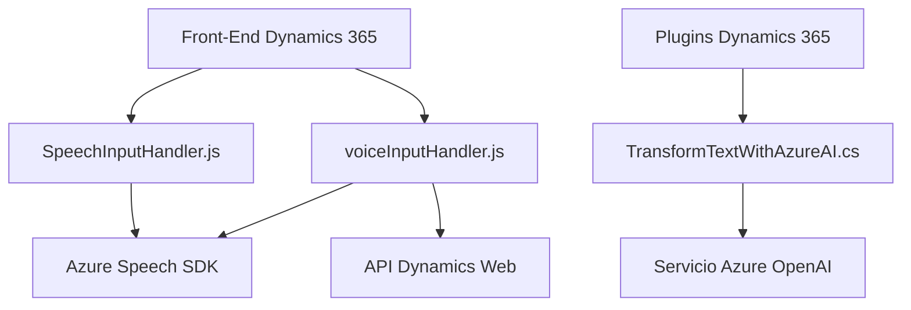

### Resumen Técnico

El repositorio tiene tres principales áreas funcionales:
1. **Front-End**: Scripts de JavaScript para formularios en Dynamics 365 que realizan interacción con los usuarios a través de voz (Azure Speech SDK).
2. **Integración de Voz**: Implementación en Dynamics 365 con entrada y procesamiento de voz que emplea APIs externas, incluyendo reconocimientos automáticos de voz y procesamiento por IA.
3. **Plugin Back-End**: Un plugin que interactúa con Dynamics 365 y usa el servicio Azure OpenAI para transformar texto según reglas definidas.

### Descripción de Arquitectura

La solución combina diferentes componentes organizados en una arquitectura **mixta de Microservicios con integración SOA (Arquitectura Orientada a Servicios)**:
- Los scripts del front-end se centran en la interacción con el usuario mediante SDKs externos.
- El procesamiento de voz se incrementa mediante APIs personalizadas para operaciones complejas (por ejemplo, reconocimiento de campos y comandos por IA).
- El plugin en el back-end maneja transformaciones avanzadas de texto con Azure OpenAI, actuando como un microservicio orientado a procesamiento.

La estructura está pensada para operar en el **ecosistema Dynamics CRM**, lo que centraliza el almacenamiento y gestión de datos conectando servicios externos con el contexto CRM.

### Tecnologías Usadas

1. **En Front-End:**
   - Azure Speech SDK: Para síntesis y reconocimiento de voz.
   - Dynamics 365 APIs (`Xrm.WebApi`): Para interacción directa con los formularios en Dynamics CRM.

2. **En el Plugin Back-End:**
   - Microsoft Dynamics SDK: Integración con el ecosistema CRM.
   - Azure OpenAI: Servicios cognitivos para procesamiento de texto.
   - .NET Framework: Implementación en C# con dependencias clásicas (`System.Net.Http`, `System.Text.Json`).

3. **Patrones de Software:**
   - **Modularización Funcional:** Scripts en JavaScript dividen claramente tareas básicas como transcripción, lectura y síntesis.
   - **Carga Condicional de SDK:** En JavaScript se usa un patrón para verificar dinámicamente la carga del SDK requerido antes de ejecutar la lógica de procesamiento.
   - **Plugin-Based Architecture:** En C#, los plugins extienden las capacidades del CRM mediante interfaces predefinidas (`IPlugin`).
   - **Service-Oriented Architecture:** La interacción con servicios externos (Azure OpenAI y Speech SDK) depende del estilo HTTP RESTful.

### Diagrama Mermaid

### Conclusión Final

Esta solución está orientada a **capacidades de voz e IA en el ecosistema Dynamics 365**, aprovechando servicios de Azure para ampliar las interacciones y realizar transformaciones avanzadas. La arquitectura diseña componentes independientes y extensibles, como microservicios funcionales (plugin y APIs integradas), junto con un front-end modularizado que asegura una integración dinámica con SDKs. Aunque robusta, su dependencia de servicios externos implica que su funcionamiento está altamente ligado al nivel de disponibilidad de la infraestructura Azure.