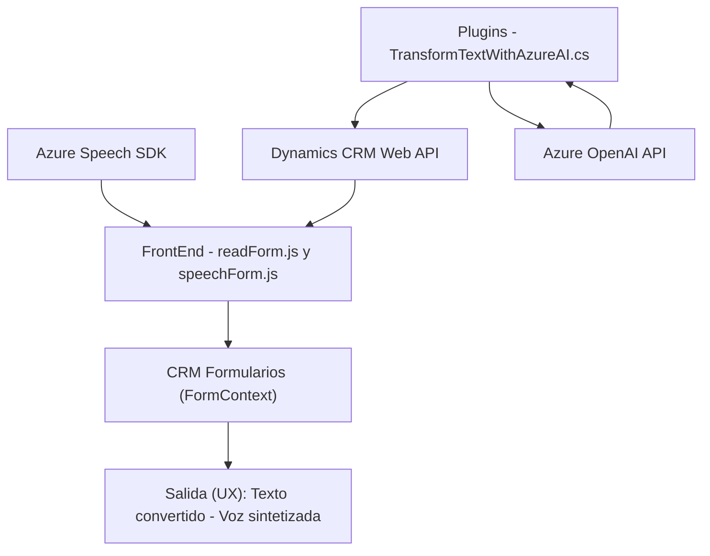

### Breve resumen técnico:
El repositorio contiene varios archivos orientados a la interacción entre una interfaz de usuario (pensada para un CRM) y el servicio externo de Microsoft Azure. La solución se centra en:

1. **FrontEnd (`readForm.js`, `speechForm.js`)**  
   Realiza recogida y sintetización de datos mediante funcionalidades como entrada y salida por voz, transformando texto en audio y viceversa, utilizando el **Azure Speech SDK**.

2. **Plugins/Backend (`TransformTextWithAzureAI.cs`)**  
   Extiende el comportamiento de Dynamics CRM mediante la integración con **Azure OpenAI** para estructurar y transformar texto basado en reglas configurables por el usuario.

---

### Descripción de arquitectura:
La solución parece formar parte de una arquitectura **híbrida basada en n capas**. Cada archivo está encaminado a abordar una capa distinta:
- **Presentación/Cliente:** Consiste en la interacción del usuario con la aplicación CRM a través de JavaScript que actúa como interfaz conectada a servicios de Azure, enfocándose en la entrada y salida de datos por voz.
- **Lógica de negocio (Dynamics CRM plugins):** Implementa reglas de negocio específicas utilizando un diseño de `plugin` en C# para transformar entradas con funciones de inteligencia artificial externas.
- **Integración con servicios externos:** Uso extensivo de APIs de **Azure Speech SDK** y **Azure OpenAI**, lo que introduce servicios en la nube para el reconocimiento, síntesis y transformación de datos.

### Tecnologías usadas:
1. **Frontend:**
   - **JavaScript (modern ES6)**: implementación y estructura de funciones modulares.
   - **Azure Speech SDK:** utilizado para realizar la síntesis y reconocimiento de voz.
   - **Dynamics CRM context objects:** interfaz directa con los formularios de la plataforma CRM utilizando APIs de Dynamics.

2. **Backend:**
   - **C#:** desarrollo de plugins basados en el marco de trabajo .NET.
   - **Microsoft Dynamics CRM SDK:** para extender la funcionalidad del sistema CRM.
   - **Azure OpenAI:** integración con el modelo GPT-4 para transformar texto basado en normas definidas.

3. **Patrones de diseño y arquitectura:**
   - **N capas:** separación de responsabilidades entre presentación (datos del formulario), lógica (transformación y reglas) e integración con servicios externos.
   - **Service Layer:** las clases y métodos se organizan como una capa de lógica que interactúa con los servicios en nube.
   - **Plugin design pattern:** para los componentes que extienden funcionalidad en Dynamics CRM.
   - **Facade pattern:** simplificación del uso de APIs con métodos como `ensureSpeechSDKLoaded`, `callCustomApi`.

### Dependencias o componentes externos:
1. **Azure Speech SDK**: Manejo de reconocimiento y síntesis de voz.
2. **Dynamics CRM Web API**: Integración directa con formularios CRM.
3. **Newtonsoft.Json (C# Backend)**: Para manejar datos estructurados como JSON.
4. **Azure OpenAI Service**: Uso del modelo GPT-4 para manipulación avanzada de texto.
5. **HTTP Client (Backend)**: Para comunicación con servicios REST que provee Azure.
6. **Dynamic Field Mapping**: La lógica del mapeo de campos CRM configurados dinámicamente podría depender de configuraciones customizadas almacenadas en el CRM.
   
### Diagrama Mermaid compatible con GitHub Markdown:

---

### Conclusión final:
La solución representa una arquitectura híbrida, orientada hacia la integración y extensión de funcionalidad de Dynamics CRM mediante servicios de **Azure**, envolviendo tanto **sistemas de frontend interactivos** como **lógica backend basada en plugins**. Su diseño estructurado facilita **modularidad**, **escalabilidad** y acceso a capacidades avanzadas de procesamiento de lenguaje natural y voz. Está muy enfocada en una experiencia de usuario interactiva y automatizada gracias a la integración de tecnología de vanguardia como **GPT-4** y el reconocimiento/síntesis de habla en Azure.