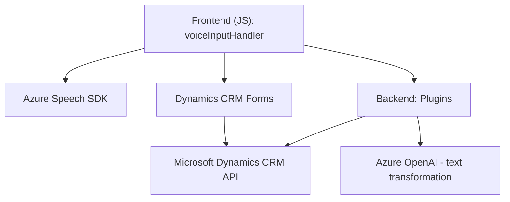

### Breve resumen técnico
Basándonos en los detalles de los archivos suministrados:
1. Este repositorio constituye una solución híbrida que incluye:
   - Frontend con JavaScript optimizado para integración de SDKs.
   - Plugins de backend desarrollados con C#, en el contexto de Microsoft Dynamics CRM.
2. La solución implementa entrada de voz y síntesis de texto en aplicaciones asociadas a sistemas CRM.
3. Mediante las capas de frontend y backend, la arquitectura parece orientada a una solución de integración componente-servicio con comunicación recurrente entre el cliente (browser) y servicios externos como Azure OpenAI y Dynamics CRM.

---

### Descripción de arquitectura
La arquitectura puede clasificarse como **orientada a servicios externalizados** o SOA, dado que múltiples módulos interactúan con Dynamics CRM, utilizan SDKs externos (Azure Speech), y hacen interacciones ligeras con servicios de inteligencia artificial (Azure OpenAI). Tiene características propias de una arquitectura multicapa y soporte modular, lo que facilita el mantenimiento y escalabilidad del sistema.

1. **Frontend (JS)**:
   - Modularización de funcionalidad (captura de voz, síntesis, manejo de APIs externas).
   - Operaciones distribuidas y asincrónicas para soportar SDK externo y APIs.
   - Comunicación con el sistema de Dynamics CRM.

2. **Backend (C# Plugin)**:
   - Plugin basado en reglas bajo Dynamics CRM API (Microsoft SDK).
   - Integración directa con **Azure OpenAI API**, transformando texto en JSON estructurado.

### Tecnologías usadas
1. **Frontend**:
   - **JavaScript** para lógica del manejo de voz y mando del proceso de síntesis y reconocimiento.
   - **Azure Speech SDK** para síntesis/entrada de voz.
   - Dynamics CRM SDK para manipular formularios.

2. **Backend**:
   - **C#**: Implementación del plugin usando la librería .NET.
   - **Newtonsoft.Json.Linq** para manipular y crear objetos JSON.
   - **Azure OpenAI Service** para transformación avanzada de texto mediante la API GPT.

3. Patrones y arquitectura:
   - **Modular Design** para separar responsabilidades.
   - Uso del **Callback Pattern** en frontend para carga dinámica del SDK.
   - **SOA** con servicios externos (Azure Speech + OpenAI + Dynamics CRM).
   - **Plugin-Based Architecture** en el lado backend (Dynamics 365 Plugin via C#).

### Dependencias y componentes externos
1. **Azure Speech SDK (voice)**:
   - URL: `https://aka.ms/csspeech/jsbrowserpackageraw`.
   - Usado en ambos archivos JS para síntesis y manejo automatizado de entrada de voz.

2. **Microsoft Dynamics CRM Web API**:
   - Permite actualización directa de formularios en Dynamics 365.

3. **Azure OpenAI API**:
   - Especialmente configurada para procesamiento avanzado de texto según reglas personalizadas.

4. **Custom CRM Plugins** (C#, Dynamics SDK):
   - Manipula datos y amplía la funcionalidad de Dynamics CRM.

---

### Diagrama Mermaid compatible con GitHub Markdown

---

### Conclusión final
Esta es una solución que combina elementos de **frontend modular** con lógica de captura y síntesis de voz, y un **backend orientado a sistemas CRM**, todo mientras despliega **Azure APIs** (Speech y OpenAI) como servicios de inteligencia artificial para procesamiento de datos. Utiliza una **arquitectura basada en componentes y capas** que fomenta la separación de responsabilidades y adaptabilidad, interactuando con múltiples actores externos y dinamizando operaciones mediante programación asincrónica y patrones de plugin.