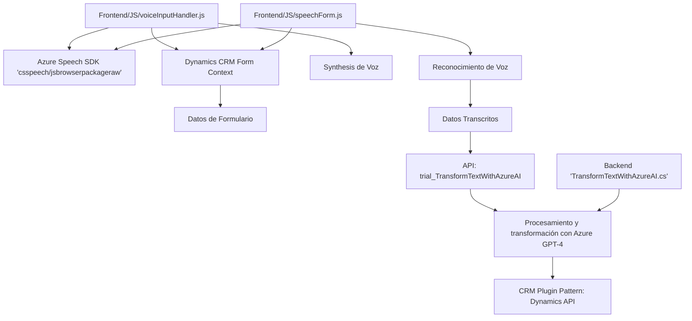

### Breve resumen técnico:
El repositorio contiene archivos distribuidos en dos categorías principales: una **funcionalidad frontend** en JavaScript para formularios dinámicos (integrada a Dynamics CRM) y un **plugin backend** desarrollado en .NET para procesar datos con inteligencia artificial mediante Azure OpenAI API. Estos archivos trabajan conjuntamente para proporcionar capacidades avanzadas de síntesis y reconocimiento de voz, así como transformación de textos según normas definidas. 

---

### Descripción de arquitectura:
**Tipo de solución:** Se trata de una arquitectura híbrida basada en Web APIs y un sistema modular. Específicamente:
1. Para el **frontend**, es un conjunto de scripts funcionales que interactúan directamente con los formularios del usuario en Dynamics CRM.
2. Para el **backend**, se utiliza un plugin de Dynamics CRM que actúa como un puente entre el cliente y Azure AI mediante el modelo GPT-4.

**Arquitectura identificada:**
- **Microservicios y API:** El backend extiende capacidades del CRM mediante un plugin que interactúa con Azure OpenAI API. Cada componente tiene un rol específico y se comunica externamente.
- **Orientada al servicio (SOA):** Los módulos del frontend consumen servicios externos (Azure Speech SDK para voz) y APIs (transformación de texto mediante Azure OpenAI API).
- **Patrón de Callback:** Aprovecha eventos para ejecutar tareas asincrónicas relacionadas con el SDK de Azure en el frontend.

---

### Tecnologías usadas:
#### Frontend:
- **JavaScript**: Principal lenguaje para los scripts de interfaz y lógica.
- **Azure Speech SDK**: Proporciona capacidades avanzadas de síntesis y reconocimiento de voz.
- **Dynamics CRM API**: Para la interacción directa con formularios CRM.
- **Event-driven Programming**: Uso de eventos y promesas para manejar asincronía.

#### Backend:
- **C# y .NET Framework**: Base para la implementación del plugin.
- **Microsoft Dynamics CRM SDK**: Para extender funcionalidades del CRM utilizando la arquitectura de plugins.
- **Azure OpenAI (GPT-4)**: Interacción con una API basada en IA para transformar texto.
- **JSON**: Estructuración de datos entre APIs y procesos CRM.
- **Newtonsoft.Json.Linq**: Facilita manipulación de datos en formato JSON.

---

### Diagrama Mermaid válido para GitHub:

---

### Conclusión final:
La solución implementada utiliza una arquitectura híbrida, combinando operaciones en el **frontend** (sintetización de voz, reconocimiento de voz, interacción con formularios) y tareas avanzadas en el **backend** (plugin ejecutado en el contexto de Dynamics CRM que interactúa con Azure OpenAI API). Los elementos están bien estructurados para evitar redundancia y promover la modularidad. 

**Puntos fuertes:**
- Buen uso de tecnologías avanzadas como Azure Speech SDK y Azure OpenAI API.
- Modularidad de funciones, cada una con un propósito claro.
- Integración eficiente entre servicios externos y APIs internas.

**Áreas de mejora:**
- Refactorización de funciones redundantes para mayor reutilización en el código.
- Robustez en el manejo de errores en promesas con el SDK o interacción con APIs.
- Diseño desacoplado: Considerar encapsular aún más lógica en servicios independientes para mejorar la escalabilidad.

En general, el sistema refleja buenas prácticas modernas de desarrollo y arquitectura, optimizando el uso de la infraestructura de Microsoft Azure y Dynamics CRM.