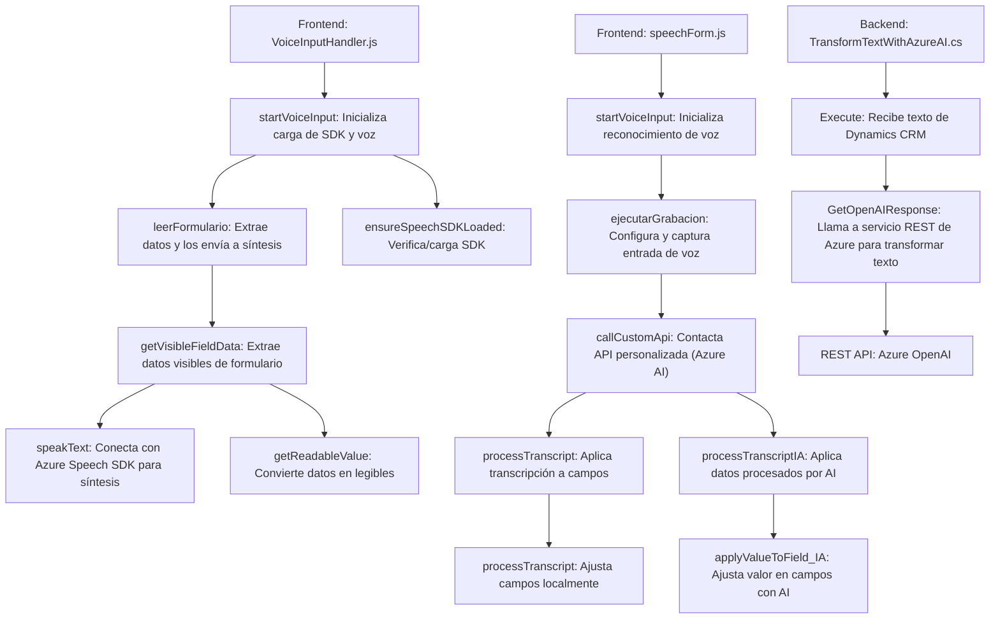

### Breve resumen técnico

La solución está centrada en integrar funcionalidades avanzadas de reconocimiento de voz, procesamiento de texto y síntesis de datos utilizando servicios como Azure Speech SDK y Azure OpenAI. Los archivos proporcionados corresponden a diferentes capas o componentes que interactúan en un contexto híbrido de frontend y backend, con fuerte acoplamiento a servicios externos.

---

### Descripción de arquitectura

La arquitectura utilizada puede clasificarse como **API expositiva para servicios integrados**, junto con una lógica definida por módulos funcionales distribuidos en frontend y backend. En resumen:

1. **Frontend (JavaScript)**:
   - Incluye archivos que manejan la interacción con el usuario, como procesamiento de entradas de voz, interpretación de datos en formularios y comunicación con servicios externos (Azure Speech SDK y APIs personalizadas).  
   - Los elementos principales tienen un enfoque **modular**, con funciones orientadas a operaciones específicas como validación de campos, extracción de datos visibles y aplicación de valores.  

2. **Backend (C# Plugins)**:
   - Implementa una lógica centralizada en el plugin de Dynamics CRM para interoperar con servicios de procesamiento de texto (Azure OpenAI) y convertir datos de texto en payloads estructurados.  
   - Se utiliza una **arquitectura basada en plugins**, típica de sistemas CRM como Dynamics, que permite desarrollar extensiones a través de interfaces predeterminadas (IPlugin).  

En general, la arquitectura tiene un enfoque híbrido que mezcla características de diseño modular y n-capas, con un fuerte acoplamiento a servicios REST y SDK externos.

---

### Tecnologías usadas

#### **Frontend:**
1. **Azure Speech SDK**:
   - Captura voces y sintetiza texto en voz.
   - Conecta con servicios externos para manejar datos.
2. **JavaScript**:
   - Para manipular DOM, formularios y eventos dinámicos.
3. **Dinámica CRM Context (`formContext`)**:
   - Puntos de integración con el sistema para operar sobre formularios.
   
#### **Backend**:
1. **Microsoft Dynamics CRM Plugin Framework**:
   - Extiende la funcionalidad del sistema CRM mediante `IPlugin`.
2. **Azure OpenAI API**:
   - Realiza transformaciones avanzadas de texto.
3. **C# Frameworks**:
   - `System.Net.Http`, `Newtonsoft.Json`, y similares para serialización, comunicación con APIs y generalización de manejo JSON.

#### **Patrones de diseño**:
1. Modular Design: Cada funcionalidad se implementa como un bloque independiente para fácil reutilización.
2. Integration: Conexiones directas con el SDK de Azure Speech y APIs personalizadas.
3. Asynchronous Callbacks: Manejo de operaciones no bloqueantes como cargas del SDK y llamadas a APIs externas.

---

### Diagrama Mermaid

---

### Conclusión final

La solución representa una arquitectura híbrida que utiliza el procesamiento y la interacción frontal con el usuario a través del reconocimiento de voz, la modelación de formularios dinámicos, y una capa de backend que conecta directamente con servicios de REST (Azure OpenAI). Esta implementación es adecuada para entornos demandantes como CRM (Microsoft Dynamics) donde los modelos interactivos optimizan la interacción del usuario con el sistema mediante tecnologías avanzadas de Inteligencia Artificial.