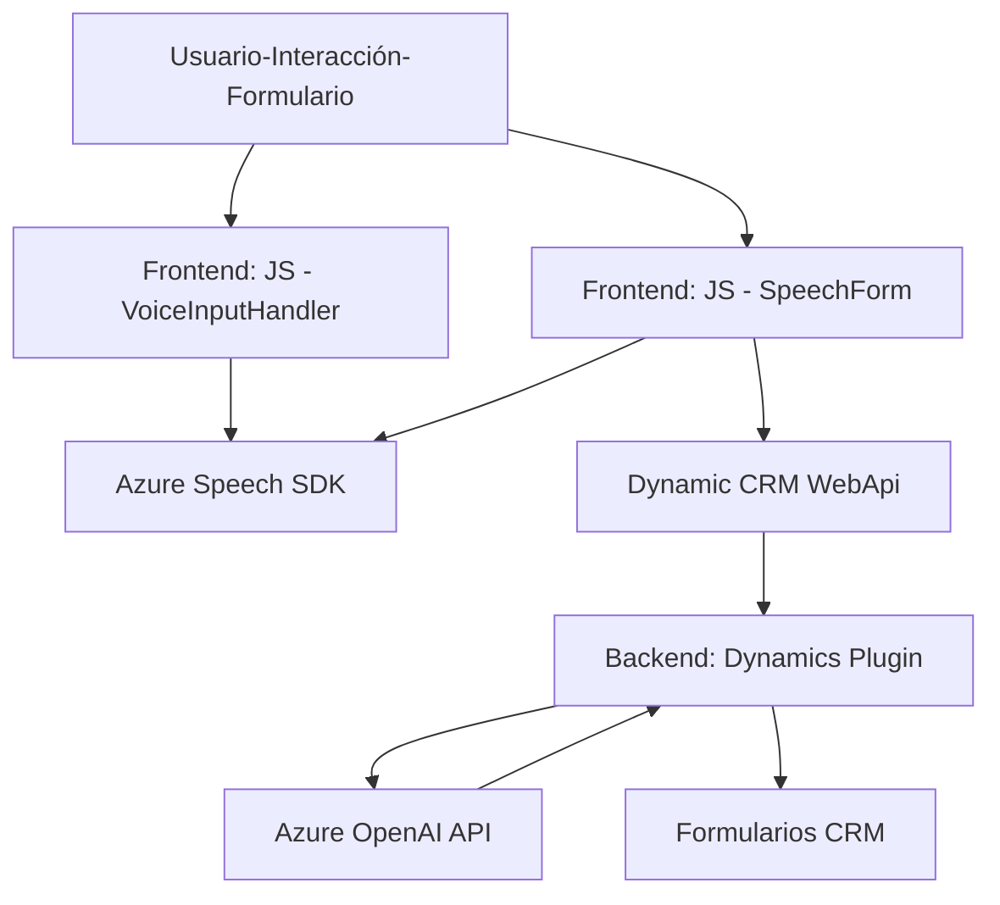

### Breve resumen técnico:
El repositorio representa una solución completa que implementa accesibilidad y funcionalidad avanzada para aplicaciones web y servicios CRM mediante interacción con formularios, síntesis de voz, reconocimiento de voz y transformación de datos con soporte ofrecido por plataformas Azure (Speech SDK y OpenAI) y Microsoft Dynamics CRM.

---

### Descripción de la arquitectura:
- **Tipo de solución:** 
  La solución combina componentes frontend (JavaScript) y backend (Dynamics CRM Plugin) para una aplicación que implementa funcionalidades de síntesis y reconocimiento de voz, además de transformación y manejo de datos en formularios interactivos.

- **Tipo de arquitectura:**
  Es una arquitectura **multicapa**, donde la capa frontend maneja interacción directa con el usuario y funcionalidad de accesibilidad (mediante Azure Speech SDK) y la capa backend, implementada en Dynamics CRM, realiza transformaciones avanzadas de los datos mediante un plugin que usa servicios externos de Azure OpenAI.

- **Patrones de diseño:** 
  - **Modularidad:** Cada funcionalidad (voz, síntesis, reconocimiento, transformación) está encapsulada en módulos/ficheros independientes.
  - **Integración basada en servicios:** Uso de APIs externas como Azure Speech SDK y OpenAI, lo que permite la ampliación y configuración independiente.
  - **Plugin pattern:** La lógica de transformación de datos se encapsula en un plugin CRM utilizando `IPlugin`.

---

### Tecnologías usadas:
1. **Frontend (JavaScript):**
   - Azure Cognitive Services Speech SDK:
     - Sintetización de voz y reconocimiento hablado.
     - URL del SDK: `https://aka.ms/csspeech/jsbrowserpackageraw`
   - Interacción dinámica con DOM y formularios.
   - JavaScript estructura moderna con funciones asincrónicas.

2. **Backend (Azure y Dynamics CRM):**
   - **Dynamics CRM Plugin:**
     - Implementación del patrón `IPlugin` para manejo contextual y flujos internos de datos.
     - Manipulación de datos definidos y reglas específicas dentro de Dynamics.
   - **Azure OpenAI API:**
     - Transformación avanzada de texto usando modelos GPT directamente vía HTTP API.
     - Autenticación basada en claves (API Key).
   - **Frameworks y librerías:**
     - `System.Net.Http`, `Newtonsoft.Json`, y otras para manipulación JSON y comunicación externa.

---

### Dependencias o componentes externos:
1. **Azure Speech SDK:** Necesario para las funcionalidades de sintetización de voz.
2. **Azure OpenAI Service:** Utilizado en el backend para estructuración avanzada de datos.
3. **Dynamic CRM APIs:** Manejo y escritura de datos en formularios mediante `Xrm.WebApi`.
4. **Microsoft Libraries (Newtonsoft.Json, System.Text.Json):** Usadas para formatear, transformar y validar estructuras JSON.

---

### Mermaid Diagrama:

---

### Conclusión final:
Este repositorio implementa una solución robusta y moderna que aborda accesibilidad con sintetización y reconocimiento de voz, junto con transformación avanzada de datos mediante el uso de modelos de inteligencia artificial de Azure OpenAI. La arquitectura multicapa garantiza modularidad y escalabilidad, integrando servicios de Azure y Dynamics CRM de manera eficiente para enriquecer el manejo de datos en formularios web interactivos. 

Su enfoque en modularidad e integración lo convierte en una solución versátil para aplicaciones que requieran accesibilidad avanzada y manipulación dinámica de datos en tiempo real.