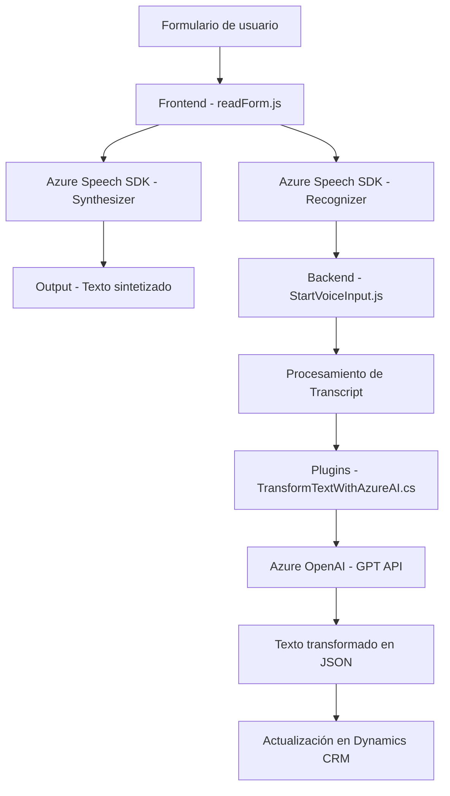

### Breve resumen técnico

Este repositorio implementa una solución orientada a la interacción entre usuarios y datos (formularios) mediante voz y procesamiento de lenguaje natural usando Azure Speech SDK y Azure OpenAI. La funcionalidad está distribuida entre módulos frontend, complementos backend y APIs externas, con particular énfasis en integrar servicios de nube en un sistema Dynamics CRM.

---

### Descripción de arquitectura

La solución parece estructurarse como una arquitectura de **n capas**:

1. **Capa de presentación (Frontend):** Contiene archivos JS (`readForm.js` y `speechForm.js`) para manejar la interacción del usuario mediante la voz. Estos archivos implementan funciones para sintetizar y transcribir texto desde formularios y coordinar eventos DOM.

2. **Capa de negocio:**
   - **Lógica frontend:** Procesos de transcripción, reconocimiento de voz y manipulación DOM.
   - **Plugin backend:** Transformación de texto con API de Azure OpenAI para producir entradas estructuradas provenientes de comandos de voz.
   
3. **Capa de datos:**
   - Integración con **Azure Speech SDK** para síntesis y reconocimiento de voz.
   - Uso de **API REST de Microsoft Dynamics CRM** para manipular atributos del formulario.
   - Comunicación con **Azure OpenAI** via HTTP (`TransformTextWithAzureAI.cs`) para generar estructuras inteligentes en función de las normas específicas.

Esta arquitectura sigue un diseño descentralizado en términos funcionales pero se ejecuta como parte de un entorno Dynamics CRM, lo que lo hace más cercano a un sistema embebido (plugin + frontend).

---

### Tecnologías usadas

- **Frontend:** 
  - **Azure Speech SDK**: Integración para síntesis y reconocimiento de voz.
  - **JavaScript ES6+**: Desarrollo modular orientado a eventos y manipulación DOM.
  - Comunicación condicional: Verifica carga dinámica de SDK antes de operar.

- **Backend:**
  - **Dynamics CRM SDK:** Para extender funcionalidades del sistema.
  - **Azure OpenAI API:** Procesamiento de lenguaje natural mediante GPT.
  - **.NET/C#:** Para implementar plugins (`TransformTextWithAzureAI.cs`).
  - **HTTP Client:** Para comunicación con la API de Azure.

- **Patrones y buenas prácticas:**
  - Modularidad y SRP: Organización del código en funciones específicas y reutilizables.
  - Event-driven en frontend.
  - Plugin-driven para extender el CRM.

---

### Diagrama Mermaid válido para GitHub

---

### Conclusión final

La solución presentada aborda, desde distintas capas funcionales (frontend y backend), la interacción de los usuarios con datos de formularios utilizando herramientas de síntesis y reconocimiento de voz. Con la integración de Azure Speech SDK y OpenAI GPT mediante APIs REST, se facilita la entrada y transformación de datos para integrarlos a una aplicación Dynamics CRM. La arquitectura modular garantiza escalabilidad y reutilización de componentes, mientras la adopción de servicios externos respalda capacidades avanzadas en el tratamiento de voz y lenguaje natural.