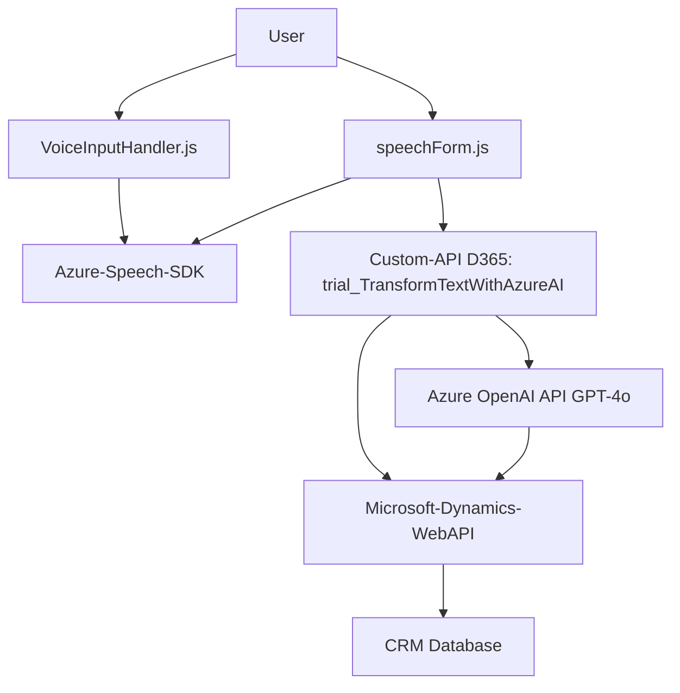

### Breve resumen técnico
El repositorio contiene varios componentes desarrollados para una solución integrada con **Microsoft Dynamics CRM** que utiliza los servicios de **Azure Speech SDK** y **Azure OpenAI API**. La solución busca mejorar la interacción con formularios mediante reconocimiento de voz, síntesis de voz y datos transformados por inteligencia artificial.

---

### Descripción de arquitectura
La arquitectura de la solución tiene elementos de **arquitectura en capas** y **event-driven**:
1. **Frontend (JS):** Define la interfaz y lógica de interacción de usuarios con formularios en Dynamics CRM mediante APIs proporcionadas por SDKs y servicios de Microsoft (Azure Speech SDK y Dynamics Web APIs).  
2. **Backend (Plugin en C#):** Representa la capa de lógica empresarial que realiza transformaciones inteligentes de texto utilizando **Azure OpenAI** y responde al contexto del CRM.

La **arquitectura final** se parece al patrón de **arquitectura de integración de servicios**, donde el cliente y el CRM están conectados a través de plugins y SDKs. Aunque utiliza múltiples servicios externos, la solución no es un enfoque totalmente orientado a **microservicios**, ya que la lógica sigue altamente acoplada al ecosistema CRM con plugins y APIs.

---

### Tecnologías usadas
1. **Lenguajes y frameworks:**  
   - **JavaScript:** Frontend para manejo de eventos y lógica integrada.  
   - **C#:** Escrito en .NET Framework para plugins personalizados de Dynamics CRM.  
   
2. **Nube y APIs:**  
   - **Azure Speech SDK**: Reconocimiento y síntesis de voz.  
   - **Azure OpenAI API**: Transformación avanzada de datos con GPT-4o.  
   - **Microsoft Dynamics CRM Web APIs**: Integración profunda con datos del CRM.  
   
3. **Patrones:**  
   - **Factory Pattern**: Configuración modular de parámetros de llamadas de voz/texto.  
   - **Adapter Pattern**: Integración entre datos del formulario y servicio externo (Azure Speech y Dynamics CRM).  
   - **Event-driven design**: Uso de eventos del formulario (executionContext) y llamadas hacia APIs externas como triggers.  
   - **Plugin Pattern**: Implementación en el backend como extensión de Dynamics CRM.  
   - **Async Programming Pattern**: Uso de promesas y asincronía para integrar comunicación con servicios remotos.  

---

### Dependencias y componentes externos
1. **Azure Speech SDK**: Manejo de audio entrada/salida (síntesis y reconocimiento de voz).  
2. **Azure OpenAI API**: Procesamiento de texto mediante el modelo GPT para transformación en JSON.  
3. **Microsoft Dynamics CRM Web APIs**: Interacción para la consulta y manipulación de datos en formularios.  
4. **Custom API de Dynamics CRM**: Extiende operaciones no estándar mediante funciones personalizadas.  
5. **Frontend dependencies (external libraries)**: Aunque no se detallan, podría incluir utilidades para manejo de eventos.  
6. **Backend dependencies**: Uso de paquetes comunes como `Newtonsoft.Json.Linq` (manipulación de JSON) y `System.Net.Http` para API calls.  

---

### Diagrama Mermaid válido para GitHub Markdown

---

### Conclusión final
La solución es modular y altamente dependiente del ecosistema de **Microsoft Azure** y **Dynamics CRM**, con un frontend basado en **JavaScript** que integra reconocimiento de voz y synthesis mediante **Azure Speech SDK**. El backend en **C#** complementa con un plugin que emplea la **Azure OpenAI API** para realizar transformaciones inteligentes de texto.

La arquitectura es principalmente **en capas**, con funcionalidad avanzada para integrar servicios externos y con una lógica que responde al contexto de Dynamics CRM.