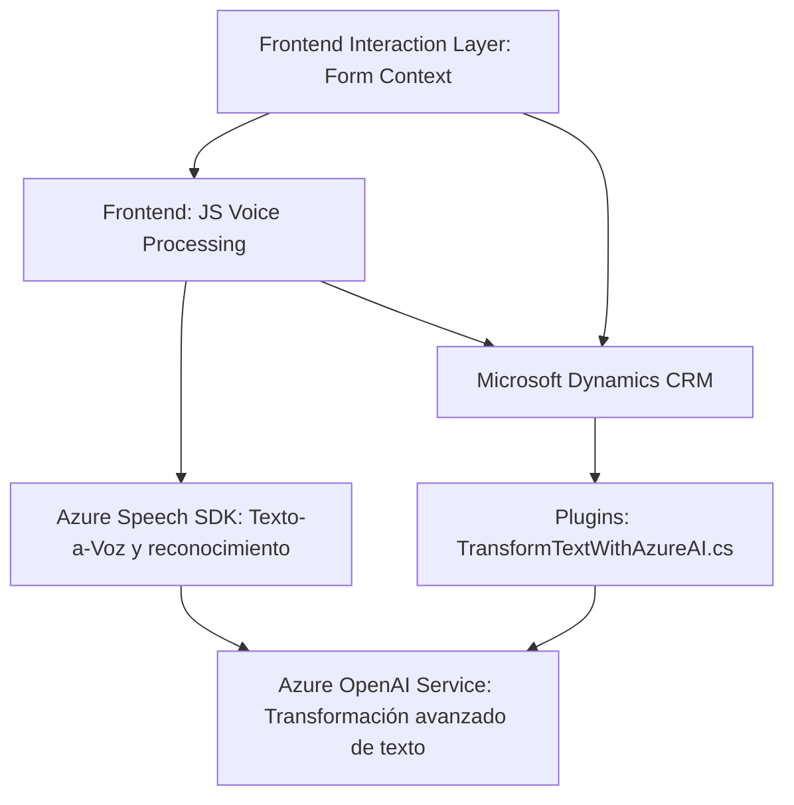

### Breve resumen técnico

El repositorio combina funcionalidad de **frontend web**, **interacción con servicios cloud externos** (Azure APIs), y extensibilidad para **Microsoft Dynamics CRM** mediante plugins y API. Maneja dos casos principales: síntesis de texto a voz y transcripción de comandos de voz, ambos integrados con Azure Speech SDK. Además, utiliza el poder de Azure OpenAI para procesar texto, estructurando datos en formato JSON. 

---

### Descripción de arquitectura

La solución se compone de tres partes principales:
1. **Frontend:** Estructurado de manera modular, se diseñó para proporcionar servicios funcionales (p.ej., síntesis de voz y control de formularios) utilizando APIs externas.
2. **Backend (Plugins):** Desarrollo basado en plugins para Dynamics CRM, que interactúa directamente con Azure OpenAI y expone funcionalidades de transformación avanzada mediante un modelo extensible.
3. **Integraciones externas:** Uso de Azure Speech SDK para reconocimiento/síntesis de voz y llamadas a servicios de Microsoft Dynamics CRM y Azure OpenAI.

La arquitectura general puede clasificarse como **n capas**, donde el frontend gestiona la interacción del usuario y las entradas, el backend procesa y gestiona la lógica empresarial, y los servicios externos amplían la funcionalidad.

---

### Tecnologías usadas

1. **Frontend:** 
   - **JavaScript** (modularización).
   - **Azure Speech SDK:** Para reconocimiento de voz y síntesis de texto a voz.
   - **Mermaid:** Representación gráfica de flujos.

2. **Backend:** 
   - **C#**: Plugin desarrollado con .NET.
   - **Dynamics 365 SDK**: Extensión del CRM y uso de su API.
   - **Azure OpenAI Service (GPT)**: Para procesamiento y transformación avanzada de texto.

3. **Arquitectural patterns:**
   - **Microservicios y servicios en la nube:** Uso de Azure APIs y OpenAI.
   - **n capas:** Separación entre frontend y backend.
   - **Modularización:** Funciones específicas y desacopladas en el frontend.

---

### Diagrama Mermaid válido para GitHub

---

### Conclusión final

La solución está bien estructurada para abordar dos necesidades críticas en un entorno CRM: conversión de datos del formulario en voz y transcripción de comandos de voz directamente mapeados a campos del formulario. Utiliza herramientas modernas y eficientes como Azure Speech SDK y OpenAI para brindar una interacción rica, potenciando formularios dinámicos en Dynamics 365. La arquitectura modular y orientada a servicios permite extensibilidad y adaptabilidad en aplicaciones empresariales.