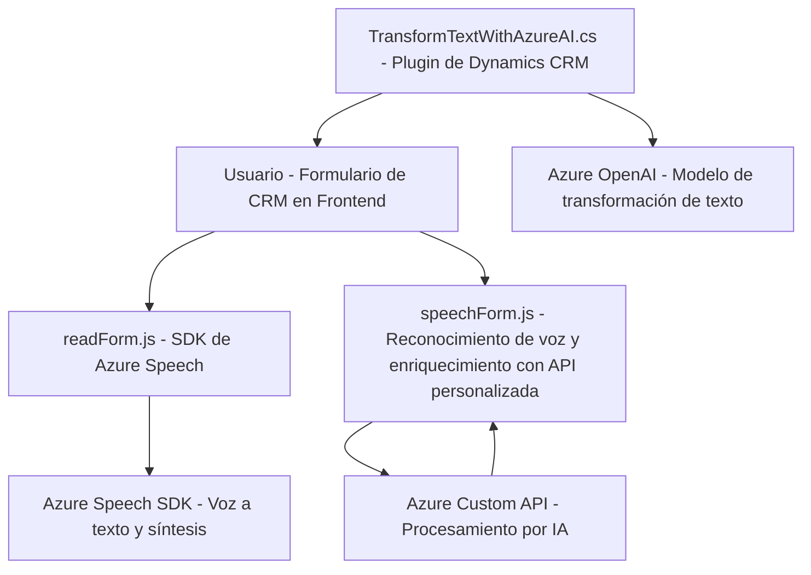

### Breve resumen técnico

El repositorio está compuesto por una solución que integra capacidades de reconocimiento y síntesis de voz mediante el Azure Speech SDK, junto con procesamiento avanzado de texto utilizando Azure OpenAI, todo enfocado a optimizar la interacción con formularios en un sistema CRM (Dynamics 365). Las funcionalidades abarcan desde la entrada de voz, transcripción, mapeo de datos a formularios, hasta el enriquecimiento de datos mediante IA.

---

### Descripción de arquitectura

La solución combina múltiples capas dentro de una arquitectura modular híbrida:

1. **Frontend JavaScript**:
   - Se enfoca en interacción y manipulación de formularios mediante voz (`readForm.js` y `speechForm.js`).
   - Capacidad de síntesis y reconocimiento de voz en tiempo real.
   - Llamadas a Azure Custom APIs para enriquecimiento de datos.

2. **Backend Dynamics CRM Plugin (.NET)**:
   - Procesamiento adicional del texto mediante Azure OpenAI en un plugin llamado `TransformTextWithAzureAI.cs`.
   - Ejecución en el contexto de Dynamics a través de la interfaz `IPlugin`.

Se implementa una **arquitectura modular orientada a servicios**:
- Integración externa mediante SDK (Azure Speech SDK) y API (Azure OpenAI).
- Interacción con servicios internos de Dynamics CRM (WebAPI y plugins).
- Trabajo en base a los patrones de **façade** y **event-driven** en el frontend, y el modelo **plugin-oriented** en el backend.

---

### Tecnologías usadas

1. **Frontend**:
   - **JavaScript**: Para manejar eventos, interactuar con formularios dinámicos y consumir SDK externos.
   - **Azure Speech SDK**: Reconocimiento y síntesis de voz.
   - **REST API**: Comunicación con Azure Custom APIs para procesamiento por IA.

2. **Backend**:
   - **C# (.NET Framework)**: Implementación del plugin de Dynamics CRM.
   - **Azure OpenAI Service**: Procesamiento avanzado de texto vía REST API.
   - **Microsoft Dynamics SDK**: Extensiones para interacción directa con datos de CRM.

3. **Dependencias externas**:
   - **Newtonsoft.Json**: Para manipulación de objetos JSON.
   - **System.Net.Http** y **System.Text.Json**: Para realizar solicitudes HTTP.

4. **Patrones comunes**:
   - **Façade pattern**: Punto centralizado de llamada en el frontend (`startVoiceInput`).
   - **Event-driven architecture**: Escucha e interacción con eventos relacionados con formularios.
   - **Service-oriented architecture (SOA)**: Integración con APIs externas.
   - **Plugin architecture**: Definición de funcionalidades extensibles dentro del contexto CRM.

---

### Diagrama Mermaid  

---

### Conclusión final

Esta solución es parte de un ecosistema de Dynamics CRM que utiliza tecnologías modernas para mejorar la accesibilidad y precisión en la interacción con formularios mediante voz y transcripción. La arquitectura está definida por el uso de SDKs, APIs personalizadas (Azure Speech y OpenAI), y plugins dentro de un enfoque híbrido que combina frontal (JavaScript) y backend (C#). Es ideal para entornos empresariales que busquen interacciones fluidas con soporte en inteligencia artificial y reconocimiento de voz.