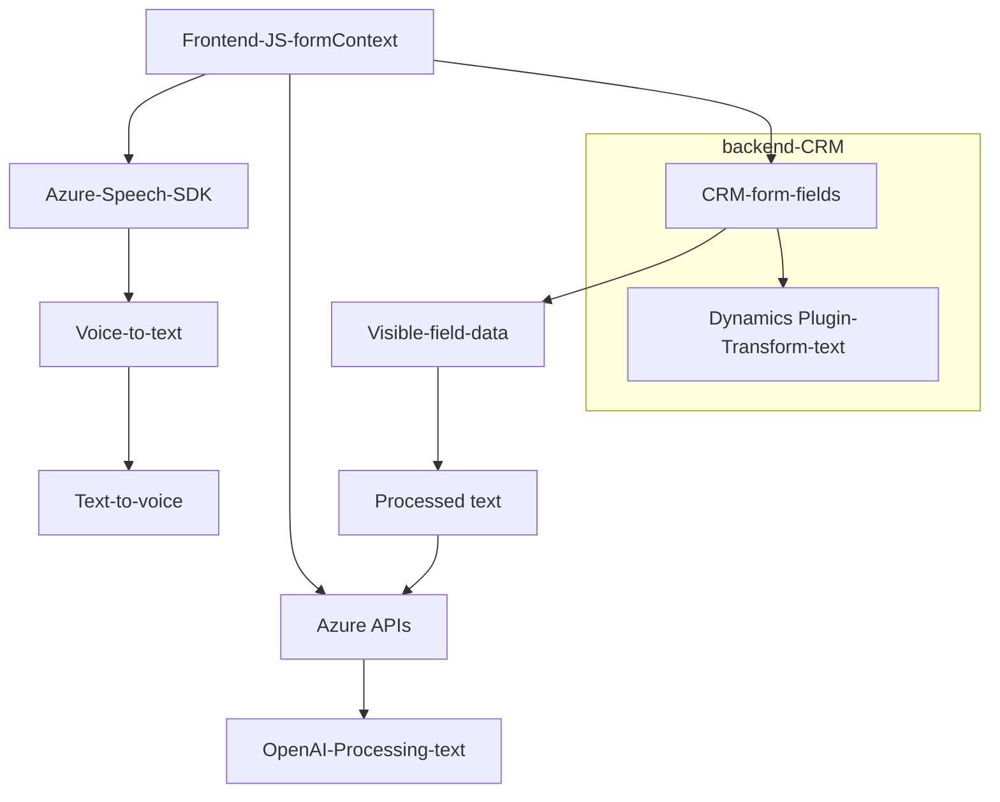

### Breve resumen técnico

El repositorio analiza una solución que combina un **frontend** basado en JavaScript y un **plugin backend** en Dynamics CRM para manejar formularios mediante **entrada por voz** y **procesamiento de texto inteligente** utilizando APIs de Microsoft Azure, específicamente **Azure Speech SDK** y **Azure OpenAI**.

---

### Descripción de la arquitectura

La solución implementa una arquitectura **n-capas** con las siguientes funcionalidades:
- **Front-end**: JavaScript interactúa con el formulario del sistema CRM, habilitando la lectura, síntesis de voz y entrada de datos mediante reconocimiento de voz.
- **Integración con APIs externas**:
  - **Azure Speech SDK**: Para reconocimiento y síntesis de voz.
  - **Azure OpenAI**: Para la generación de JSON estructurado a partir de texto.
- **Plugin (back-end)**: Implementado en C#, gestionado por Dynamics CRM, que transforma texto usando Azure OpenAI en respuesta a eventos del sistema CRM.

---

### Tecnologías usadas

1. **Frontend (JavaScript)**:
   - **SDK externo**: Azure Speech SDK para síntesis y reconocimiento de voz.
   - **Dynamics CRM context**: Uso de objetos del entorno `executionContext`, `formContext`, y API `Xrm.WebApi`.

2. **Backend (C#)**:
   - Framework: Microsoft Dynamics CRM SDK.
   - Librerías: `System.Net.Http`, `System.Text.Json`.
   - Dependencia externa: Azure OpenAI para procesamiento de texto.

3. **Patrones de diseño**:
   - **Modularización**: Las funciones y métodos están agrupados por responsabilidades específicas (lectura de formulario, interacción con el SDK de Azure, etc.).
   - **Desacoplamiento del SDK externo**: El SDK se carga dinámicamente, creando un diseño extensible y reactivo.
   - **Plugin architecture**: Usado para integrar servicios backend en el ecosistema de Dynamics CRM.
   - **Microservicios/API-centric**: Uso de APIs externas (OpenAI y Speech SDK) permite desacoplar la lógica de procesamiento inteligente del sistema CRM.

---

### Diagrama Mermaid

A continuación está el diagrama **Mermaid**, que representa relaciones clave entre los componentes:

---

### Conclusión final

La solución presenta una **arquitectura n-capas** con una clara separación de responsabilidades:
- El **frontend** gestiona la interacción del usuario mediante reconocimiento de voz y síntesis de texto.
- El **backend-plugin** extiende la funcionalidad de Dynamics CRM al integrar inteligencia artificial para transformaciones avanzadas de texto.
- Patrones como **SOA**, **Plugin Architecture**, y **API-centric architecture** son destacados, junto con la integración de servicios de terceros (Azure SDK y Azure IA).

Es una solución robusta para escenarios empresariales que buscan automatizar la interacción con formularios CRM utilizando **voz** e inteligencia artificial. Sin embargo, es importante adoptar mejores prácticas de seguridad para manejar claves API (por ejemplo, almacenarlas fuera del código fuente).