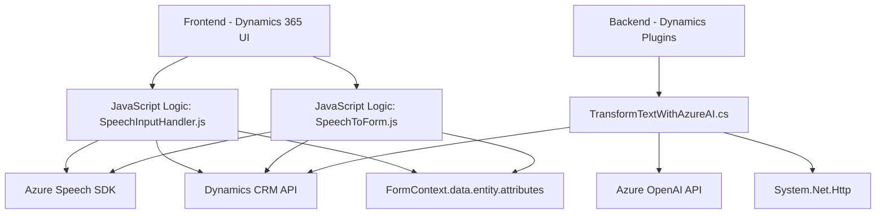

### Breve resumen técnico:
El repositorio describe una solución que utiliza una combinación de frontend (JavaScript con Azure Speech SDK), backend (C# plugins para Dynamics CRM y Azure AI), y servicios de nube (Azure Cognitive Services). Está diseñado para transformar y manejar información de formularios mediante voz y procesamiento avanzado con integración de APIs y servicios de IA.

---

### Descripción de arquitectura:
La solución utiliza una arquitectura **mixta de capas**:
1. **Frontend**: La interfaz de usuario permite interacción en tiempo real con un enfoque en inteligencia artificial para la entrada y salida de voz (captura de datos y síntesis de texto a voz).
2. **Backend**: Los plugins en C# extienden la funcionalidad del sistema Dynamics CRM y se integran con Azure OpenAI y Cognitive Services.
3. **Servicios externos**: La solución interactúa dinámicamente con APIs como Azure Speech SDK y Azure OpenAI para tareas como síntesis y análisis de voz junto con transformación de texto en JSON estructurado.
La arquitectura está organizada en **módulos independientes**, respetando principios de **modularidad y separación de responsabilidades**. Sin embargo, debido al enfoque de interacción con Dynamics CRM y su SDK, tiene características de un diseño monolítico extendido por plugins.

---

### Tecnologías usadas:
1. **Frontend**:
   - **JavaScript**: Utilizado para la lógica del cliente.
   - **Azure Speech SDK**: Maneja síntesis de voz y transcripciones vocales.
   - **Dynamics CRM API (Xrm.WebApi)**: Usado para manipular datos y formularios internos.
2. **Backend**:
   - **C# (.NET Framework)**:
     - Plugins (`IPlugin`) para Dynamics CRM.
   - **Azure OpenAI**: Procesamiento y generación de texto enriquecido.
   - **HttpClient (.NET)**: Realiza solicitudes RESTful hacia el endpoint de OpenAI.
3. Dependencias adicionales:
   - **System.Net.Http**, **System.Text.Json**, y **Newtonsoft.Json** para manejar respuestas de APIs RESTful.

---

### Diagrama Mermaid:

---

### Conclusión final:
La solución presentada ofrece una integración avanzada de un **frontend basado en voz asistida**, un modelado de lógica de negocio personalizada con **Dynamics CRM**, y un backend extensible para utilizar servicios de AI de procesamiento de texto mediante Azure OpenAI. La arquitectura es principalmente de **n capas**, pero está diseñada para soportar extensibilidad mediante módulos (plugins). Aunque la interacción dinámica entre los componentes internos y externos está bien definida, podría beneficiarse de mejores prácticas como parámetros configurables para endpoints y credenciales, así como posible integración de eventos asincrónicos para mejorar la escalabilidad en sistemas grandes.