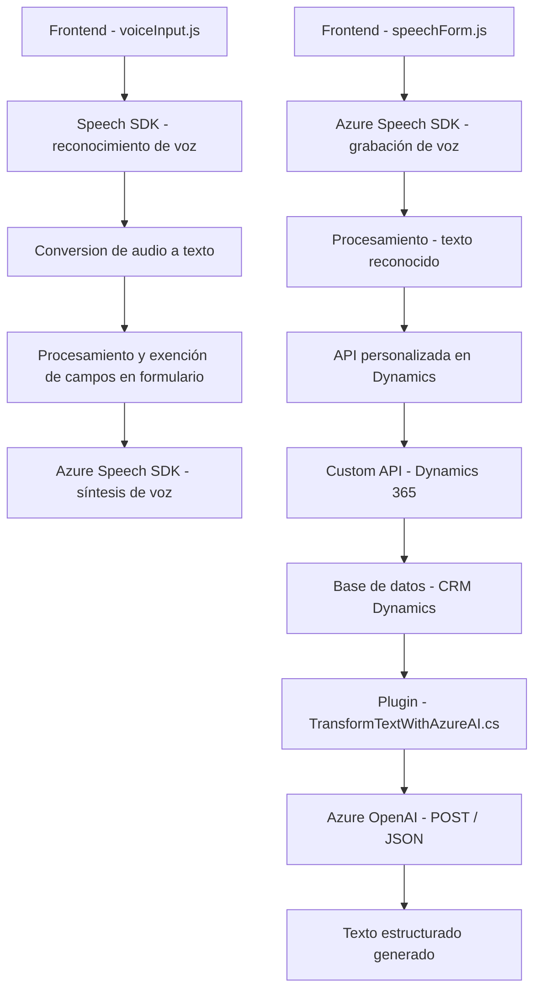

### Breve Resumen Técnico
El repositorio parece estar diseñado para integrar funcionalidades avanzadas de reconocimiento y síntesis de voz en sistemas basados en Microsoft Dynamics 365. Utiliza el **Azure Speech SDK** para capturar audio, realizar reconocimiento de voz y síntesis de texto en voz, junto con un plugin en Dynamics CRM que conecta a **Azure OpenAI** para procesamiento de texto bajo reglas específicas.

---

### Descripción de Arquitectura
La arquitectura de esta solución combina aspectos de **microservicios** y **plugins orientados a eventos**. Los archivos `readForm.js` y `speechForm.js` operan como el nivel de presentación y procesamiento de datos, interactuando con formularios en la capa de cliente. Por otro lado, el archivo `TransformTextWithAzureAI.cs` actúa como intermediario entre Dynamics CRM y Azure OpenAI, utilizando APIs REST en el backend.

La solución aplica el patrón **Event-Driven Architecture:** las funciones clave en los scripts (`readForm.js`, `speechForm.js`) y el plugin en Dynamics CRM se desencadenan según eventos, como interacciones de voz y activación de plugins en el CRM.

Fundamentalmente, el sistema parece implementar una arquitectura **híbrida de n capas**, donde:
- **Capa de presentación**: Los archivos JavaScript interactúan con formularios en el navegador.
- **Capa de negocio y procesamiento**: Un plugin en Dynamics CRM realiza transformaciones avanzadas.
- **Capa de integración**: Conexión a SDKs y APIs externas, como Azure Speech y Azure OpenAI.

---

### Tecnologías Usadas
1. **Azure Speech SDK**: Para reconocimiento y síntesis de voz.
2. **Dynamics 365**: Framework para formularios y manejo de datos.
3. **Azure OpenAI**: Procesamiento de texto estructurado.
4. **Lenguajes de programación**:
   - **JavaScript** para frontend/dinámicas de voz.
   - **C#** para el plugin de Dynamics CRM.
5. **Frameworks y librerías adicionales**:
   - `Newtonsoft.Json` (manejo JSON en C#).
   - `System.Net.Http` (interacciones API REST).
6. **Patrones usados**:
   - **Encapsulación funcional**: Modularización en funciones independientes en JS.
   - **Plug-in Pattern**: En Dynamics CRM.
   - **Adaptador**: Para manipulación y transformación de datos hacia servicios externos (SDK, API).

---

### Diagrama Mermaid **(Modelo de Arquitectura)**

---

### Conclusión Final
El repositorio refleja una arquitectura híbrida y modular que combina tecnologías modernas para reconocimiento y síntesis de voz, junto con la potencia de Microsoft Dynamics CRM y Azure OpenAI. Desde el perspective de software, esta solución ejemplifica cómo integrar servicios externos dentro de un ecosistema corporativo, aprovechando patrones como la modularidad, adaptadores y procesos orientados a eventos.

Los archivos de JavaScript actúan en la capa de presentación y procesamiento inicial, mientras que el plugin en C# aborda requisitos de negocio y operaciones específicas del CRM. Esto asegura que el sistema pueda extenderse fácilmente a otros dominios mientras mantiene una separación clara de responsabilidades.

La implementación general parece limpia y bien organizada, aunque sería ideal incluir pruebas automáticas para verificar la funcionalidad del plugin y los scripts JS.