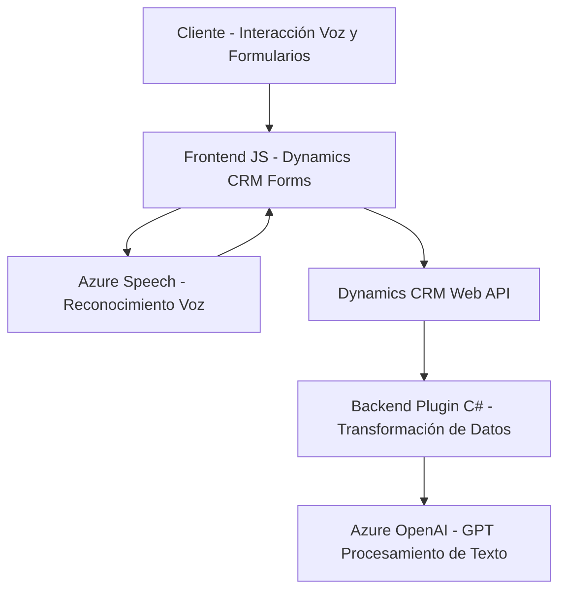

### **Breve resumen técnico**
El repositorio parece estar segmentado en tres componentes principales: un **frontend** basado en JavaScript que interactúa con formularios y servicios, y un **plugin backend de Dynamics CRM** desarrollado en **C#**, que ofrece funcionalidad de transformación de texto mediante Azure OpenAI. 

El enfoque general parece estar orientado hacia una solución integrada en un ecosistema de **Microsoft Dynamics CRM**, con interacción avanzada por voz, automatización de formularios, y procesamiento de datos por IA.

---

### **Descripción de arquitectura**
Basado en las estructuras analizadas:
1. **Frontend**: Modular y orientado a formularios dinámicos, con integración externa mediante Azure Speech SDK para habilitar interfaz de voz para los usuarios. Permite reconocimiento de voz, síntesis de texto a voz, y manipulación dinámica de formularios en un sistema CRM.
2. **Backend**: Plugin diseñado para Microsoft Dynamics CRM, integrándose como componente dentro de la arquitectura del CRM. Usa reglas de negocio definidas y Azure OpenAI para transformar texto estructuralmente según requerimientos específicos.

La arquitectura parece seguir una **estructura de n capas**:
- **Capa de presentación**: Frontend en JS para formularios dinámicos de CRM.
- **Capa lógica de negocio**: Funciones de procesamiento de voz y un plugin de lógica unificada.
- **Capa de integración**: Dependencia con Azure Speech y Azure OpenAI como microservicios externos.
- **Capa de datos**: Se comunica con Dynamics CRM para manipulación directa de datos en el sistema.

---

### **Tecnologías usadas**
1. **Frontend**:
   - **JavaScript**: Lenguaje primario del frontend.
   - **Azure Speech SDK**: Reconocimiento de voz y síntesis de texto a voz.
   - **Dynamics 365 Web API**: APIs del ecosistema Dynamics CRM para la manipulación de formularios y datos.
   - **Browser API**: Carga dinámica de scripts y acceso al DOM.

2. **Backend**:
   - **C#**: Lenguaje en el desarrollo de plugins de Dynamics CRM.
   - **Microsoft.Xrm.Sdk**: SDK oficial de CRM para crear y manipular extensiones.
   - **Azure OpenAI API**: Transformación de texto usando GPT.
   - **System.Net.Http, Newtonsoft.Json**: Comunicación y manejo de datos JSON API.

3. **Patrones arquitectónicos**:
   - **Integración de servicios externos**: Uso extensivo del SDK de Azure Speech y APIs de Azure OpenAI.
   - **Encapsulación lógica y modularidad**: División clara de responsabilidades en funciones y clases.
   - **Plugin Design Pattern**: Uso del patrón de plugin en CRM, que sigue el estándar del Microsoft Dynamics framework.

---

### **Dependencias o componentes externos presentes**
- **Azure Speech SDK**: Software para habilitar reconocimiento y síntesis de voz.
- **Azure OpenAI API**: API basada en GPT para transformación y procesamiento de texto.
- **Microsoft Dynamics 365 Web API y SDK**: Para la interacción con el CRM de Dynamics.
- **APIs del navegador**: Manipulación de DOM, escucha de eventos, y carga dinámica de scripts.
- **Newtonsoft.Json** y **System.Text.Json**: Manejo avanzado de JSON para comunicación entre componentes y servicios externos.

---

### **Diagrama Mermaid**

---

### **Conclusión final**
La solución implementa una arquitectura de **n capas** con integración de microservicios externos (Azure Speech y Azure OpenAI), lo que permite:
1. Reconocimiento y síntesis de voz en tiempo real por parte del **frontend** en interacción con Dynamics CRM.
2. Un back-end modular que transforma datos textual o estructuradamente mediante un **plugin de alto valor agregado** para Microsoft Dynamics.

El diseño modular y las dependencias externas bien definidas (Azure Speech/AI y Dynamics Web API/SDK) respaldan la escalabilidad y extensibilidad del sistema, lo cual resulta valioso en ambientes empresariales complejos. Sin embargo, mejorar la seguridad en la integración con APIs externas y optimizar el manejo de excepciones en el plugin backend podría incrementar su robustez y resiliencia.