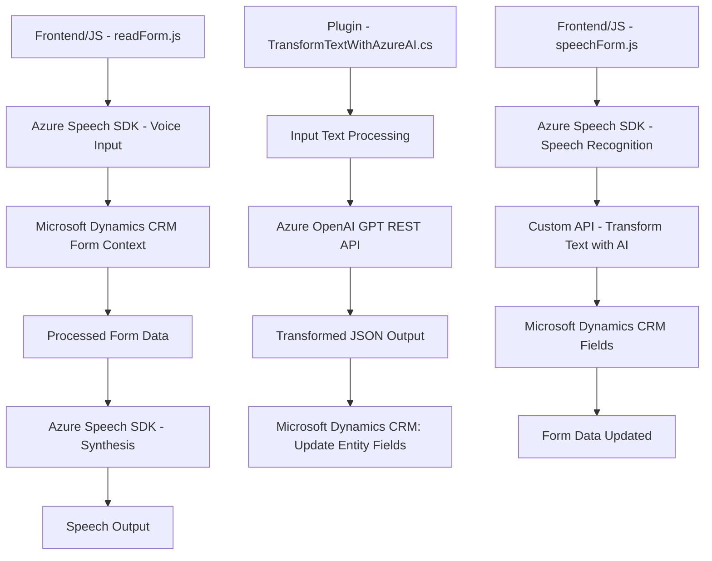

### Breve resumen técnico:
El repositorio contiene la implementación de una solución integral orientada al reconocimiento y síntesis de voz para formularios dinámicos en Microsoft Dynamics CRM. Utiliza **Azure Speech SDK** y **Azure OpenAI API** para procesar datos de entrada y salida, ofreciendo una experiencia de usuario avanzada. La solución está compuesta por tres partes principales:
1. **Frontend/JS**: Scripts en JavaScript para funcionalidades de reconocimiento de voz y síntesis.
2. **Backend/Plugins**: Plugins en C# que interactúan con Dynamics CRM y servicios de Azure.
3. **Integración API**: Interacción con APIs externas como Azure Speech SDK y OpenAI.

---

### Descripción de arquitectura:
La solución implementa una arquitectura **n capas**:
1. **Capa de presentación**:
   - Incluye los scripts JavaScript en el frontend que habilitan la interacción del usuario con los formularios de Dynamics CRM.
   - Funcionalidades como reconocimiento de voz para llenar campos y síntesis para lectura automática de datos son partes clave en esta capa.

2. **Capa de lógica de negocio**:
   - Los plugins en C# ejecutan lógica avanzada mediante servicios de Dynamics CRM.
   - Incluyen llamadas a APIs externas (Azure OpenAI y APIs personalizadas) para transformar texto y responder dinámicamente.

3. **Capa de datos**:
   - Se apoya en los servicios y entidades de Microsoft Dynamics CRM, lo que permite modificaciones directas en registros gestionados por la plataforma y almacenamiento dinámico.

---

### Tecnologías usadas:
1. **Frontend**:
   - **JavaScript**: Para funcionalidades del cliente como reconocimiento y síntesis de voz.
   - **Microsoft Dynamics Context API** (`executionContext`): Para integrar con formularios.
   - **Azure Speech SDK**: Captura y síntesis de voz.

2. **Backend**:
   - **Microsoft Dynamics CRM SDK**:
     - `IPluginExecutionContext`: Obtención de datos en eventos del plugin.
     - `IOrganizationService`: Operaciones sobre datos de CRM.
   - **Azure OpenAI GPT API**: Transforma texto según reglas predefinidas.
   - **Newtonsoft.Json** y **System.Text.Json**: Para manipular Json en plugins.
   - **C#**: Implementación del plugin.

3. **Patrones utilizados**:
   - **Carga dinámica**: El SDK de reconocimiento de voz se descarga solo cuando es necesario.
   - **Plugin Pattern**: Extensiones basadas en eventos en Dynamics CRM.
   - **Modularidad**: Funciones que cumplen responsabilidades específicas para facilitar integraciones futuras.

---

### Dependencias o componentes externos:
1. **Microsoft Dynamics CRM SDK**:
   - Se utiliza tanto en el frontend (API de contexto) como en plugins para interacción dinámica con los datos.

2. **Azure Speech SDK**:
   - Procesamiento de reconocimiento y síntesis de voz.

3. **Azure OpenAI API**:
   - Transformación avanzada de texto mediante modelos GPT.

4. **Newtonsoft.Json**:
   - Herramienta de manipulación JSON utilizada en los plugins.

5. **System.Net.Http**:
   - Realiza las solicitudes HTTP a los servicios de Azure desde el plugin.

---

### Diagrama Mermaid:

---

### Conclusión final:
La estructura describe una solución basada en **n capas**, con fuerte integración entre Microsoft Dynamics CRM, Azure Speech SDK, y Azure OpenAI. Combina la potencia del reconocimiento y síntesis de voz con capacidades enriquecidas por IA para ofrecer una experiencia interactiva avanzada en la manipulación de formularios. La arquitectura modular y el uso de patrones como el Plugin Pattern hacen que este diseño sea altamente escalable y extensible para proyectos futuros.