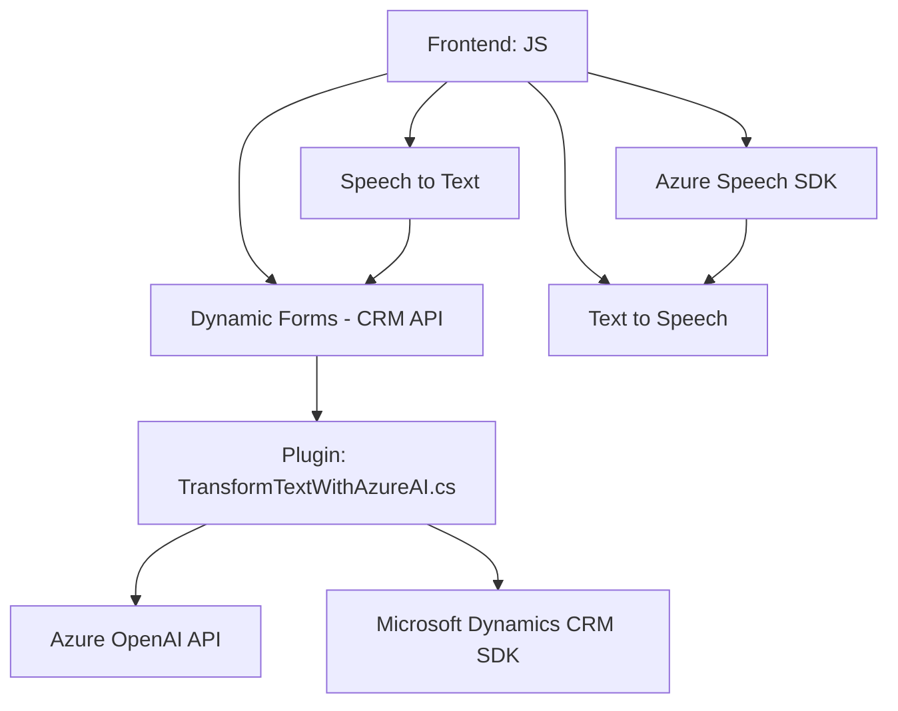

### Breve Resumen Técnico
Los archivos analizados forman parte de una solución que integra funcionalidades de síntesis y reconocimiento de voz (Azure Speech SDK) con un sistema CRM (Dynamics 365). Adicionalmente, se interactúa con Azure OpenAI para transformar datos y mejorar el procesamiento con capacidades de inteligencia artificial. La arquitectura combina capas frontend (JavaScript) y backend (plugins en C#) con servicios externos.

---

### Descripción de Arquitectura
1. **Tipo de Solución:** Una solución híbrida que incluye:
   - Frontend basado en JavaScript para el cliente (interfaz CRM y funcionalidad de voz).
   - Plugins en C# para la lógica de negocio que procesan datos a través de Azure OpenAI.
   - Integración profunda con Dynamics CRM y uso de APIs para lectura y modificación de datos.

2. **Arquitectura:** La solución está diseñada como un sistema **n capas**, donde:
   - **Capa de presentación:** Maneja los datos extraídos de formularios y la interacción con la síntesis/reconocimiento de voz (JavaScript).
   - **Capa de lógica de negocio:** Implementada a través de plugins en C#, proporcionando capacidades avanzadas como IA mediante Azure OpenAI y gestión de datos en CRM.
   - **Capa de servicios externos:** Conectividad con Azure Speech SDK y OpenAI APIs para la integración de servicios en la nube.

3. **Patrones de diseño utilizados:**
   - **Basado en eventos:** En los scripts frontend para la interacción con formularios.
   - **Plugin Design Pattern:** En los archivos C#, siguiendo la estructura que junto con Dynamics CRM segmenta las responsabilidades del sistema.
   - **Modularidad Funcional:** Reutilización de código en funciones dedicadas para tareas específicas (p. ej., mapeo de campos, conversión de texto/voz, integración con APIs externas).
   - **Cliente/Servidor:** Comunicación con Azure OpenAI mediante HTTP mientras se actualizan los formularios del CRM.

4. **Dependencias/Componentes externos:**
   - **Azure Speech SDK:** Sintetización de texto a voz y reconocimiento de voz.
   - **Azure OpenAI API:** Procesamiento avanzado de texto mediante inteligencia artificial (probablemente con modelos GPT).
   - **Microsoft Dynamics CRM SDK:** Para la relación con datos de formularios y la implementación de plugins.
   - **Newtonsoft.Json:** Parsing y generación de JSON en plugins C#.

---

### Tecnologías Usadas
1. **Frontend:**
   - **JavaScript**: Scripts que manejan interacción de formularios, reconocimiento y síntesis de voz.
   - **Azure Speech SDK**: API de Microsoft para síntesis y reconocimiento de voz.

2. **Backend:**
   - **C#:** Lógica de negocio implementada en plugins con integración a Dynamics CRM.
   - **Azure OpenAI:** Servicios de procesamiento e inteligencia artificial.

3. **Plataforma:** Microsoft Dynamics CRM para gestión de datos y ejecución de plugins.

---

### Diagrama **Mermaid** Válido para GitHub Markdown

---

### Conclusión Final
Esta solución es una integración innovadora de tecnologías para convertir datos de formularios dinámicos en voz, procesar transcripciones de voz a texto con apoyo de inteligencia artificial y realizar modificaciones en un sistema CRM. La arquitectura n-capas permite alta modularidad y una clara separación entre las tareas de presentación, lógica de negocio y comunicación con servicios externos. A pesar de estas ventajas, debe implementarse una mejora en la gestión de credenciales (idealmente, a través de un servicio seguro como Azure Key Vault en lugar de hardcoding) para garantizar la seguridad de la solución en todo su flujo operativo.