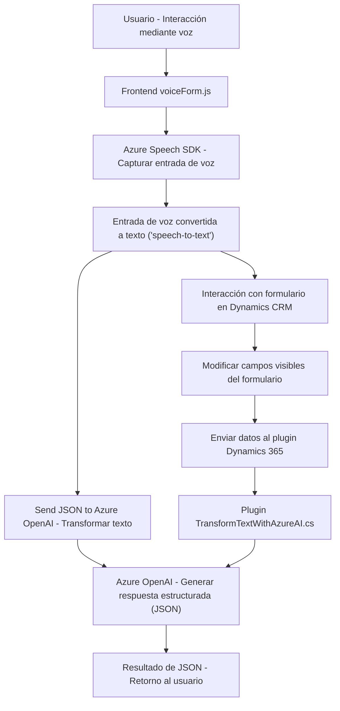

### Breve Resumen Técnico

Este repositorio parece estar diseñado para una solución que integra el reconocimiento y síntesis de voz junto con capacidades de transformación de texto mediante Azure Cognitive Services Speech SDK y Azure OpenAI API. Las principales características incluyen:

1. **Frontend**: Realiza entrada y salida de voz para interactuar con formularios visuales.
2. **Backend (Plugin para Dynamics 365)**: Implementa un plugin que utiliza Azure OpenAI para transformar texto, convirtiéndolo en una estructura JSON que es utilizada dentro del ecosistema Dynamics CRM.

### Descripción de Arquitectura

1. **Tipo de solución**: La solución se configura como un **híbrido entre un frontend y un sistema backend**. El frontend realiza integración con Dynamics 365 e interactúa con los servicios de Azure para habilitar entrada de voz y actualización automática de formularios. El plugin en el backend implementa un servicio que transforma texto utilizando Azure AI y devuelve un JSON a Dynamics CRM.

2. **Arquitectura empleada**: La estructura general parece ser una combinación de **arquitectura n-capas**.
   - **Primera capa**: Frontend realiza capturas de voz, y es responsable de interactuar directamente con el usuario.
   - **Segunda capa**: Gestión de solicitudes, procesamiento de voz y actualizaciones en formularios de Dynamics 365.
   - **Tercera capa**: Integración con servicios de Azure Speech, Azure OpenAI y API de Dynamics 365.
   
   Adicionalmente, en el nivel del plugin (`TransformTextWithAzureAI.cs`), se observa una aplicación **orientada a servicios** (SOA), delegando el procesamiento complejo al servicio Azure OpenAI.

3. **Patrones utilizados**:
   - **Integración de APIs externas**: Se emplean servicios de Azure (Speech SDK y OpenAI) para el reconocimiento y procesamiento del texto.
   - **Callback-based architecture** en el frontend (e.g., `ensureSpeechSDKLoaded`).
   - **Facade pattern**: En el frontend, las funciones simplifican la complejidad de trabajar directamente con el SDK y las APIs.
   - **Plugin pattern**: En el backend, el plugin sigue el estándar de Microsoft Dynamics CRM para extensibilidad empresarial.
   - **Service-Oriented Architecture (SOA)**: El backend depende de Azure APIs y Dynamics APIs como servicios externos.
   - **Separation of Concerns**: Las funciones separan la síntesis de voz, la interacción con el formulario y la generación de valores legibles en el frontend, así como la conexión con Azure y Dynamics en el backend.

4. **Componentes externos**:
   - **Frontend**:
     - Azure Speech SDK: Utilizado en las funciones relacionadas con la entrada y síntesis de voz.
     - Dynamics CRM API (Xrm.WebApi.online.execute): Para la integración con el modelo de datos del formulario en Dynamics 365.
   - **Backend**:
     - Azure OpenAI API: Accesos mediante llamadas HTTP para la transformación de texto.
     - `Newtonsoft.Json`/`System.Text.Json`: Utilizadas para gestionar las operaciones relacionadas con objetos JSON.
     - `System.Net.Http`: Para realizar solicitudes HTTP al servicio de Azure OpenAI.

### Tecnologías Usadas

- **Frontend**:
   - JavaScript: Utilizado en todos los archivos del frontend (`readForm.js`, `speechForm.js`).
   - Azure Cognitive Services Speech SDK: Manejando la entrada y síntesis de voz.
   - Dynamics 365 Xrm.WebApi API: Para interactuar con los datos y formularios.

- **Backend**:
   - Microsoft Dynamics SDK: Para la implementación de los plugins y la integración con CRM usando `IPlugin`.
   - Azure OpenAI API: Para transformar el texto entrante en un JSON estructurado.
   - Newtonsoft.Json / System.Text.Json: Encoding y decoding de objetos JSON.

### Diagrama Mermaid 100 % compatible con GitHub Markdown

### Conclusión Final

Este proyecto es una solución híbrida que combina un frontend basado en JavaScript con integración al SDK de Azure Speech y un backend (plugin) desarrollado en C#, el cual interactúa con Dynamics 365 y la API de Azure OpenAI. La arquitectura de esta solución es principalmente de **n-capas**, y su diseño modular hace que sea altamente extensible, lo que permite ajustarse a distintas necesidades dentro de sistemas que demanden interacción mediante voz y generación de datos estructurados.