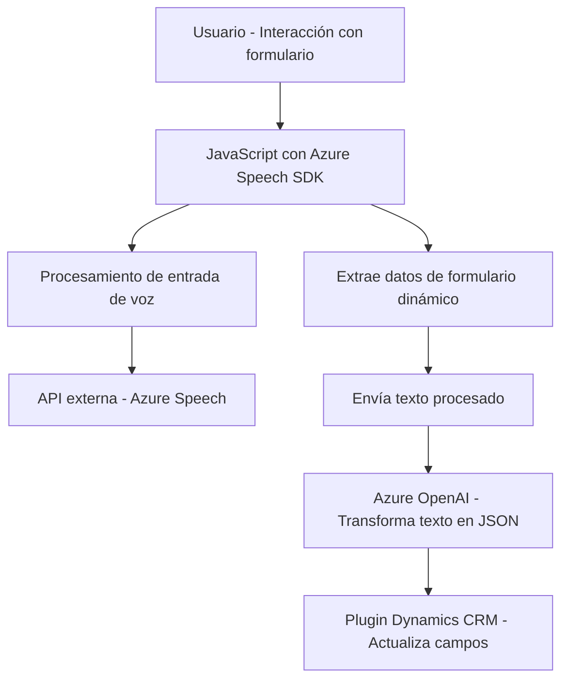

### Breve resumen técnico:
El repositorio está compuesto por archivos que integran funcionalidades dinámicas relacionadas con procesamiento de voz, manipulación de formularios en un contexto web (usando Dynamics 365) y un plugin para Dynamics CRM que utiliza Azure AI para transformar texto en formato JSON estructurado. Los archivos están orientados a proporcionar servicios específicos como entrada de voz, síntesis de texto y procesamiento avanzado con IA.

---

### Descripción de arquitectura:
La arquitectura general del repositorio es híbrida, ya que combina elementos de una **arquitectura en capas**:
1. **Frontend**: Funciones de JavaScript para manejar la interacción del usuario con formularios y entrada de voz mediante Azure Speech SDK.
2. **Middleware/Servicios**: Utilización de APIs externas (Speech SDK y OpenAI) como servicios conectados para procesar datos proporcionados por el usuario.
3. **Backend**: Plugin basado en Dynamics CRM que opera directamente sobre el contexto de un formulario en el CRM y extiende capacidades con IA.

Esta combinación sigue un enfoque modular y desacoplado, donde cada componente tiene una responsabilidad específica y reutilizable.

---

### Tecnologías usadas:
1. **Frontend**:
   - **JavaScript**: Para manejar la interfaz interactiva, entrada de voz y síntesis de texto.
   - **Azure Speech SDK**: Procesamiento de voz y generación de audio.
   - **Dynamics 365**: Interacción con formularios del CRM.

2. **Backend**:
   - **C# y .NET Framework**: Para implementar el plugin en Dynamics CRM.
   - **Azure OpenAI API**: Procesamiento de texto con IA (modelos GPT).
   - **REST APIs**: Comunicación con servicios externos.

3. **Librerías auxiliares**:
   - **Newtonsoft.Json**: Para manipulación JSON.
   - **SDK de Microsoft Dynamics CRM**: Administración de datos dentro del CRM.

4. **Patrones utilizados**:
   - **Modularidad**: Cada archivo contiene funciones o clases específicas con una única responsabilidad.
   - **Integración API externa**: Carga de SDKs dinámicamente y comunicación con servicios en la nube.
   - **Plugin Pattern**: Implementación extensible específica para CRM como una capa backend.

---

### Diagrama **Mermaid** (100% compatible con GitHub Markdown):

---

### Conclusión final:
El repositorio implementa una solución orientada a interacción dinámica entre usuarios y una plataforma CRM, donde se aprovechan tecnologías de procesamiento de voz y transformación de datos con inteligencia artificial. La arquitectura modular utiliza estrategias de desacoplamiento, lo que facilita el mantenimiento y escalabilidad. La dependencia de servicios cloud como Azure Speech SDK y Azure OpenAI contribuye a la funcionalidad avanzada pero introduce vínculos con servicios de terceros que deben gestionarse cuidadosamente.