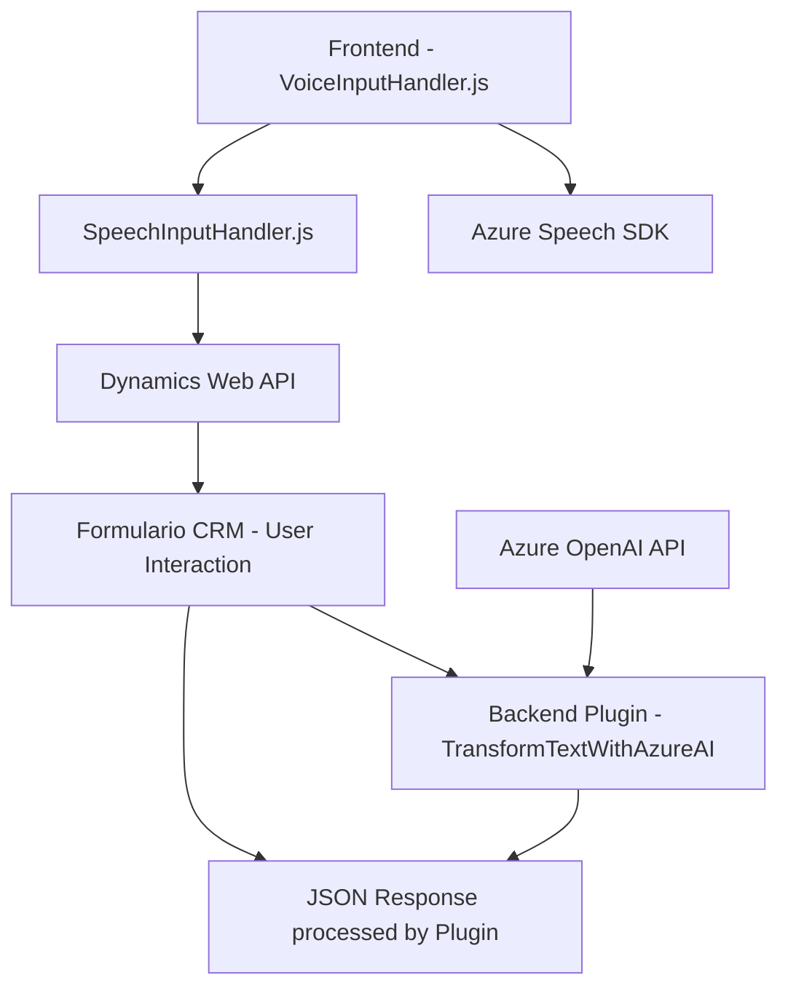

### Análisis del Repositorio

#### 1. Tipo de solución
El repositorio tiene elementos que sugieren una solución híbrida compuesta por un **frontend basado en JavaScript**, que habilita interacción a través de voz y texto, y una **implementación backend basada en plugins para Dynamics CRM**, que extiende la funcionalidad de procesamiento con APIs externas (Azure Speech SDK y Azure OpenAI).

#### 2. Tecnologías, Frameworks y Patrones usados
- **Frontend**:
  - Tecnología principal: **JavaScript**, en combinación con bibliotecas específicas como Azure Speech SDK.
  - Patrones: Modularidad y servicios externos (Azure Speech SDK), siguiendo principios de integración de SaaS/API.
  
- **Backend**:
  - Integración con **Dynamics CRM SDK**.
  - Uso de **Azure OpenAI API**.
  - Patrones:
    - Basado en Eventos: El backend se ejecuta en función de disparadores del sistema CRM (evento de Plugin).
    - Comunicación REST API para servicios externos.

#### 3. Tipo de arquitectura
La arquitectura sigue un esquema **modular** en el frontend y una combinación de **plugin/eventos** con microservicios en el backend, presentando características de integración de SaaS.

#### 4. Dependencias o componentes externos
- **Azure Speech SDK** para la síntesis y reconocimiento de voz (frontend).
- **Dynamics CRM SDK** para el manejo de datos estructurados dentro del entorno CRM (backend).
- **Azure OpenAI API** para procesamiento IA de texto (backend).
- Dependencias específicas:
  - `Newtonsoft.Json` para serialización/deserialización de JSON.
  - `HttpClient` para realizar solicitudes REST en el Plugin .NET.

---

### Diagrama Mermaid

---

### Conclusión Final
El repositorio está diseñado como una solución para mejorar la interacción en entornos CRM mediante tecnologías de **procesamiento de voz e inteligencia artificial**. La separación entre el frontend y el backend demuestra un enfoque modular, facilitando la interacción en tiempo real y el análisis de datos desde múltiples canales (voz, texto, IA). Aunque es funcional, existen riesgos relacionados con las claves de API incrustadas directamente en el código, que deberían sustituirse por un mecanismo seguro como variables de entorno o soluciones de gestión de secretos.