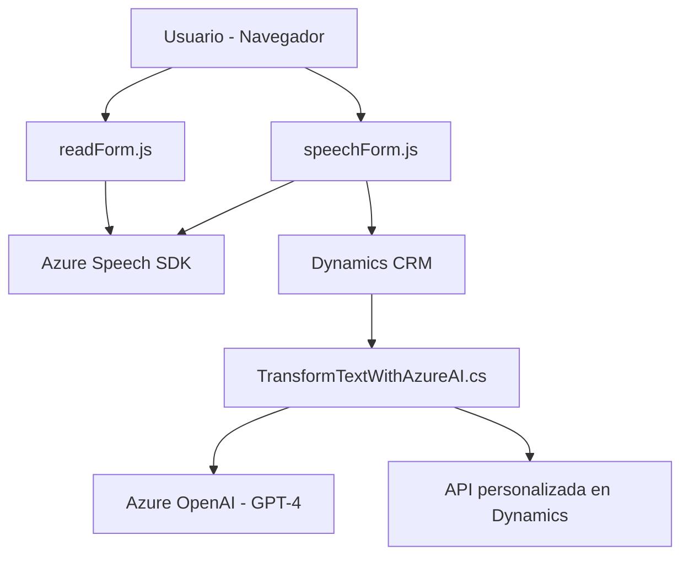

### Breve resumen técnico:
El repositorio tiene múltiples archivos que interactúan entre sí para proporcionar funcionalidades de *input* y generación de voz, transcripción de texto mediante reconocimiento de voz, y transformación de texto utilizando inteligencia artificial. La solución está fuertemente integrada con servicios externos como Azure Speech SDK, Azure OpenAI y Microsoft Dynamics CRM, y se enfoca en automatización, accesibilidad y procesamiento dinámico de datos.

---

### Descripción de arquitectura:
Este repositorio implementa diferentes componentes arquitectónicos que funcionan conjuntamente:

1. **Frontend**: Contiene archivos como `readForm.js` y `speechForm.js`, que trabajan con la interacción del usuario en el navegador. Se destacan las funcionalidades para leer datos de formularios y realizar la entrada/captura de voz, además de integrar con APIs externas para el procesamiento de información.
   - **Frontend pattern**: Modular con funciones independientes. Utiliza un enfoque basado en procesos asíncronos y eventos.
   - **Service integration**: Azure Speech SDK se carga dinámicamente para interacción en tiempo real con el usuario.

2. **Backend (plugin)**: `TransformTextWithAzureAI.cs` es un plugin de Dynamics 365 que actúa como un microservicio encargado de procesar texto utilizando un modelo de IA alojado en Azure OpenAI. Este plugin sigue los estándares de diseño para Dynamics (`IPlugin` interface).
   - **Backend pattern**: Plugin que aplica transformación de datos con normas específicas. Es integrado directamente en el sistema CRM.
   - **Distributed architecture**: Conexión a servicios de Azure permite procesamiento de texto avanzado y operaciones CRUD en Dynamics CRM.

3. **Arquitectura general**:
   - **N capas con integración distribuida**:
     - Capa **Frontend**: Procesamiento y entrada de voz.
     - Capa **Backend/API**: Transformaciones y almacenaje (mediante plugins y APIs personalizadas).
     - Capa **Servicios externos**: Azure Speech SDK y Azure OpenAI.
   - Hay una ligera referencia a **Patrón Hexagonal**, pues las interacciones entre componentes dependen de puertos externos (APIs) y adaptadores (como los mapeadores y servicios).

---

### Tecnologías usadas:
- **Frontend**:
  - JavaScript, para lógicas de entrada de voz y síntesis de texto.
  - Azure Speech SDK, usado dinámicamente para reconocimiento y generación de voz.
  
- **Backend**:
  - C#: Implementación de plugins de Dynamics.
  - Microsoft Dynamics CRM SDK: Contexto, ejecución y manipulación de datos.
  - Azure OpenAI GPT API: para procesamiento avanzado de texto con IA.
  
- **Dependencias externas**:
  - `System.Net.Http`: Para llamadas API desde C#.
  - `Newtonsoft.Json`: Manipulación de objetos JSON para el procesamiento de datos de OpenAI.
  - `SpeechSDK`: SDK de Azure Speech para interacción de voz en frontend.
  
- **API personalizada**:
  - Integración con API específica en Dynamics que interactúa con Azure AI para transformaciones más personalizadas.

---

### Diagrama Mermaid válido para GitHub:

---

### Conclusión final:
Este repositorio ofrece una solución avanzada para la automatización de formularios y acceso mediante voz, contextualizada en sistemas CRM como Microsoft Dynamics. Presenta un diseño que combina un frontend modular y funcional con un backend de extensibilidad distribuida―todo mediante la integración con servicios de IA y síntesis de voz en Azure. La arquitectura aprovecha patrones como plugin-oriented design, microservicios y modularidad, garantizando una interoperabilidad eficiente entre los componentes locales y distribuidos. 

Esta combinación de tecnologías lo hace ideal para organizaciones que requieren capacidades de accesibilidad, automatización de procesos manuales y mejoras en UX mediante servicios de IA.