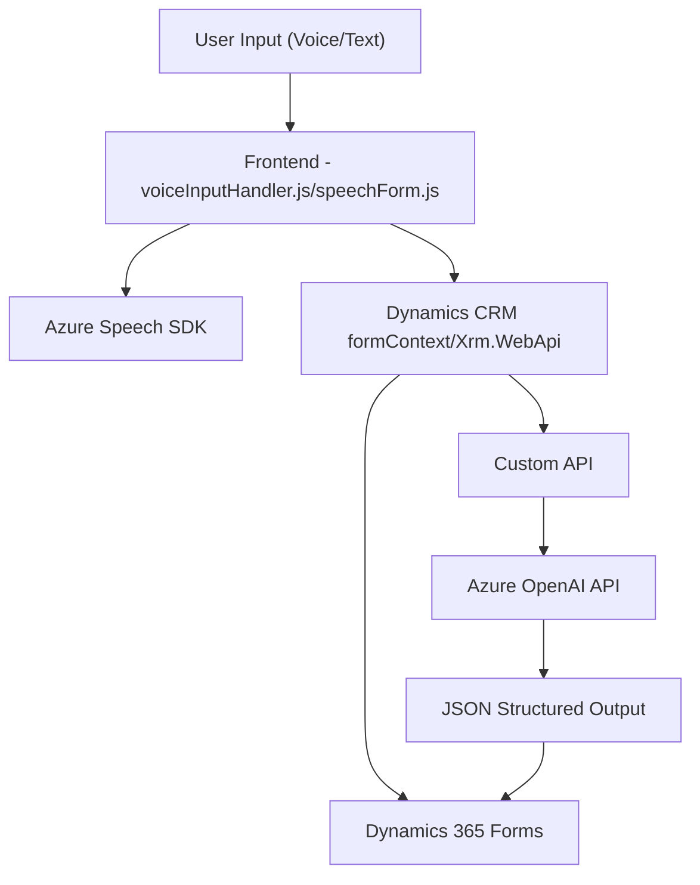

### Breve resumen técnico:
El repositorio tiene varias funcionalidades destinadas a optimizar la interacción por voz y procesamiento de texto en formularios de Dynamics 365. Las diferentes capas (frontend y backend) están altamente acopladas a servicios externos como Azure Speech SDK y Azure OpenAI API. Esto evidencia un diseño orientado a servicios para mejorar la experiencia del usuario con inteligencia artificial y reconocimiento de voz.

---

### Descripción de arquitectura:
1. **Tipo de solución:**  
   - Este repositorio tiene un enfoque híbrido entre frontend y backend, con una dependencia muy marcada en servicios externos. Por ejemplo:
     - Frontend: Archivos en JavaScript (`voiceInputHandler.js`, `speechForm.js`) implementan controladores de entrada por voz que interactúan con formularios de Dynamics 365.
     - Backend: Plugins en C# (`TransformTextWithAzureAI.cs`) procesan texto con APIs externas (Azure OpenAI API).

2. **Arquitectura general:**  
   - La arquitectura muestra patrones típicos de **n capas**:
     - **Capa de Presentación (Frontend):** Procesa el reconocimiento de voz y mapea datos ingresados hacia formularios.
     - **Capa de Aplicación (Middleware):** Interactúa con SDKs y APIs externas (Azure Speech y OpenAI), ejecutando transformaciones específicas.
     - **Capa de Datos:** Se integra profundamente con Dynamics CRM mediante manipulaciones en `formContext` y llamadas al `Xrm.WebApi`.

   - En el backend (C#), el diseño del plugin con integración explícita a un servicio externo (Azure OpenAI API) refuerza un patrón **orientado a servicios (SOA)**.

---

### Tecnologías utilizadas:
1. **Frontend:**  
   - **JavaScript:** Lenguaje principal del lado cliente.  
   - **Azure Speech SDK:** Reconocimiento y síntesis de voz.  
   - **Dynamics CRM API (`Xrm.WebApi`)**: Manipula datos en formularios y entidades vinculadas del CRM.  

2. **Backend:**  
   - **C#/.NET:** Usado para desarrollo del plugin.  
   - **Azure OpenAI API:** Procesa texto con inteligencia artificial avanzada.  
   - **System.Net.Http:** Realiza solicitudes HTTP.  
   - **System.Text.Json:** Serialización/deserialización JSON.  

3. **Patrones:**  
   - Single Responsibility Principle: Separación de funciones con propósitos bien delimitados.  
   - Modularidad Funcional: Una apropiada separación de lógica para procesamiento textual y recursos integrados.  
   - **SDK Initialization Patterns:** Verifica dinámicamente la disponibilidad del Azure Speech SDK y lo carga según necesidad.

---

### Dependencias o componentes externos:
1. **Azure Speech SDK:** Sintetiza voz, reconocimiento de comandos y entradas habladas.  
2. **Azure OpenAI API:** Realiza transformaciones inteligentes de texto mediante IA.  
3. **Dynamics CRM (`Microsoft.Xrm.Sdk`, `Xrm.WebApi`):** Manejo de datos y entidades dinámicas.  
4. **Configuraciones de ambiente:**  
   - Claves API (`azureKey`, `apiKey`) conectan con servicios de Azure y deben adminstrarse con seguridad.  

---

### Diagrama **Mermaid** válido para GitHub:

---

### Conclusión final:
El repositorio tiene una interesante combinación de reconocimiento de voz e inteligencia artificial utilizando servicios modernos como Azure Speech SDK y Azure OpenAI API. La arquitectura está claramente diseñada en **n capas**, con una marcada orientación hacia servicios externos y modularización de tareas. Sin embargo, se observan algunos puntos de mejora, como la refactorización de dependencias hardcodeadas y asegurar configuraciones críticas como claves/API para una mayor seguridad.