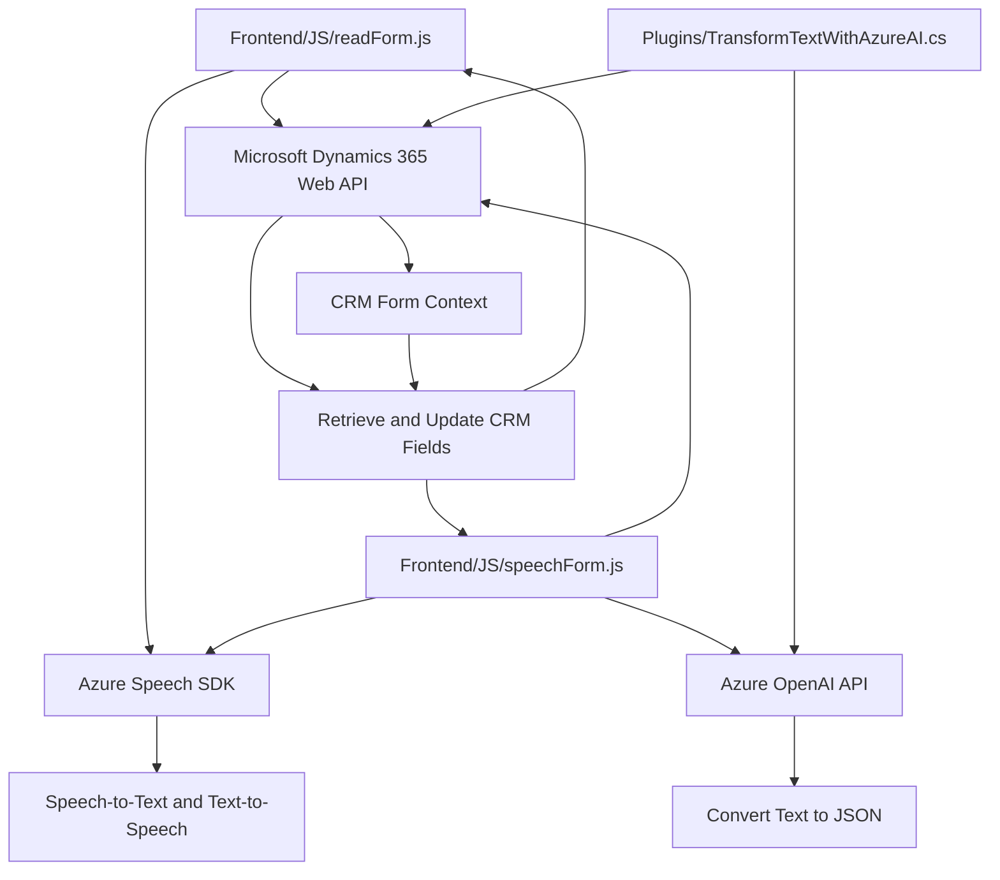

### Breve resumen técnico
El repositorio contiene tres componentes principales que trabajan juntos para brindar funcionalidades de procesamiento de voz y transformación de texto en el contexto de formularios, integrando servicios externos como **Azure Speech SDK**, **Azure OpenAI**, y **Microsoft Dynamics CRM APIs**.

---

### Descripción de arquitectura
La solución está diseñada como un sistema modular basado en servicios conectados. Implementa patrones de integración mediante SDKs y APIs, siguiendo principios de baja acoplación:
1. **Frontend (JavaScript)**:
   - Gestión del reconocimiento de voz y síntesis, con integración del **Azure Speech SDK**.
   - Procesamiento de datos para interactuar con formularios visibles y servicios como **Dynamics 365 API**.
2. **Backend (C# Plugins)**:
   - Extensión de **Dynamics CRM** mediante plugins, implementando el patrón de plugin nativo de Microsoft Dynamics (`IPlugin`).
   - Conexión con **Azure OpenAI Service** para transformación de texto a JSON estructurado, aplicando reglas configuradas.

La arquitectura general sugiere una **modular aproximación basada en servicios**, aprovechando SDKs, APIs externas y el plugin del CRM como componentes interconectados. Dentro de la solución, el diseño representa un patrón **n-capas**, con responsabilidades divididas en:
- **Frontend (Capa de presentación):** Interacción con el usuario mediante formularios y servicios de voz/texto.
- **Conector intermedio:** Llamadas de APIs y delegación de procesamiento entre frontend y backend.
- **Backend (Capa de lógica):** Manipulación de datos y conexión con servicios externos mediante plugins.

---

### Tecnologías usadas
1. **Azure Speech SDK:**
   - SDK para JavaScript.
   - Funcionalidades: Texto a voz (text-to-speech), reconocimiento de voz (speech-to-text).
   - Enlaces: [Azure Speech SDK - JS Browser Package](https://aka.ms/csspeech/jsbrowserpackageraw).

2. **Azure OpenAI Service:**
   - Procesamiento avanzado del lenguaje con modelos GPT para la transformación de texto en JSON.
   - Manejo de API REST para hacer solicitudes.

3. **Technology stack:**
   - **Frontend:** JavaScript, HTML, DOM Manipulation.
   - **Backend:** .NET Framework, C#.
   - **Microsoft Dynamics 365 CRM Plugins:** `IPlugin`.

4. **Additional libraries:**
   - `Newtonsoft.Json.Linq` for JSON manipulation.
   - `System.Net.Http` for HTTP requests to external APIs.

---

### Diagrama Mermaid válido para GitHub Markdown:

---

### Conclusión final
Esta solución muestra una arquitectura **modular basada en servicios distribuidos**, integrada principalmente con **Azure SDKs** y **Microsoft CRM**. Los componentes frontend en **JavaScript** manejan la interacción con el usuario y la integración con APIs, mientras que el backend implementado en **C# CRM Plugins** gestiona transformaciones avanzadas utilizando **Azure OpenAI Services**.

Las dependencias externas como **Azure Speech SDK**, **Azure OpenAI**, y **Microsoft Dynamics 365 Web API** amplifican la funcionalidad de la solución, permitiendo dinámica avanzada como convertir texto visible en voz, reconocimiento de voz y transformación de texto en JSON para manipulación y consumo.

El diseño está orientado a separación de responsabilidades y reusabilidad, lo que lo hace adecuado para entornos empresariales que requieren robustez y flexibilidad en la manipulación de datos.