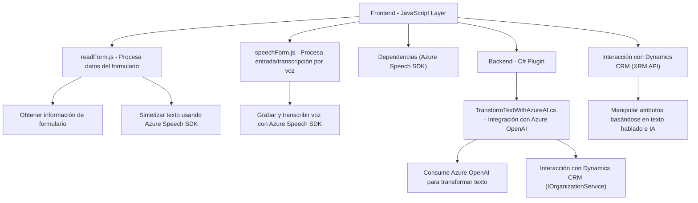

### Breve Resumen Técnico

El repositorio contiene múltiples capas de una solución que parece estar diseñada para operar en un entorno CRM como Dynamics 365. Su función principal involucra:

1. **Frontend (JavaScript)**: Implementación en el lado del cliente, con componentes para procesamiento de voz y síntesis de texto a voz utilizando Azure Speech SDK. Procesa formularios, lectura de atributos y contextos dentro del frontend interactivo.
2. **Plugins (C#)**: Backend extendido para Microsoft Dynamics CRM, utilizando Azure OpenAI para transformar texto mediante inteligencia artificial y APIs REST.
3. **Integración de servicios externos**: Dependencia de Azure Speech SDK y Azure OpenAI para tareas especializadas como síntesis de voz y transformación avanzada de texto.

---

### Descripción de Arquitectura

1. **Tipo de arquitectura:** 
   - Modular en el cliente (capa frontend) con interacción directa con servicios externos (Azure Speech SDK), adoptando el patrón **n capas**.
   - En el backend (Plugins/TransformTextWithAzureAI.cs), se utiliza el **Plugin Pattern**, estándar para extensiones de Microsoft Dynamics CRM.
2. **Flujo general del sistema:**
   - Carga dinámica del SDK en el cliente.
   - Procesamiento de datos del formulario.
   - Comunicación con el CRM para asignación de valores.
   - Integración backend con servicios de Azure para tareas IA/texto estructurado.

---

### Tecnologías Usadas

- **Frontend y APIs:**
  - **JavaScript**: Implementación modular para cargar dinámicamente dependencias como SDKs.
  - **Azure Speech SDK**: Procesamiento de voz, síntesis de texto y generación de audio.
  - **DOM API**: Dinámica de carga de scripts y manipulación de atributos de formularios.
  - **XRM API**: Interacción con CRM/Dynamics 365 en el frontend.

- **Backend:**
  - **C#**: Plugin extensible para CRM, utilizando patrones orientados a la encapsulación y modularidad.
  - **System.Net.Http**: Manejo de solicitudes REST hacia Azure OpenAI.
  - **System.Text.Json**: Serialización/deserialización de datos JSON (enviados entre CRM y API).
  - **Microsoft CRM SDK**: Extensión estándar para recibir y manejar datos de Dynamics 365.

---

### Diagrama Mermaid 100% Compatible

---

### Conclusión Final

La solución combina un sistema **n capas** con integración extensiva de servicios externos (Azure Speech SDK y Azure OpenAI) para habilitar funcionalidades avanzadas en un contexto CRM como Dynamics 365. Sus componentes están bien organizados y aprovechan patrones como modularidad, separación de responsabilidades y carga dinámica, lo que asegura escalabilidad y claridad en las interacciones entre el frontend, el backend y las APIs externas.

