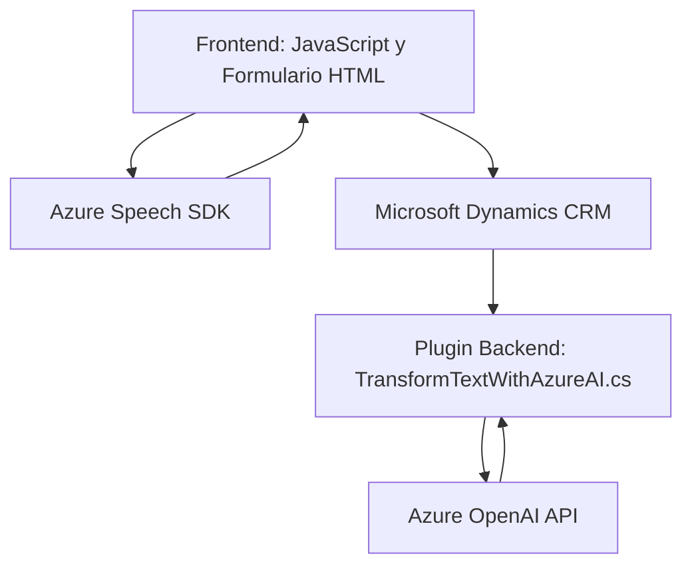

### Resumen técnico:
El repositorio GitHub describe una solución que combina elementos frontend, lógica de procesamiento de voz, integración con APIs externas (Azure Speech SDK y Azure OpenAI) y un plugin para Microsoft Dynamics CRM. Se utiliza un enfoque modular con funciones bien organizadas, diseño orientado a servicios y buena práctica de separación de responsabilidades.

---

### Descripción de arquitectura:
Esta solución emplea una arquitectura híbrida:
1. **Frontend:** Código JavaScript para interactuar con formularios, capturar datos y sintetizar/conversar mediante voz. Utiliza patrones como módulos funcionales y callbacks.
2. **Backend y Plugin CRM:** El plugin implementado en C# para Dynamics CRM opera como un componente orientado a servicios, con integración externa mediante la API de Azure OpenAI.
3. **Patrones observados:**
   - **SOA (Service-Oriented Architecture):** Los elementos del sistema están diseñados para ser altamente desacoplados, cada uno cumpliendo una función específica: frontend manejando la interfaz, los servicios de Azure realizando tareas de IA y síntesis de voz, y el plugin conectando con Dynamics CRM.
   - **Encapsulación:** Cada módulo/plugin realiza tareas específicas, y los datos/acciones están bien separados.
   - **Delegación:** Uso de callbacks y promesas para manejar la carga dinámica y procesamiento asíncrono.

Por lo tanto, esta solución es una **arquitectura n capas**, con diferencias entre el frontend (captura de datos/síntesis de voz), servicio externo (Azure Speech SDK/OpenAI) y lógica backend en forma de plugins CRM.

---

### Tecnologías usadas:
#### En el frontend (`JS`):
- **JS/ES6**: Lenguaje base para las funciones de lectura/síntesis de voz y comunicación con el SDK. 
- **Azure Speech SDK**: API para síntesis de voz y reconocimiento.
- **Microsoft Dynamics WebApi (`Xrm.WebApi`)**: Se utiliza para procesar datos en formularios de Dynamics 365.

#### En el backend/plugin (`C#`):
- **C#**: Backend en forma de plugins para Dynamics CRM.
- **Microsoft.Xrm.Sdk**: Framework para desarrollo en Dynamics CRM.
- **System.Net.Http**: Para comunicación con el servicio Azure OpenAI desde el plugin.
- **Newtonsoft.Json:** Manejo de JSON para construir el payload y deserializar solicitudes.
- **Azure OpenAI GPT (via API)**: Utilizado para transformar texto a formato estructurado (JSON).

---

### Dependencias o componentes externos:
1. **Azure Speech SDK**: Para las funcionalidades de síntesis de voz y grabación de audio/transcripción.
2. **Azure OpenAI API**: Para procesamiento y transformación avanzada de texto.
3. **Microsoft Dynamics CRM**: Plataforma principal donde se integran el plugin y se interactúa con formularios y bases de datos.
4. **Sistema de navegación dinámica**: Muchos de estos módulos dependen de formularios y APIs proporcionados por Dynamics 365 (`Xrm.WebApi`).
5. **Servicio HTTP y JSON**: Utilizados para solicitudes asincrónicas a otros sistemas.

---

### Diagrama Mermaid:

---

### Conclusión final:
El repositorio destaca una solución integrada que combina frontend y backend, enfocada en servicios altamente especializados como reconocimiento y síntesis de voz (frontend con Azure Speech SDK) y transformación avanzada de datos (backend con Azure OpenAI API). La arquitectura n capas está bien definida y desacoplada, con separación entre la interfaz de usuario, la lógica de negocio implementada en el plugin y los servicios externos. La solución está bien diseñada para entornos de Dynamics CRM, aprovechando los módulos externos para minimizar la complejidad dentro del propio sistema. Sin embargo, podría optimizarse mediante refactorización del payload y mejora de la seguridad en el manejo de claves/API.